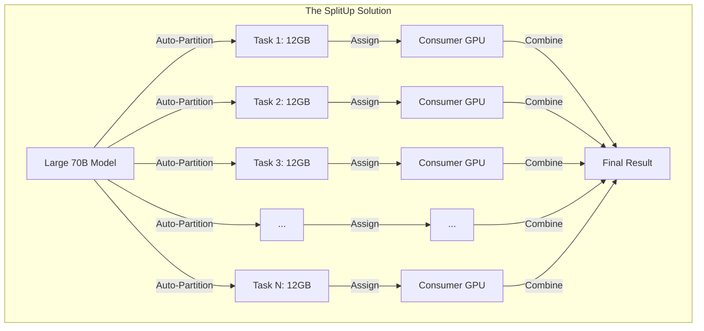
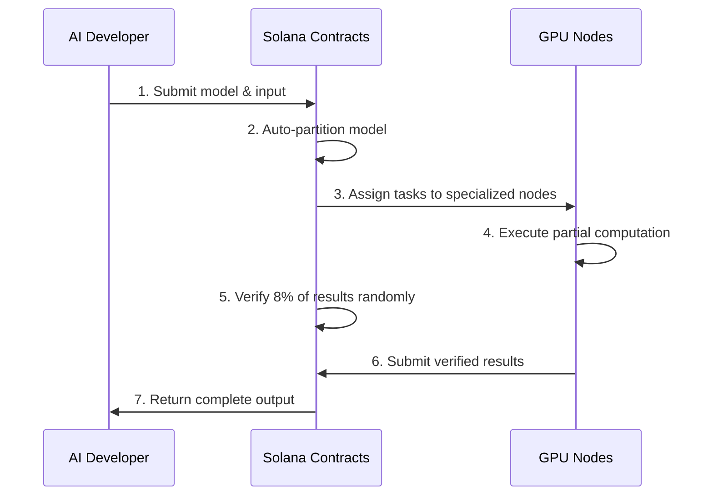

# SplitUp: Decentralized AI Inference on Consumer Hardware

> Run any size AI model across distributed consumer GPUs with efficient verification on Solana

## 🚀 The Problem We Solve

Modern AI models like LLaMA-70B require 80-140GB VRAM, but consumer GPUs only have 8-24GB. Current solutions force centralization or expensive hardware. Verification adds 100%+ overhead in traditional decentralized systems.

SplitUp solves this with automatic model partitioning and our Proof of Sampling Protocol (PoSP) with just 8% verification overhead.



## 🔑 Key Technical Advantages

| Feature | SplitUp | Others |
|---------|---------|--------|
| **VRAM Distribution** | ✅ Run any size model on consumer GPUs | ❌ Limited by single node VRAM |
| **Verification Overhead** | ✅ Only 8% overhead (PoSP) | ❌ 100%+ overhead |
| **Memory Safety** | ✅ Tensor-only operations | ❌ Often allows arbitrary code |
| **Hardware Compatibility** | ✅ Any GPU (NVIDIA, AMD, Intel) | ❌ Often vendor-specific |
| **Developer Experience** | ✅ TinyGrad/PyTorch compatible | ❌ Complex custom APIs |
| **Economic Model** | ✅ Mathematically optimal incentives | ❌ Vulnerable to dishonesty |

## 💻 How It Works

Our system integrates EigenTensor's memory-safe computation with Solana's efficient contract platform:



### Auto-Partitioning Magic

```python
# Define your model using TinyGrad-compatible code
model = LLaMAModel(config)
outputs = model(input_ids)

# Automatically partition for distributed execution
partitions = auto_partition(
    graph_program=outputs, 
    target_vram=12 * 1024 * 1024 * 1024  # 12GB target
)
```

## 🏗️ Technical Architecture

Our system consists of four integrated layers:

1. **Solana Contract Layer** ([details in diagram 1](diagrams/1_deployment.md))
   - Model Registry: Manages model DAGs and tensor interfaces
   - Task Registry: Defines computational task requirements
   - Node Registry: Tracks node capabilities and specializations
   - Execution Contract: Orchestrates distributed inference

2. **Node Execution Layer** ([details in diagram 2](diagrams/2_node-configuration.md))
   - Task Executor: Runs specialized model components
   - Pre-loading System: Keeps weights ready for instant execution
   - Heartbeat Service: Maintains node availability status

3. **Verification Layer** ([details in diagram 4](diagrams/4-PoSP.md))
   - Proof of Sampling Protocol: 8% random verification
   - Economic incentives: Dishonesty becomes unprofitable
   - VRF-based validator selection: Prevents manipulation

4. **Client Interface Layer**
   - Model Deployment CLI: Register and partition models
   - Node Management CLI: Operate and monitor compute nodes
   - NextJS Developer Console: Submit jobs and monitor execution

## 🛠️ Hackathon Deliverables

We've built a complete end-to-end prototype:

1. **EigenTensor Integration**
   - Memory-safe tensor operations
   - TinyGrad-compatible API
   - Automatic computational graph analysis

2. **Auto-Partitioning Engine**
   - Splits models to fit target VRAM constraints
   - Optimizes communication between partitions
   - Creates clean tensor interfaces between tasks

3. **Solana Programs**
   - Model/Task Registry: Track model definitions and tasks
   - Node Registry: Manage compute providers
   - Execution Contract: Coordinate inference tasks
   - Verification Contract: Implement PoSP with 8% overhead

4. **Node Software**
   - Specialization system for efficient preloading
   - Heartbeat mechanism for liveness monitoring
   - Task execution environment

5. **Developer Tools**
   - `splitup-deploy`: For model developers to register models
   - `splitup-node`: For GPU owners to participate in marketplace
   - Web interface for job submission and monitoring

## 🔐 Security & Economics

Our Proof of Sampling Protocol creates a Nash equilibrium where honesty is the dominant strategy:

- Only 8% of work gets verified (vs traditional 100%+ overhead)
- Verification reward: 1.2× computation cost
- Slashing amount: 10× computation cost
- Economic security mathematically guaranteed when:
  ```
  p > C/((1-r)(R+S))
  ```
  Where p=verification probability, C=computation cost, r=collusion fraction, R=reward, S=slashing amount

## 🌐 Advanced Features

- **Fault Tolerance**: Automatic task reassignment for failed nodes ([diagram 7](diagrams/7.md))
- **Optimal Assignment**: Nodes can handle multiple adjacent tasks ([diagram 9](diagrams/9.md))
- **Parallel Execution**: Independent DAG branches execute simultaneously ([diagram 6](diagrams/6.md))
- **Dynamic Scaling**: Execution adapts to available marketplace capacity

## 👥 Join Our Marketplace

**For AI Developers**:
- Run large models without expensive hardware
- Pay only for what you use (~$0.25-1.00 per inference vs $2-8 on cloud platforms)
- Simple, familiar API similar to centralized alternatives

**For GPU Owners**:
- Earn $0.10-0.50 per hour per GPU
- Specialize in specific model components
- No arbitrary code execution - only memory-safe operations

## 📚 Learn More

- [Full Technical Explanation](technical.md)
- [Comprehensive Presentation](presentation.md)
- [Execution Flow Diagram](diagrams/3.md)
- [Model Partitioning Diagram](diagrams/1.md)

---

*Built for Solana Hackathon 2023*  
Contact: team@splitup.dev
