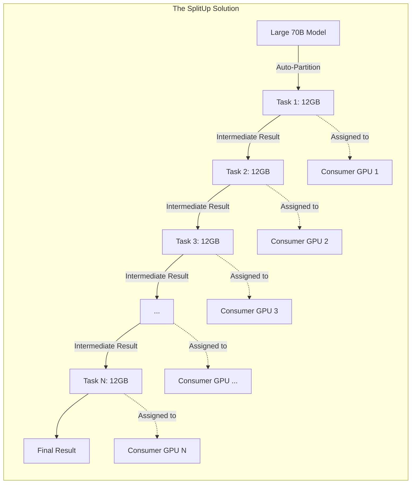
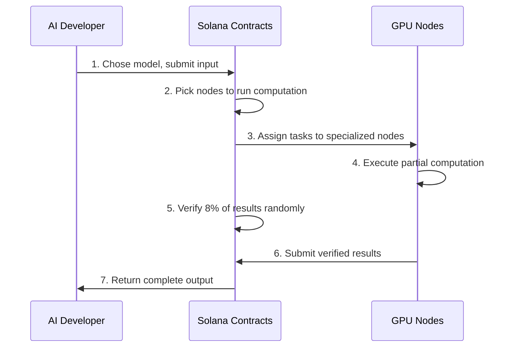

This project won Solana Superteam's first AI3 Hackathon in London!!

We're shaking things up, and will be back with an updated README soon!

Hackathon won at Git commit `fa3db00a611a7b8754bd2cddaeed81c358c45719`.

---

# SplitUp: Decentralized AI Inference on Consumer Hardware

> Run any size AI model across distributed consumer GPUs with efficient verification on Solana

## 🚀 The Problem We Solve

Modern AI models like LLaMA-70B require 80-140GB VRAM, but consumer GPUs only have 8-24GB. Current solutions force centralization or expensive hardware. Verification adds 100%+ overhead in traditional decentralized systems.

SplitUp solves this with automatic model partitioning and our [Proof of Sampling Protocol (PoSP)](concrete_plans/smart_contracts/proof_of_sampling.md) with just 8% verification overhead.



## 🔑 Key Technical Advantages

| Feature                    | SplitUp                                | Others                         |
| -------------------------- | -------------------------------------- | ------------------------------ |
| **VRAM Distribution**      | ✅ Run any size model on consumer GPUs | ❌ Limited by single node VRAM |
| **Verification Overhead**  | ✅ Only 8% overhead (PoSP)             | ❌ 100%+ overhead              |
| **Memory Safety**          | ✅ Tensor-only operations              | ❌ Often allows arbitrary code |
| **Hardware Compatibility** | ✅ Any GPU (NVIDIA, AMD, Intel)        | ❌ Often vendor-specific       |
| **Developer Experience**   | ✅ TinyGrad compatible                 | ❌ Complex custom APIs         |
| **Economic Model**         | ✅ Mathematically optimal incentives   | ❌ Vulnerable to dishonesty    |

## 💻 How It Works

Our system integrates EigenTensor's memory-safe computation with Solana's efficient contract platform:



### Auto-Partitioning Magic

```python
# Define your model using TinyGrad-compatible code
model = LLaMAModel(config)
outputs = model(input_ids)

# Automatically partition for distributed execution
partitions = auto_partition(
    graph_program=outputs,
    target_vram=12 * 1024 * 1024 * 1024  # 12GB target
)
```

## 🏗️ Technical Architecture

Our system consists of four integrated layers:

1. **[Solana Contract Layer](concrete_plans/smart_contracts/index.md)**

   - Model Registry: Stores model metadata, the structure of it's computational DAG (made up of "tasks"), and it's tensor interfaces
   - Task Registry: Specifies input and output tensor interfaces for each task, VRAM requirements, and weight file locations
   - Node Registry: Tracks specializations, stake amounts, etc
   - Model Execution Contract: Assigns tasks based on optimal allocation, tracks execution state, and handles result aggregation
   - [Verification Contract](concrete_plans/smart_contracts/proof_of_sampling.md): Implements PoSP consensus with VRF for 8% random verification
   - Staking Contract: Manages deposits, withdrawals, and slashing conditions

2. **[Node Execution Layer](concrete_plans/compute_client/index.md)**

   - [Task Executor](concrete_plans/compute_client/task_completion.md): Uses TinyGrad for GPU execution with device-optimized machine code
   - Pre-loading System: Downloads and verifies weight files, pre-loads into GPU memory, optimizes for multi-task handling
   - [Heartbeat Service](concrete_plans/heartbeat/oracle_server.md): Sends regular heartbeats to Oracle Committee

3. **Verification Layer**

   - [Proof of Sampling Protocol](concrete_plans/smart_contracts/proof_of_sampling.md): 8% random verification
   - Economic incentives: Dishonesty becomes unprofitable
   - VRF-based validator selection: Prevents manipulation

4. **Storage Layer**

   - Model Definitions: Stores complete model specifications with DAG structure and task relationships
   - Weight Files: Efficiently stores weights in safetensors format with standardized URI scheme
   - Tensor Data: Handles intermediate results with automatic garbage collection and efficient serialization

5. **Client Interface Layer**
   - [Model Deployment CLI](concrete_plans/model_deployment/index.md): Analyzes model structure for optimal partitioning, creates task definitions, uploads weight files
   - Node Management CLI: Registers node capabilities, manages stake deposits and withdrawals, monitors performance

## 🛠️ Hackathon Deliverables

We've built a complete end-to-end prototype:

1. **EigenTensor Integration**

   - Memory-safe tensor operations
   - TinyGrad-compatible API
   - Automatic computational graph analysis

2. **[Auto-Partitioning Engine](concrete_plans/model_deployment/index.md)**

   - Splits models to fit target VRAM constraints
   - Optimizes communication between partitions
   - Creates clean tensor interfaces between tasks

3. **[Solana Programs](concrete_plans/smart_contracts/index.md)**

   - Model and Task Registry: Track model definitions and tasks
   - Node Registry: Register ML compute nodes
   - Execution Contract: Coordinate inference tasks between nodes
   - Verification Contract: Implement PoSP with 8% overhead

4. **Developer Tools**

   - `splitup-deploy`: For model developers to register models
   - `splitup-node`: For GPU owners to participate in marketplace
   - Web interface for job submission and monitoring

5. **MNIST Demo**
   - NextJS UI with Tailwind CSS, detect numbers drawn on canvas
   - Interactive web demo showcasing model partitioning
   - End-to-end flow from model submission to result visualization

## 🔐 Security & Economics

Our [Proof of Sampling Protocol](concrete_plans/smart_contracts/proof_of_sampling.md) creates a Nash equilibrium where honesty is the dominant strategy:

- Only 8% of work gets verified (vs traditional 100%+ overhead)
- Verification reward: 1.2× computation cost
- Slashing amount: 10× computation cost
- Economic security mathematically guaranteed when:
  ```
  p > C/((1-r)(R+S))
  ```
  Where p=verification probability, C=computation cost, r=collusion fraction, R=reward, S=slashing amount

## 🌐 Advanced Features

- **Fault Tolerance**: Automatic task reassignment for failed nodes ([diagram 7](diagrams/7.md))
- **Optimal Assignment**: Nodes can handle multiple adjacent tasks ([diagram 9](diagrams/9.md))
- **Parallel Execution**: Independent DAG branches execute simultaneously ([diagram 6](diagrams/6.md))
- **Dynamic Scaling**: Execution adapts to available marketplace capacity

## 📚 Learn More

- [Full Technical Explanation](concrete_plans/explanation.md)
- [Comprehensive Presentation](presentation.md)
- [Execution Flow Diagram](diagrams/3.md)
- [Model Partitioning Diagram](diagrams/1.md)
- [Heartbeat Oracle System](concrete_plans/heartbeat_oracle/index.md)

---

_Built for AI Web3 Hackathon 2025_  
Contact: team@splitup.dev
