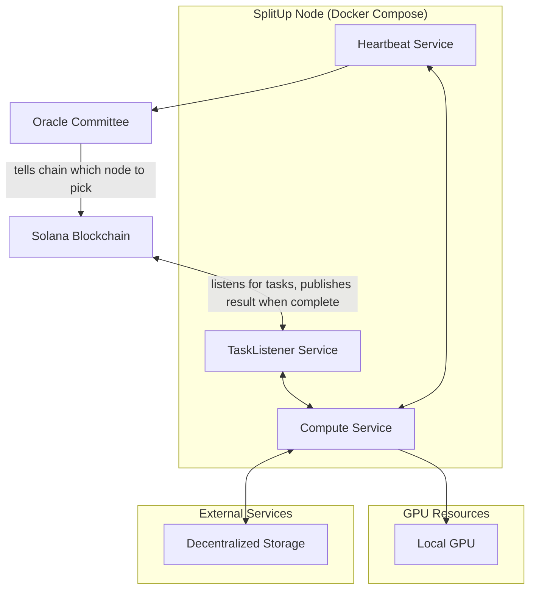
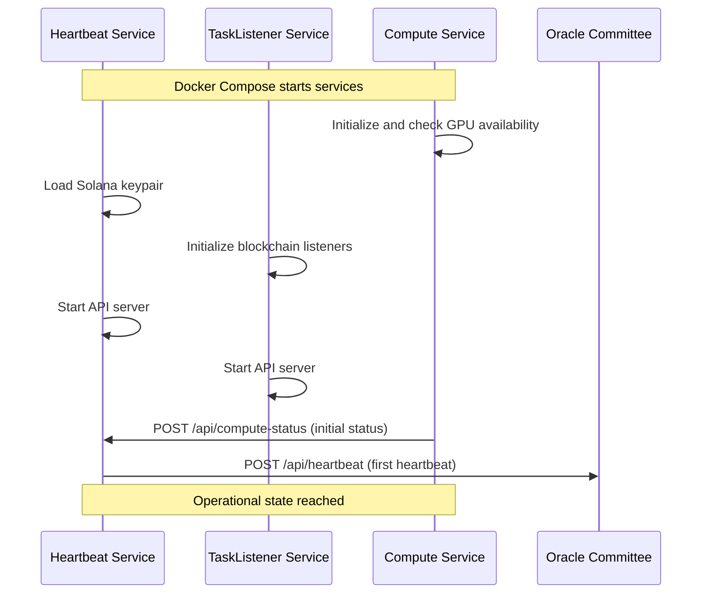
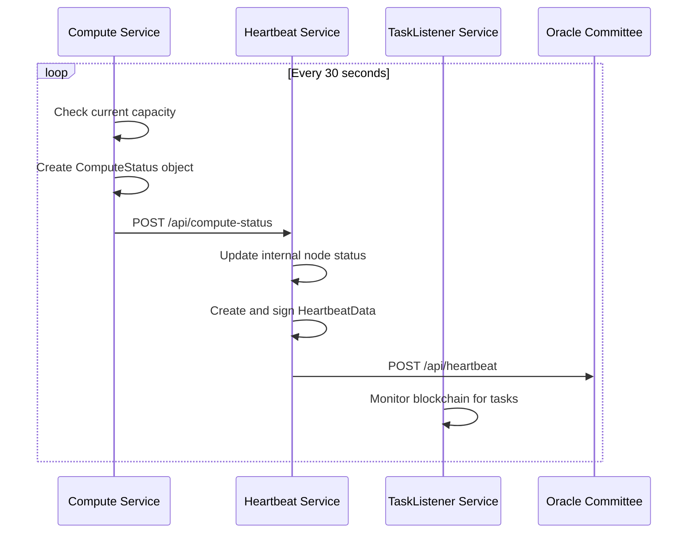

# SplitUp Node: Component Orchestration Guide

This document explains how the SplitUp Node components work together to provide reliable ML computation services with proper liveness reporting to the Oracle Committee. It should be read alongside the [Oracle Committee Communication Protocol Specification](../heartbeat/oracle_server.md) which details the specific data formats and APIs.

## System Overview

A SplitUp Node consists of two containerized services:

1. **TypeScript Heartbeat Service**: Maintains communication with the Oracle Committee
2. **Python Compute Service**: Performs ML computations on the GPU

These services work together to ensure both reliable computation and proper network status reporting.



## Service Responsibilities

### TypeScript Heartbeat Service

- Maintains cryptographic identity (Solana keypair)
- Sends regular heartbeats to the Oracle Committee
- Reports node capacity status
- Ensures node liveness is properly tracked

### TypeScript TaskListener Service

- Listens for task assignment events on the Solana blockchain
- Forwards tasks to the Compute Service
- Submits task completion transactions back to the blockchain
- Tracks pending task executions

### Python Compute Service

- Loads and runs ML models on the GPU
- Retrieves input tensors from decentralized storage
- Executes computation tasks
- Stores output tensors to decentralized storage
- Reports task results to the TaskListener

## Docker Compose Configuration

Below is the updated Docker Compose configuration that orchestrates these services:

```yaml
version: "3"

services:
  heartbeat-service:
    build: ./heartbeat-service
    ports:
      - "3000:3000" # Heartbeat service API port
    volumes:
      - ./keys:/app/keys # Mount volume for Solana keys
    environment:
      - NODE_ENV=production
      - HEARTBEAT_INTERVAL_MS=30000
    restart: always
    depends_on:
      - compute-service

  task-listener:
    build: ./task-listener
    ports:
      - "3001:3001" # TaskListener API port
    volumes:
      - ./keys:/app/keys # Same keys as heartbeat service
    environment:
      - NODE_ENV=production
      - SOLANA_RPC_URL=https://api.mainnet-beta.solana.com
      - SPLITUP_PROGRAM_ID=YOUR_PROGRAM_ID_HERE
    restart: always
    depends_on:
      - compute-service

  compute-service:
    build: ./compute-service
    ports:
      - "8000:8000" # Compute service API port
    volumes:
      - ./model-cache:/app/model-cache # Cache for model weights
      - ./tensor-cache:/app/tensor-cache # Cache for tensors
    environment:
      - ENVIRONMENT=production
      - STORAGE_API_URL=https://URL_HERE.TLD
    restart: always
    deploy:
      resources:
        reservations:
          devices:
            - driver: nvidia
              count: 1
              capabilities: [gpu]
```

## Communication Flow

### Service Initialization



### Regular Status Updates



### Task Completion

This flow is described in detail within [`task_completion.md`](./task_completion.md)
