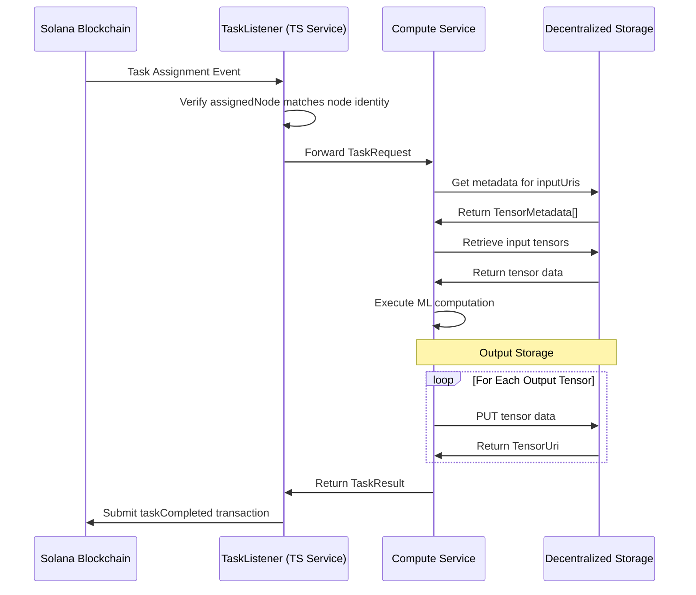

# SplitUp Task Execution Protocol Specification

This document details the communication protocols and data types used by SplitUp nodes to execute ML computation tasks based on blockchain events.

## System Overview

The SplitUp Task Execution system enables nodes to:

1. Listen for task assignments on the Solana blockchain
2. Retrieve input tensors from decentralized storage
3. Execute ML computation tasks
4. Store result tensors in decentralized storage
5. Report task completion back to the blockchain

## Network Communication Protocols

### Task Execution Flow



## Data Types Specification

### Task Assignment Types

```typescript
// Task-related Types

/** Unique task identifier */
export type TaskId = string;

/** Unique model identifier */
export type ModelId = string;

/** Unique execution identifier */
export type ExecutionId = string;

/** URI pointing to tensor data in storage */
export type TensorUri = string;

/** Task assignment data from blockchain */
export interface TaskAssignmentData {
  executionId: ExecutionId; // Execution instance ID
  taskId: TaskId; // Task to execute
  modelId: ModelId; // Model to use
  inputUris: TensorUri[]; // Input tensor URIs
  expectedOutputCount: number; // Number of output tensors
  deadline: Timestamp; // Execution deadline
  computeUnits: number; // Computational complexity measure
  assignedNode: NodeAddress; // Assigned node address
}

/** Tensor metadata */
export interface TensorMetadata {
  shape: number[]; // Tensor dimensions
  dtype: string; // Data type (float32, int8, etc.)
  name?: string; // Optional tensor name
  isWeights?: boolean; // Whether tensor is model weights
}

/** Task completion data for blockchain */
export interface TaskCompletionData {
  executionId: ExecutionId; // Execution instance ID
  taskId: TaskId; // Completed task
  outputUris: TensorUri[]; // Output tensor URIs
  executionTime: number; // Execution time in milliseconds
  nodeAddress: NodeAddress; // Node that executed the task
}
```

### Compute Service Communication Types

```typescript
/** Task execution request */
export interface TaskRequest {
  taskId: TaskId; // Task identifier
  modelId: ModelId; // Model identifier
  executionId: ExecutionId; // Execution instance ID
  inputUris: TensorUri[]; // Input tensor locations
  outputCount: number; // Expected number of outputs
  deadline?: Timestamp; // Execution deadline
}

/** Task execution result */
export interface TaskResult {
  taskId: TaskId; // Task identifier
  executionId: ExecutionId; // Execution instance ID
  success: boolean; // Whether execution succeeded
  outputUris: TensorUri[]; // Output tensor locations
  executionTime: number; // Execution time in milliseconds
  errorMessage?: string; // Error details if failed
}
```

## Components

### 1. Blockchain Event Listening

**Event Types**:

- `TaskAssigned`: When a task is assigned to this node
- `ExecutionCancelled`: When an execution is cancelled before completion

**Event Parsing**:

- Node filters events by its own public key
- Events include all necessary data to execute the task
- Node validates event signature and data integrity

### 2. Task Execution Protocol

**Endpoint**: `POST /api/task`

**Request Body**: `TaskRequest`

- Contains all necessary information to execute a task
- Includes URIs to retrieve inputs

**Response**: `TaskAcceptedResponse`

- Indicates whether the task was accepted
- Tasks may be rejected if node is at capacity

**Task Execution Flow**:

1. Node retrieves input tensors from storage
2. Node executes the ML computation
3. Node stores output tensors to storage
4. Node reports completion to blockchain

## Conclusion

The SplitUp Task Execution Protocol enables ML computation to be distributed across specialized nodes in a verifiable manner. By separating the blockchain interaction (TypeScript service) from the actual computation (Python service), the system achieves both security and computational efficiency. The decentralized storage layer ensures that tensor data can be efficiently shared between tasks while maintaining proper type information.
