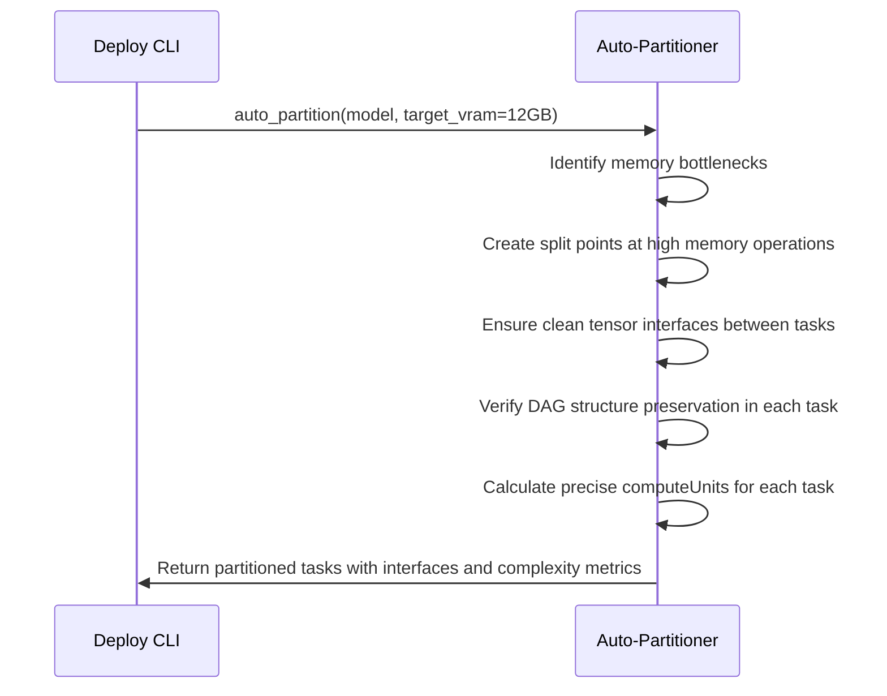
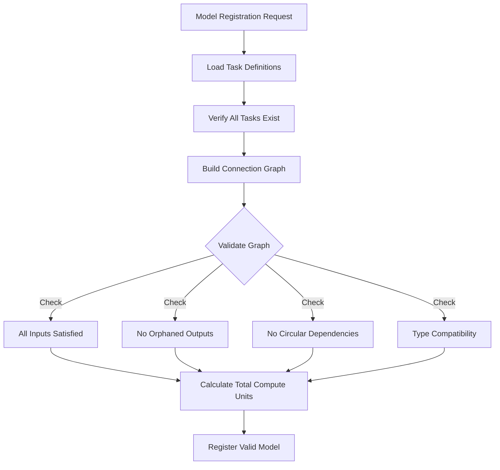
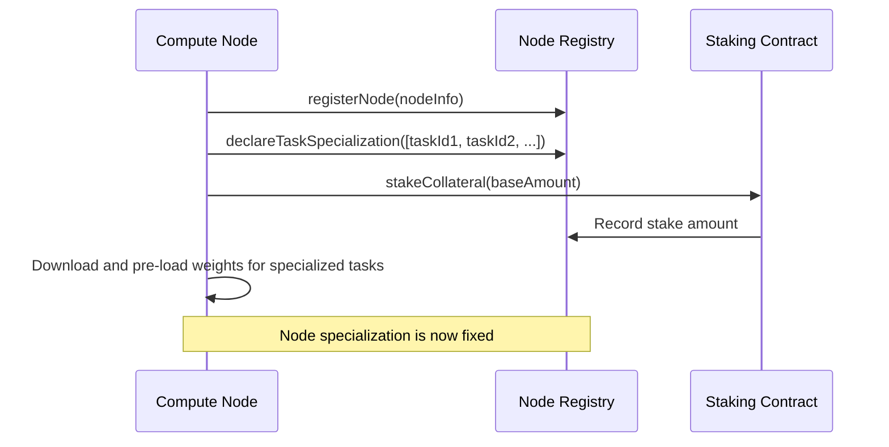
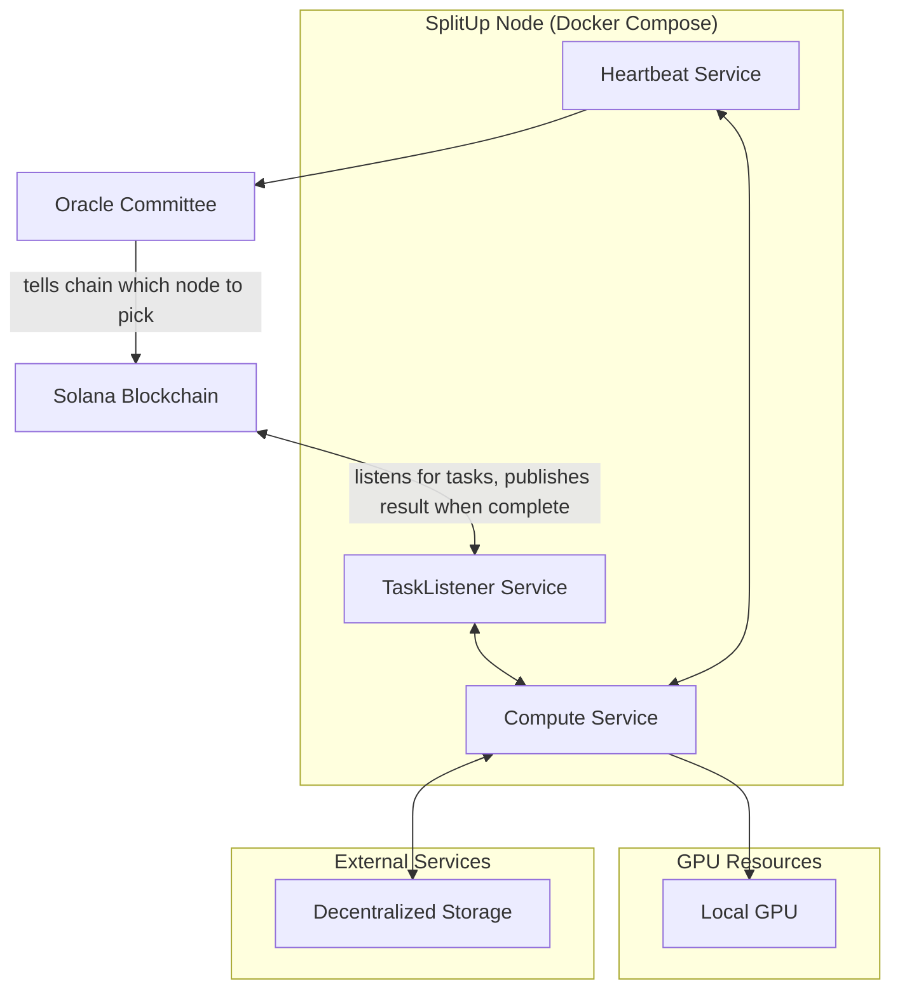
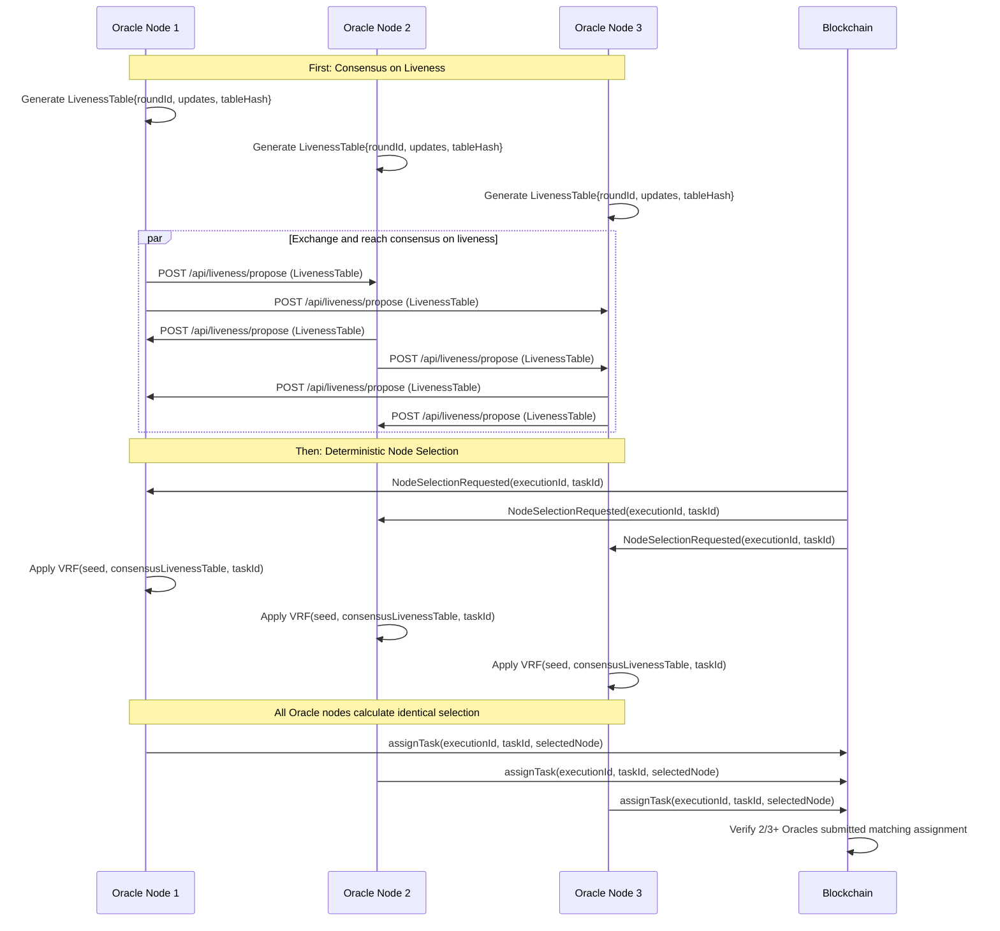
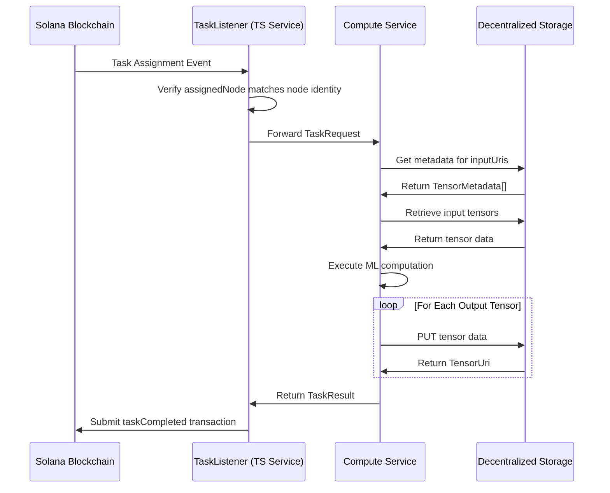
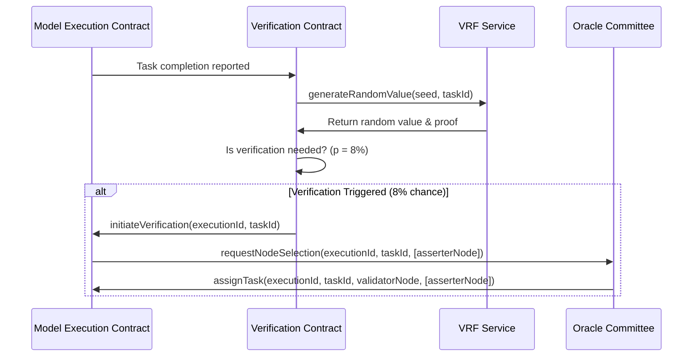

# SplitUp: A First-Principles Explanation (Complete)

## 1. The Core Problem

Modern AI models like LLaMA-70B require 80-140GB of VRAM (Video RAM on graphics cards), but consumer GPUs typically only have 8-24GB. This creates a fundamental limitation: even if you have a powerful consumer GPU, you simply can't run these large models on your hardware.

## 2. Our Solution: High-Level Overview

SplitUp allows large AI models to run across multiple consumer GPUs by:

1. Breaking models into smaller "tasks" that function as pure computations with typed tensor interfaces
2. Creating a marketplace where GPU owners can specialize in specific tasks
3. Coordinating the execution of these tasks to run complete models
4. Ensuring correct results through efficient verification (only 8% overhead)
5. Using USDC for payments and economic security guarantees

## 3. The Technical Components

### 3.1. Model Partitioning

**Problem:** Large models don't fit in consumer GPU memory

**Solution:** We automatically split models into smaller pieces (tasks) with predictable computation requirements

```
ModelDev->>CLI: "splitup-deploy register --model llama-70b.pkl --target-vram 12GB"
```

As detailed in [`model_deployment/index.md`](concrete_plans/model_deployment/index.md), this process:

- Loads the model using TinyGrad (a lightweight ML framework)
- Analyzes its computational graph (the mathematical flow of operations)
- Finds optimal split points where memory usage peaks
- Creates independent tasks with strictly typed tensor interfaces between them

**Critical Feature: DAG Structure Preservation**

Each individual task itself is a directed acyclic graph (DAG) of operations.

The DAG structure ensures deterministic execution with predictable operation counts, allowing precise cost estimation, preventing infinite loops or unpredictable runtime costs, and providing transparent billing where computational costs are known before execution. This is possible because DAGs have a one-directional flow of information through the chain of operations with no cycles, making it impossible to create loops that could repeat indefinitely.

The Auto-Partitioner carefully preserves this DAG structure while splitting the model:



**Key Terms:**

- **Computational graph**: A representation of all mathematical operations in the model as a flowchart
- **DAG (Directed Acyclic Graph)**: A strict one-way flow structure with no cycles, ensuring finite execution time
- **Task**: A pure function that takes typed tensor inputs and produces typed tensor outputs
- **Tensor**: A multi-dimensional array with explicit shape and data type (e.g., int8, float16, float32)
- **computeUnits**: A standardized measure of computational complexity used for predictable billing

### 3.2. Task & Model Structure Definition

After partitioning, we explicitly define:

1. Each individual task with its typed tensor interfaces
2. How the tasks connect to form the complete model

**Critical Feature: Fully Connected Model DAG**

When combining multiple tasks into a complete model, we must ensure they form a proper Directed Acyclic Graph (DAG) where:

1. **All inputs are satisfied** - Every task must receive all required input tensors, either from the model's initial input or from predecessor tasks
2. **No orphaned outputs** - Every task's output must either feed into another task or be part of the model's final output
3. **No redundant computations** - No task should perform calculations that aren't used in subsequent processing
4. **No circular dependencies** - Tasks must form a strict forward-flowing graph to prevent infinite loops
5. **Type compatibility** - Every connection between tasks must have matching tensor specifications (dimensions, shape, data type)

The Model Registry contract performs comprehensive validation of these properties during model registration:



**Why This Matters:**

1. **Computational Efficiency** - Eliminates wasted computation and storage of unused tensors
2. **Cost Optimization** - Users only pay for necessary computation
3. **Predictable Execution** - Ensures model will complete without unexpected failures
4. **Security** - Prevents potential exploit vectors from improperly connected tasks
5. **Deterministic Results** - Guarantees consistent outputs given the same inputs

We use Solana smart contracts for this validation, as defined in [`smart_contracts/index.md`](concrete_plans/smart_contracts/index.md):

```typescript
// From smart_contracts/index.md
interface ModelRegistry {
  // Registration Function (One-time only)
  registerModel(modelInfo: ModelInfo): ModelId;

  // Query Functions
  getModelInfo(modelId: ModelId): ModelInfo;
  getModelDAG(modelId: ModelId): TaskConnection[];
  listModels(): ModelId[];
}

interface TaskRegistry {
  // Registration Function (One-time only)
  registerTask(taskInfo: TaskInfo): TaskId;

  // Query Functions
  getTaskInfo(taskId: TaskId): TaskInfo;
  getTasksByModel(modelId: ModelId): TaskId[];
  getTaskRequirements(taskId: TaskId): TaskRequirements;
}
```

The ModelRegistry contract performs extensive validation during registration to ensure all task connections form a properly structured DAG. If any validation fails, the model registration is rejected with a specific error indicating which connectivity requirement was violated.

**Key Terms:**

- **Task Registry**: Contract that stores task definitions with explicit input and output tensor specifications
- **Model Registry**: Contract that stores how tasks connect to form a model
- **DAG (Directed Acyclic Graph)**: A flowchart structure showing which tasks depend on others
- **TaskConnection**: A specification of how output tensors from one task connect to input tensors of another
- **Weight URI**: A reference to where the model weights are stored (not on Solana)

### 3.3. Decentralized Storage Strategy

Because Solana can't efficiently store large files, we use external decentralized storage for:

1. Model weights (parameters that define the model's behavior)
2. Input tensors
3. Intermediate tensor results between tasks
4. Final output tensors

**Key Storage Implementation Details:**

- Each tensor has a unique URI
- Tensors include explicit type information (TensorSpec) including dimensions, shape, and data type
- Intermediate tensors have automatic time-to-live for garbage collection
- We're implementing a specialized storage backend for efficient tensor operations
- Nodes handling adjacent tasks can maintain local copies to reduce transfer costs

This separation means Solana only handles coordination, while actual tensor data flows through external storage.

### 3.4. Node Specialization and Task Registration

**Core Concept:** Nodes explicitly declare which tasks they will perform, ensuring they only receive work they're prepared to execute.

As detailed in [`smart_contracts/index.md`](concrete_plans/smart_contracts/index.md), nodes must specify their specializations during registration:

```typescript
// From smart_contracts/index.md
interface NodeRegistry {
  // Registration and Staking
  registerNode(nodeInfo: NodeInfo): void;

  // Task Specialization
  declareTaskSpecialization(taskIds: TaskId[]): void;
}
```

**Why This Matters:**

1. **Efficient Resource Use** - Nodes only perform tasks for which they have the weights pre-cached, and don't need to cache the data for every model on the network
2. **Implied Capability** - By specializing in a task, a node commits to having sufficient VRAM and compute power
3. **Execution Reliability** - Nodes commit to specific tasks they're prepared to execute

**Task Registration Process:**

```
NodeOp->>NodeCLI: "splitup-node register --model-id llama-70b --tasks 1,2"
```

When registering, a node:

1. **Explicitly selects specific tasks** to specialize in
2. Downloads and pre-loads weights for those tasks into GPU memory
3. Stakes USDC as security collateral
4. Implicitly certifies it has sufficient hardware resources to execute its chosen tasks

As specified in [`smart_contracts/index.md`](concrete_plans/smart_contracts/index.md):



**Integration with Oracle Committee:**

The Oracle Committee (they pick which nodes should perform each instance of a task), described in [`heartbeat_oracle/index.md`](concrete_plans/heartbeat_oracle/index.md), is bound by these specialization declarations:

```typescript
// From smart_contracts/index.md
function assignTask(executionId, taskId, nodeAddress) {
  // Oracle Committee can only assign tasks that a node has specialized in
  require(nodeRegistry.isSpecializedForTask(
    nodeAddress,
    taskId,
  ), "Node not specialized for task");

  // Assign the task
  assignments[executionId][taskId] = nodeAddress;
}
```

This ensures nodes only receive tasks they've explicitly opted into performing, with all necessary weights already loaded and ready for immediate execution.

Each SplitUp Node consists of containerized services as detailed in [`compute_client/index.md`](concrete_plans/compute_client/index.md):



**Key Terms:**

- **Pre-loading**: Loading model weights into GPU memory in advance for instant execution
- **isSpecializedForTask**: Function that enforces the task-node specialization relationship

### 3.5. Node Liveness System

To ensure system reliability, we implement a comprehensive liveness tracking system detailed in [`heartbeat/oracle_server.md`](concrete_plans/heartbeat/oracle_server.md):

1. **Heartbeat Mechanism**:

   ```mermaid
   sequenceDiagram
       participant N as Node (TS Service)
       participant O as Oracle Committee

       N->>N: Generate HeartbeatData{timestamp, nodeStatus, hasCapacity}
       N->>N: Sign to create SignedHeartbeatData{payload, signature, publicKey}
       N->>O: POST /api/heartbeat (SignedHeartbeatData)
       O->>N: Return HeartbeatResponse{success, message, timestamp, status}
   ```

   - Each node sends cryptographically signed heartbeats every 30 seconds
   - Heartbeats include node status and VRAM availability
   - Missing heartbeats trigger a grace period before a node is marked offline

2. **Failure Detection**:
   - After 3 consecutive missed heartbeats (90 seconds), a node is marked offline
   - Active tasks receive timeout warnings
   - Tasks are reassigned after their specific timeout period expires

### 3.6. Oracle Committee: Verifiable Node Selection Through Consensus

As detailed in [`heartbeat_oracle/index.md`](concrete_plans/heartbeat_oracle/index.md), the Oracle Committee is a Byzantine Fault Tolerant (BFT) system of multiple oracle nodes that:

1. Track the liveness status of all compute nodes in the network
2. Reach consensus about which nodes are currently online and available
3. **Deterministically select nodes** for task execution using a Verifiable Random Function (VRF)
4. After reaching consensus, publish the node assignment to the blockchain, linking specific compute nodes to specific task instances (identified by `ExecutionID` and `TaskID`)

**Why VRFs and Consensus Are Critical:**

1. **Guaranteed Fairness** - VRFs provide provably random but deterministic selection that cannot be manipulated
2. **Unanimous Selection** - All Oracle nodes independently calculate the same node selection given the same inputs
3. **Verifiable Process** - The selection can be independently verified by any observer
4. **Prevents Manipulation** - No single Oracle member can influence which node gets selected

This makes it possible for PoSP, our protocol for ensuring computations are correct, functions as expected: if colluding nodes can be selected to verify each-other's computation, the entire security model falls apart.



**The Selection Process in Detail:**

1. **Shared Inputs**: All Oracle nodes work with:

   - The same agreed-upon liveness status (which nodes are online)
   - The same task requirements
   - The same VRF seed (derived from a recent block hash)
   - The same execution ID

2. **Deterministic Algorithm**:

   - Filter for nodes that specialize in the required task
   - Filter for nodes that are currently online
   - Apply the VRF to deterministically select a node
   - Sign the selection result

3. **Consensus Validation**:
   - Blockchain contract only accepts assignment when a supermajority (2 of 3) of Oracle nodes submit the same selection
   - This prevents a minority of malicious Oracle nodes from influencing selection

**Why This Matters:**

Without this consensus-based selection process, individual Oracle nodes could assign tasks to colluding nodes and thus undermine the integrity of the Proof of Sampling verification.

By requiring consensus on both node liveness and node selection, the system guarantees that task assignment is fair, transparent, and resistant to manipulation—critical properties for a system that handles valuable computation and relies on probabilistic verification for security.

### 3.7. Execution Coordination

When a user wants to run an inference:

```
Client->>ModelContract: executeModel(modelId, inputUri, maxFee)
```

As specified in [`smart_contracts/index.md`](concrete_plans/smart_contracts/index.md), the Model Execution contract then:

```typescript
interface ModelExecution {
  // Execution Initiation (User-facing)
  requestModelExecution(
    modelId: ModelId,
    inputUri: TensorUri,
    maxFee: number,
  ): ExecutionId;

  // Oracle-Controlled Task-Node Assignment
  assignTask(
    executionId: ExecutionId,
    taskId: TaskId,
    nodeAddress: string,
  ): void;

  // Node-Facing Functions
  reportTaskCompletion(
    executionId: ExecutionId,
    taskId: TaskId,
    outputUris: TensorUri[],
  ): void;
}
```

**Node Selection Process:**

1. **Filtering**: Find all live nodes specialized in the required task
2. **Deterministic Selection**: Use a verifiable random function (VRF) seeded with a block hash

**Task Timeout Handling:**

- Each task has a dynamic timeout based on its computational complexity (computeUnits)
- If a task fails, it's reassigned with exponential backoff (double timeout)
- The system maintains checkpoints after each task completion for partial recovery

### 3.8. Task Execution Flow

As detailed in [`compute_client/task_completion.md`](concrete_plans/compute_client/task_completion.md), the complete task execution flow is:



### 3.9. Verification: Proof of Sampling Protocol (PoSP)

Traditional verification would double costs by running every task twice. Our PoSP approach, as detailed in [`smart_contracts/proof_of_sampling.md`](concrete_plans/smart_contracts/proof_of_sampling.md), is much more efficient:

1. For each task, there's only an 8% probability of verification
2. If selected, a second node re-computes the pure function task with identical inputs
3. Output tensors are compared for exact equality
4. Economic incentives make honesty more profitable than cheating

**Verification Process:**



**Economics of Verification:**

- If a node is honest: It receives payment in USDC
- If a node cheats and isn't caught (92% chance): It receives payment without doing the work
- If a node cheats and is caught (8% chance): It loses staked USDC worth 10x the task payment

### 3.10. Economic Security Model

The system uses a precisely calibrated economic model as described in both smart contract documents:

- Nodes stake USDC as security collateral (1000 USDC base + 100 USDC per GB of VRAM)
- Task payments are fixed based on computational complexity (computeUnits)
- Verification rewards are 1.2x the computation cost
- Slashing penalties are 10x the computation cost

The mathematical security condition is:

```
p > C/((1-r)(R+S))
```

Where:

- p = verification probability (8%)
- C = computation cost
- r = maximum collusion fraction (10%)
- R = verification reward (1.2x)
- S = slashing amount (10x)

With these parameters, dishonesty has negative expected value, ensuring system integrity.

## 4. The Complete Workflow

Let's walk through the entire process:

### 4.1. Preparation Phase

1. **Model Registration**:

   - Developer partitions model into pure function tasks with typed tensor interfaces
   - Uploads weights to decentralized storage
   - Registers tasks and model structure on Solana with explicit tensor specifications

2. **Node Registration**:
   - Stake USDC as security
   - Specialize in specific tasks, pre-loading weights for them
   - Begin sending regular heartbeats to prove availability

### 4.2. Execution Phase

1. **Inference Request**:

   - User uploads input tensors to decentralized storage
   - Submits request with maximum fee and tensor URI
   - Model Execution contract begins orchestration

2. **Task Assignment**:

   - Oracle Committee listens for unassigned task instances
     - Watching Model Execution contract state
     - There's an `ExecutionID` for each instance of task executed
   - Oracle Committee selects specialized nodes for each task
   - Oracle Committee updates contract state to assign nodes

3. **Computation**:

   - Nodes listen for task assignments
     - Watching Model Execution contract state
   - Nodes retrieve input tensors from storage
   - Nodes execute pure function tasks
   - Upload output tensors to storage
   - Report completion with output tensor URIs

4. **Verification**:

   - 8% of tasks randomly verified by other nodes
   - Output tensors compared for exact equality
   - Disputes resolved by Oracle Committee
   - USDC payments and penalties distributed

5. **Result Delivery**:
   - Final output tensor URI returned to user
   - User retrieves complete result from storage

## 5. Advanced Features

1. **Fault Tolerance**: If a node fails (detected by missing heartbeats), the task is automatically reassigned with appropriate backoff.

2. **Multi-Task Assignment**: Nodes with higher VRAM can handle multiple adjacent tasks, improving efficiency by reducing tensor transfer overhead.

3. **Parallel Execution**: Independent branches of the model execute simultaneously on different nodes, following the DAG structure.

4. **Checkpoint Recovery**: The system maintains execution state checkpoints after each task, enabling partial recovery by preserving all intermediate tensors.

5. **Dynamic Task Prioritization**: Critical path tasks receive higher priority to minimize overall latency.

By constructing this system from first principles, SplitUp creates a decentralized marketplace that makes large AI models accessible on consumer hardware with mathematical security guarantees and robust operational reliability.
