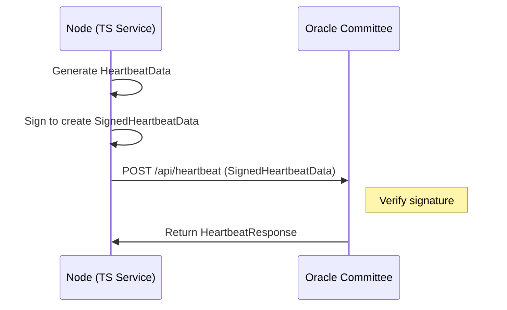
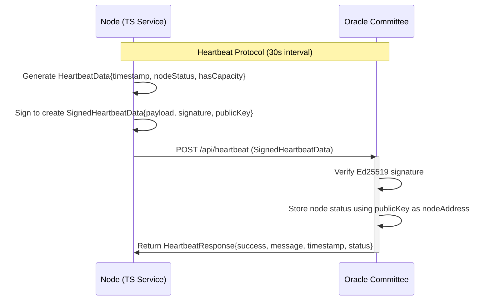
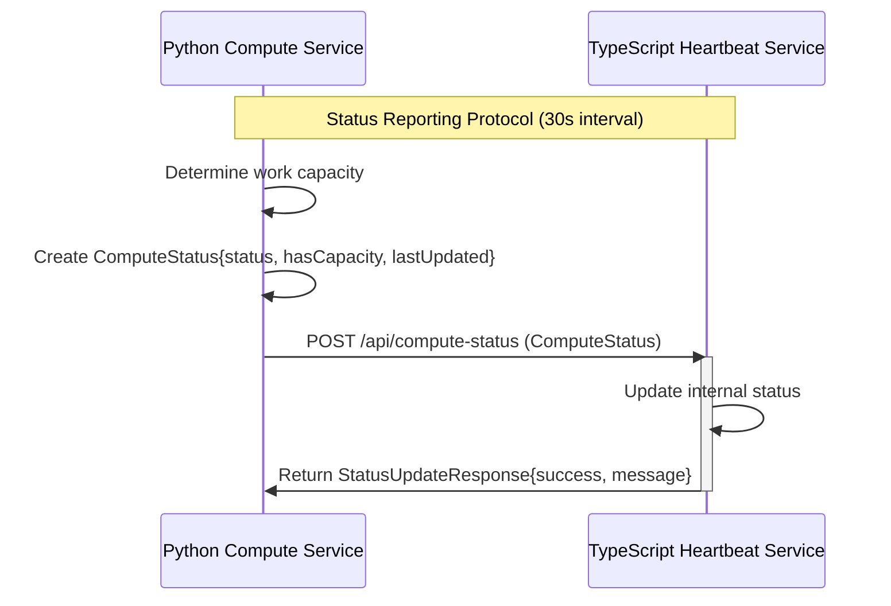

# SplitUp Node & Oracle Committee Communication Protocol Specification

This document details the liveness heartbeat protocol between the SplitUp Oracle Committee and Node clients, focusing on the core heartbeat mechanism for tracking node availability.

## Network Communication Protocols

### Node-to-Oracle Committee Protocol



## Data Types Specification

### Node-to-Oracle Committee Communication Types

```typescript
// Network Types for Node-Oracle Committee Protocol

/** Node's unique Solana address */
export type NodeAddress = string;

/** Unix timestamp in seconds */
export type Timestamp = number;

/** Possible node status values */
export type NodeStatus = "online" | "offline" | "unknown";

/** Core heartbeat data payload */
export interface HeartbeatData {
  timestamp: Timestamp; // Current time
  nodeStatus: NodeStatus; // Node status
  hasCapacity: boolean; // Whether node can accept more work
}

/** Cryptographically signed heartbeat data */
export interface SignedHeartbeatData {
  payload: HeartbeatData; // The heartbeat data
  signature: string; // Base58-encoded Ed25519 signature
  publicKey: string; // Base58-encoded Solana public key
}

/** Response to a heartbeat submission */
export interface HeartbeatResponse {
  success: boolean; // Whether heartbeat was accepted
  message: string; // Human-readable status message
  timestamp: Timestamp; // Server timestamp
  status: NodeStatus; // Current status according to Oracle Committee
}

/** Node status information */
export interface NodeStatusData {
  nodeAddress: NodeAddress; // Node's Solana address
  lastHeartbeat: Timestamp | null; // Last received heartbeat time
  status: NodeStatus; // Current node status
  hasCapacity: boolean; // Whether node can accept more work
}

/** System-wide statistics */
export interface OracleStats {
  totalNodes: number; // Total registered nodes
  onlineNodes: number; // Currently online nodes
  availableNodes: number; // Online nodes with capacity
  offlineNodes: number; // Currently offline nodes
  totalHeartbeats: number; // Total heartbeats received
  startTime: Timestamp; // When Oracle Committee started
}
```

### Intra-Node Communication Types

```typescript
// Network Types for Intra-Node Communication

/** Simplified compute service status */
export interface ComputeStatus {
  status: "idle" | "busy" | "error"; // Current activity state
  hasCapacity: boolean; // Whether node can accept more work
  lastUpdated: Timestamp; // When status was last updated
}

/** Response to status update */
export interface StatusUpdateResponse {
  success: boolean; // Whether update was accepted
  message: string; // Any relevant message
}
```

## Protocol Flows with Explicit Type References

### Heartbeat Protocol Flow



### Intra-Node Status Reporting Protocol



## Protocol Specifications

### 1. Heartbeat Protocol

**Endpoint**: `POST /api/heartbeat`

**Request Body**: `SignedHeartbeatData`

- Must include valid Ed25519 signature
- Timestamp must be within ±60 seconds of server time
- `publicKey` is used as the node's address identifier
- Must include `nodeStatus` and `hasCapacity` flags

**Response**: `HeartbeatResponse`

- Indicates acceptance and current node status

**Frequency**: Every 30 seconds

- Missing 3 consecutive heartbeats (90 seconds) marks node offline

**Security**:

- Relies on Solana Ed25519 signatures
- Prevents replay attacks via timestamp validation
- Node identity is derived from the public key

### 2. Oracle Committee Status Lookup Protocol

**Endpoint**: `GET /api/stats`

**Response**: `OracleStats`

- Returns current system-wide statistics including available nodes

**Usage**:

- Used by task coordinators to check overall system status
- Used by monitoring systems to track network health

### 3. Compute Status Protocol (Intra-Node)

**Endpoint**: `POST /api/compute-status`

**Request Body**: `ComputeStatus`

- Simplified to include only capacity information

**Response**: `StatusUpdateResponse`

- Simple acknowledgment response

**Frequency**:

- Every 30 seconds for regular updates
- Immediate update on status changes

**Purpose**:

- Enables the heartbeat service to accurately report capacity to Oracle
- No detailed metrics needed, only availability status

## Implementation Considerations

### HTTP Status Codes

All protocols should use standard HTTP status codes:

- `200 OK`: Successful request
- `400 Bad Request`: Invalid request data
- `401 Unauthorized`: Invalid signature
- `404 Not Found`: Node/resource not found
- `500 Internal Server Error`: Server-side error

### Content Types

- All requests and responses use `application/json` content type

### Error Handling

All error responses should follow a consistent format:

```typescript
interface ErrorResponse {
  success: false;
  message: string;
  errorCode?: string;
}
```

### Request Timeouts

- Oracle requests: 5 second timeout
- Intra-node requests: 2 second timeout

## Conclusion

This simplified protocol specification focuses exclusively on the heartbeat mechanism that enables the Oracle Committee to track node liveness and capacity. By limiting the shared information to just what's necessary for node selection (online status and capacity), we maintain a clean separation of concerns. The Oracle Committee doesn't need to know what tasks a node is running or detailed resource metrics - it only needs to know if a node is alive and able to accept more work.
