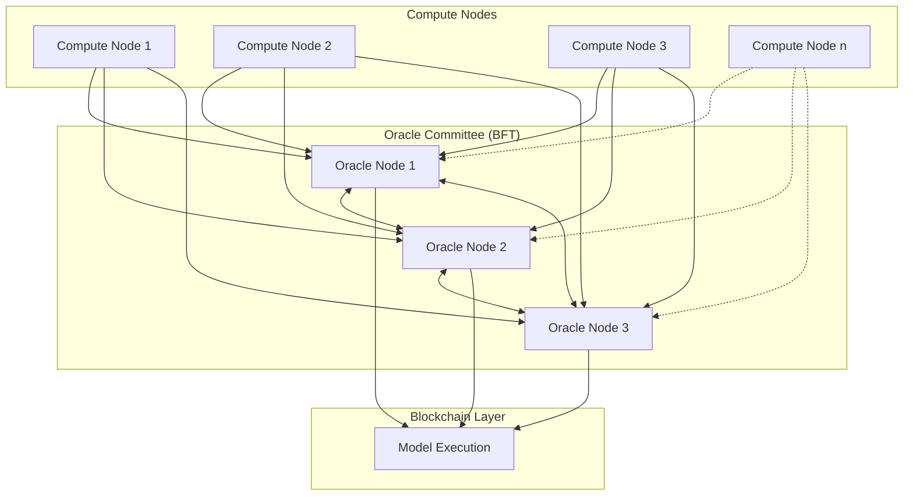
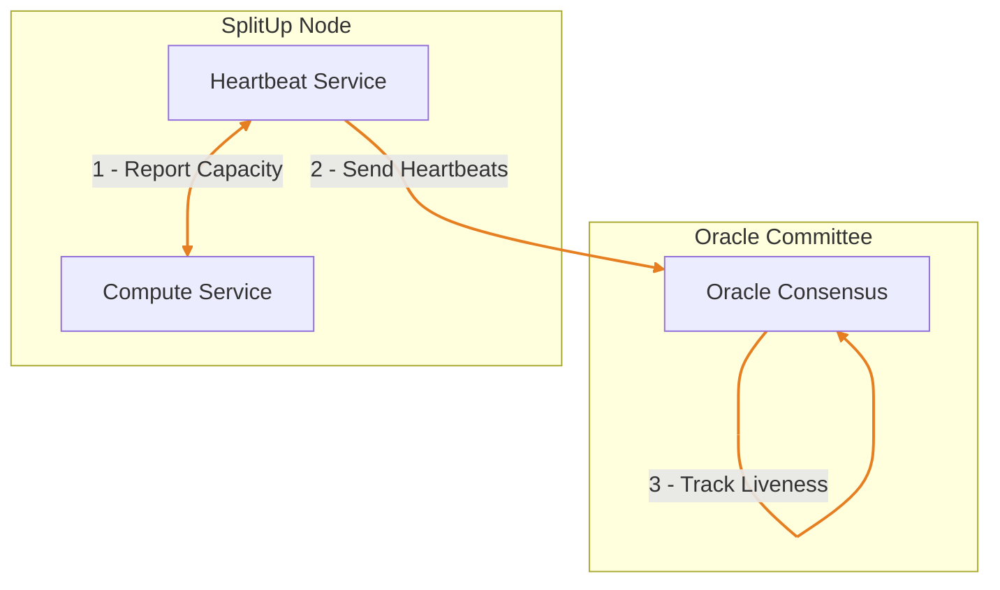
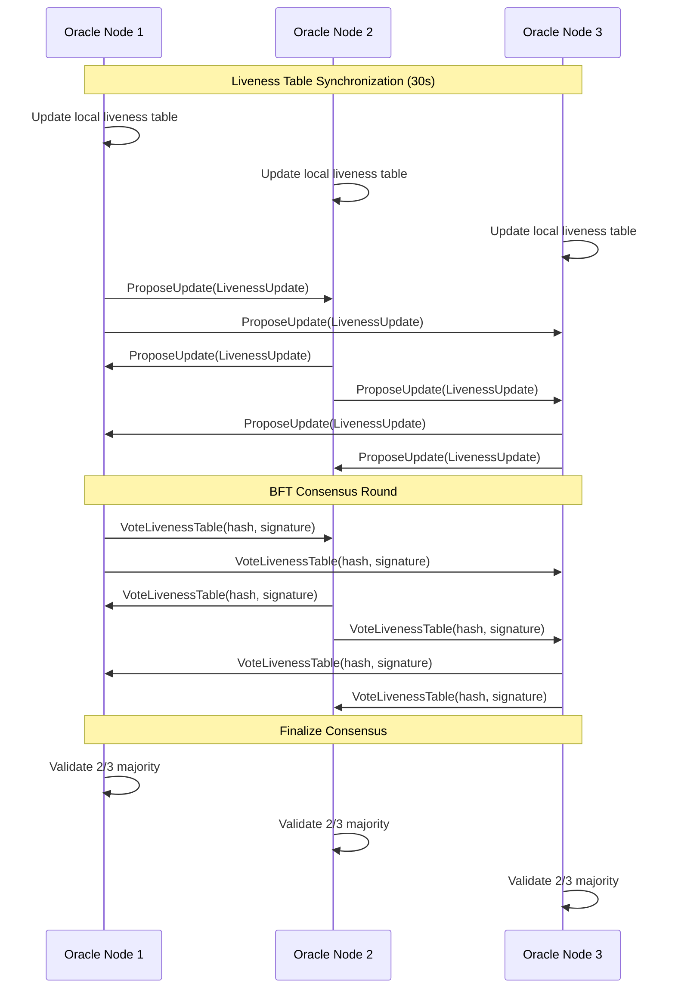
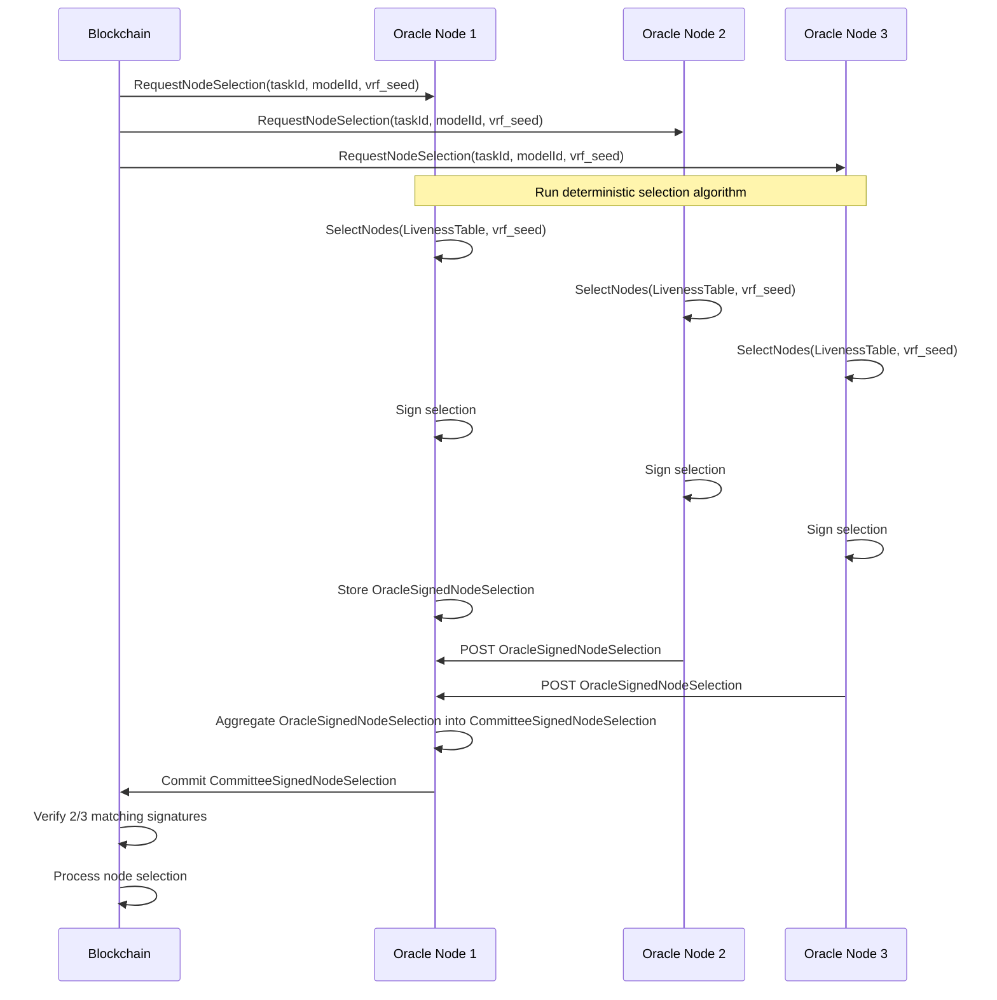
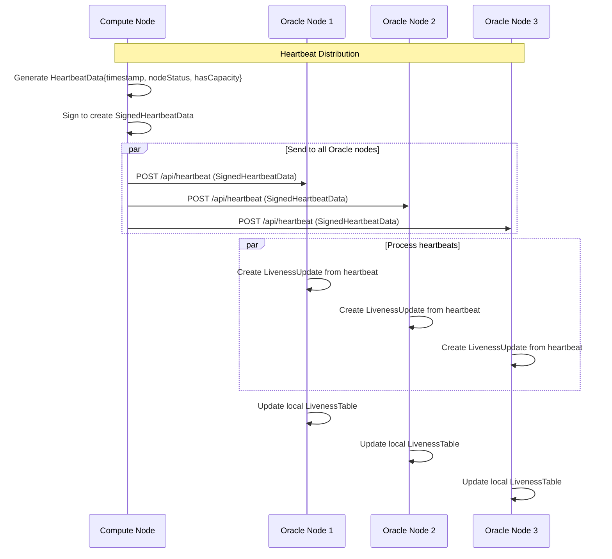
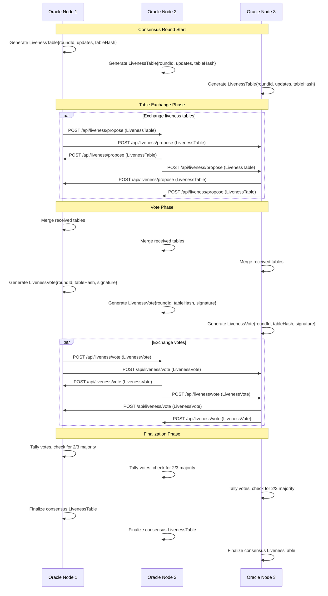
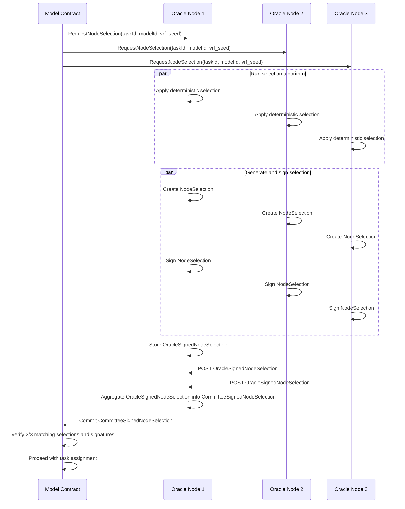

# SplitUp Oracle Committee: Consensus Protocol Specification

This document details the Oracle Committee consensus protocol in the SplitUp network, focusing on how liveness data is tracked, consensus is reached, and computation nodes are selected.

## System Overview

The SplitUp Oracle Committee is a Byzantine Fault Tolerant (BFT) system consisting of multiple oracle nodes that work together to:

1. Track the liveness status of all compute nodes in the network
2. Reach consensus about which nodes are currently online and available
3. Provide deterministic node selection recommendations to the blockchain
4. Validate node selection algorithms for fairness and correctness
5. Ensure economic security through multi-signature authorizations





## Network Communication Protocols

### Oracle-to-Oracle Protocol



### Oracle-to-Blockchain Protocol



## Data Types Specification

### Oracle Committee Types

```typescript
/** Oracle node identifier */
export type OracleId = string;

/** Consensus round identifier */
export type RoundId = number;

/** Hash of liveness table */
export type TableHash = string;

/** Liveness update for a specific node */
export interface LivenessUpdate {
  nodeAddress: NodeAddress; // Address of the node
  lastHeartbeat: Timestamp; // Last heartbeat time
  status: NodeStatus; // Current status
  hasCapacity: boolean; // Whether node has capacity
  oracleId: OracleId; // Oracle that received the update
  updateTime: Timestamp; // When update was received
}

/** Complete node liveness table */
export interface LivenessTable {
  roundId: RoundId; // Current consensus round
  updates: LivenessUpdate[]; // All node updates
  tableHash: TableHash; // Hash of the sorted table
  timestamp: Timestamp; // When table was created
}

/** Vote on a liveness table */
export interface LivenessVote {
  oracleId: OracleId; // Voting oracle
  roundId: RoundId; // Round being voted on
  tableHash: TableHash; // Hash being voted for
  signature: string; // Signature of the vote
  timestamp: Timestamp; // When vote was cast
}

/** Node selection for a task */
export interface NodeSelection {
  taskId: string; // Task to be executed
  selectedNodes: NodeAddress[]; // Selected nodes in priority order
  vrfSeed: string; // Seed used for selection
  roundId: RoundId; // Liveness round used
  timestamp: Timestamp; // When selection was made
}

/** Signed node selection from individual oracle **/
export interface OracleSignedNodeSelection: {
  selection: NodeSelection;
  signature: string;
}

/** Signed node selection */
export interface CommitteeSignedNodeSelection {
  selection: NodeSelection; // The node selection
  signatures: {
    // Signatures from oracles
    [oracleId: string]: string;
  };
}
```

## Protocol Flows with Explicit Type References

### Heartbeat Collection Flow



### Consensus Protocol Flow



### Node Selection Flow



## Implementation Details

### 1. BFT Consensus Protocol

**Consensus Process**:

- Consensus runs in rounds (every 30 seconds)
- Each oracle independently tracks heartbeats from compute nodes
- Oracles exchange their view of the network
- 2/3 majority required to reach consensus
- Consensus result becomes the authoritative liveness table

**Offline Node Detection**:

- Nodes missing 3 consecutive heartbeats are marked offline
- Oracle Committee requires 2/3 agreement to change node status
- Status transitions have hysteresis to prevent flapping

### 2. Deterministic Node Selection

**Selection Algorithm**:

- Inputs: task requirements, consensus liveness table, VRF seed
- Filter: Match only online nodes with capacity and required specialization
- Ranking: Apply deterministic function based on VRF seed, stake amount, and performance history
- Multi-select: Choose primary and backup nodes if needed

**Selection Security**:

- VRF seed comes from recent blockchain state
- Selection algorithm is pure and deterministic
- All oracles must produce identical results
- Multi-signature prevents manipulation by minority of oracles

### 3. Oracle Committee Structure

**Committee Membership**:

- Initially 3 oracle nodes (2/3 majority threshold)
- (TODO) Economic slashing for malicious behavior

**Oracle Redundancy**:

- System remains functional if minority of oracles fail
- Each compute node sends heartbeats to all oracles
- Oracle Committee members are geographically distributed

## API Specifications

### 1. Heartbeat Collection API

**Endpoint**: `POST /api/heartbeat`

**Request Body**: `SignedHeartbeatData`

- Identical to standard heartbeat protocol
- Must include valid signature

**Response**: `HeartbeatResponse`

- Indicates acceptance

**Processing**:

- Oracle verifies signature
- Oracle stores heartbeat in local database
- Oracle prepares for next consensus round

### 2. Consensus Protocol API

**Endpoint**: `POST /api/liveness/propose`

**Request Body**: `LivenessTable`

- Current view of network liveness from an oracle

**Response**: Simple acknowledgment

**Endpoint**: `POST /api/liveness/vote`

**Request Body**: `LivenessVote`

- Vote on a specific table hash

**Response**: Simple acknowledgment

### 3. Node Selection API

**Endpoint**: `POST /api/selection/request`

**Request Body**:

```typescript
{
  taskId: string;
  modelId: string;
  vrfSeed: string;
  requirements: {
    minVram: number;
    specializations: string[];
  }
}
```

**Response**: `CommitteeSignedNodeSelection`

- Contains selection with oracle signatures

## Conclusion

The SplitUp Oracle Committee provides a crucial BFT consensus layer that ensures reliable tracking of node liveness without requiring on-chain storage of this rapidly changing state. By reaching agreement on which nodes are available, the committee enables deterministic node selection for task execution while maintaining the security and fault tolerance guarantees required by the network.

This approach combines:

1. **Efficiency**: Keeping rapidly changing liveness data off-chain
2. **Security**: Using BFT consensus to prevent manipulation
3. **Determinism**: Ensuring consistent node selection
4. **Redundancy**: Operating through oracle failures
5. **Economic Security**: Aligning incentives through staking

Together, these properties allow the SplitUp network to efficiently distribute computation across nodes while maintaining security guarantees.
