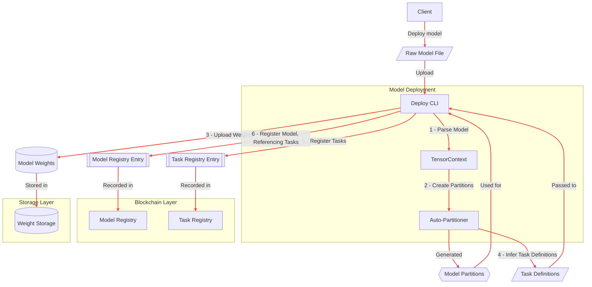

# SplitUp Model Deployment: Automatic Partitioning and Registration

This document details the process of partitioning large ML models and registering them in the SplitUp network, focusing on the automatic task generation and registration workflow.

## System Overview

The SplitUp Model Deployment system enables model developers to:

1. Register large models that would not fit on single consumer GPUs
2. Automatically partition models into smaller tasks based on VRAM constraints
3. Define explicit tensor interfaces between tasks
4. Register model weights to decentralized storage
5. Create an immutable model DAG structure on the blockchain



## Deployment Process

The model deployment workflow consists of several stages:

### 1. Model Loading and Analysis


### 2. Automatic Partitioning


### 3. Task Registration


### 4. Model Registration


## Core Data Types

```typescript
// Model definition types

/** Tensor specifications with explicit type information */
export interface TensorSpec {
  name: string; // Tensor name
  dimensions: string[]; // Symbolic dimensions (e.g., "batch", "sequence")
  shape?: number[]; // Concrete shape if known
  dtype: string; // Data type (float32, float16, int8)
}

/** Connections between tasks */
export interface TaskConnection {
  sourceTaskId: TaskId; // Source task (0 for model inputs)
  destinationTaskId: TaskId; // Destination task (0 for model outputs)
  sourceOutputIndex: number; // Index in source task's outputs
  destInputIndex: number; // Index in destination task's inputs
  tensorSpec: TensorSpec; // Tensor specification
}

/** Task definition with VRAM requirements */
export interface TaskInfo {
  description: string; // Human-readable description
  vramRequirement: number; // VRAM needed in MB
  computeUnits: number; // Computational complexity
  inputs: TensorSpec[]; // Input tensor specifications
  outputs: TensorSpec[]; // Output tensor specifications
  weightUri: string; // URI to immutable weights
}

/** Complete model definition */
export interface ModelInfo {
  name: string; // Model name
  description: string; // Model description
  creator: string; // Creator's address
  taskIds: TaskId[]; // All tasks in this model
  connections: TaskConnection[]; // How tasks connect to each other
}
```

## Auto-Partitioning Algorithms

The partitioning algorithm works by:

1. **Memory Profiling**: Analyzing memory usage across the computational graph
2. **Split Point Selection**: Placing cuts where memory usage exceeds target VRAM
3. **Interface Generation**: Creating clean tensor interfaces between split points
4. **Topological Sorting**: Ensuring DAG structure is preserved after partitioning

Key principles of the partitioning algorithm:

- **Clean Cuts**: Partitions are made at operation boundaries
- **Type Preservation**: Full tensor type information is maintained at interfaces
- **Minimized Communication**: Cuts are placed to minimize tensor size between tasks
- **Balance**: Tasks attempt to use similar amounts of VRAM
- **GPU Efficiency**: Partitioning respects GPU-specific optimization rules

## Immutability Guarantees

The design enforces immutability through:

1. **Immutable Task Definitions**: Tasks cannot be modified after registration
2. **Immutable Model Structure**: The DAG structure cannot be changed
3. **Immutable Weights**: Weight URIs point to content-addressed storage
4. **Explicit Interfaces**: All tensor interfaces are explicitly defined
5. **Blockchain Verification**: All registrations are validated by smart contracts

This immutability ensures that each model version is permanently fixed, allowing:

- Consistent execution across different nodes
- Security guarantees for the PoSP verification system
- Reliable node specialization for specific tasks
- Accurate cost and resource estimation

## Decentralized Storage Integration

Model weights and task definitions are stored in decentralized storage with:

1. **Content-Addressing**: Files are addressed by hash of contents
2. **Typed Storage**: All tensors include explicit type information
3. **Redundancy**: Multiple storage nodes ensure availability
4. **Specialized Format**: Optimized tensor storage format
5. **Validation**: Storage integrity is verified by the storage network

## Example Deployment Command

```bash
# Register a model with target VRAM constraint
splitup-deploy register \
  --model llama-70b.pkl \
  --target-vram 12 \
  --name "LLaMA 70B" \
  --description "Meta's 70B Parameter LLM" \
  --framework tinygrad

# Get model information after registration
splitup-deploy info <model-id>

# Test model execution on the network
splitup-deploy test-execution <model-id> --input-file prompt.json
```

## Conclusion

The SplitUp Model Deployment system enables large models to be automatically partitioned and registered for distributed execution. By focusing on explicit tensor interfaces, immutable definitions, and clean partitioning, the system ensures that models can be reliably executed across multiple specialized nodes while maintaining the security guarantees required by the Proof of Sampling Protocol.
