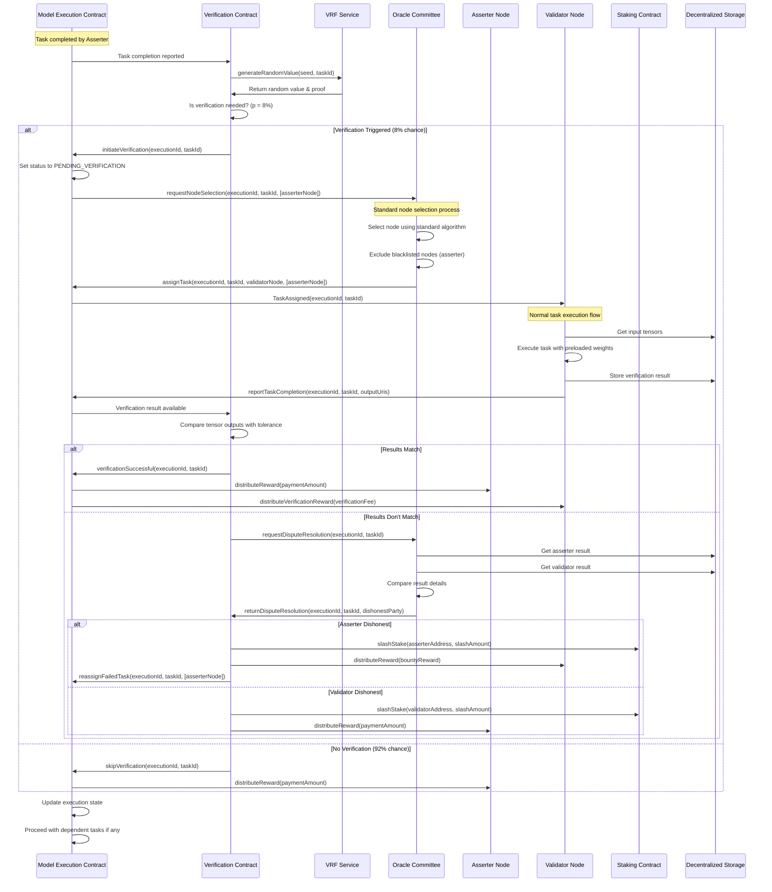
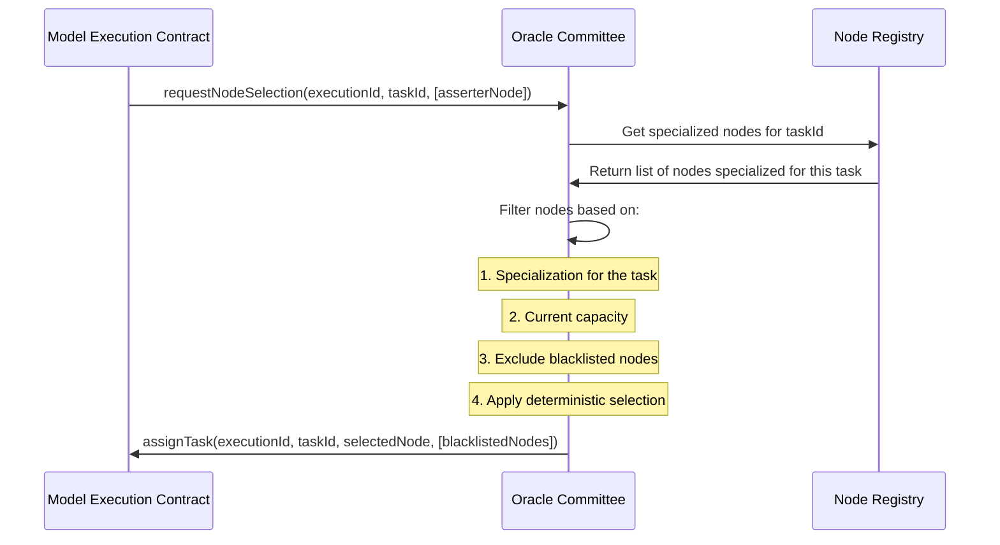
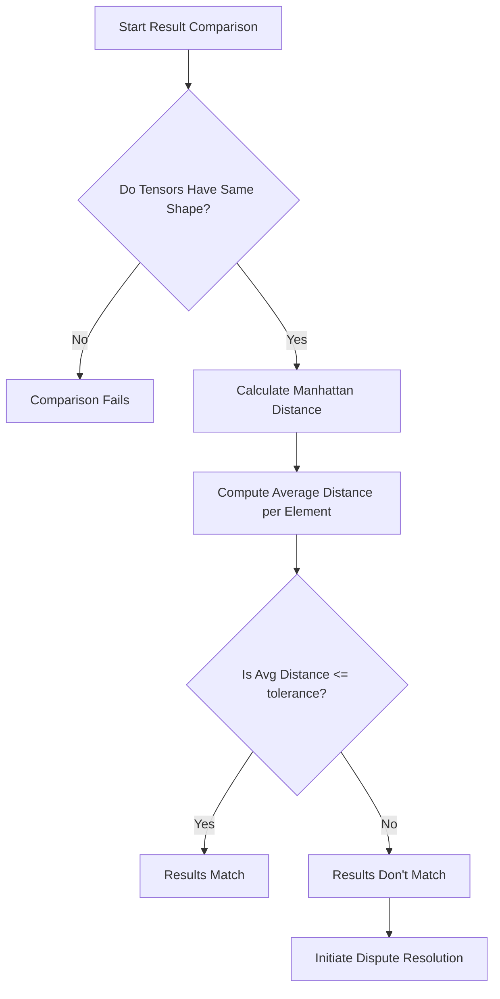
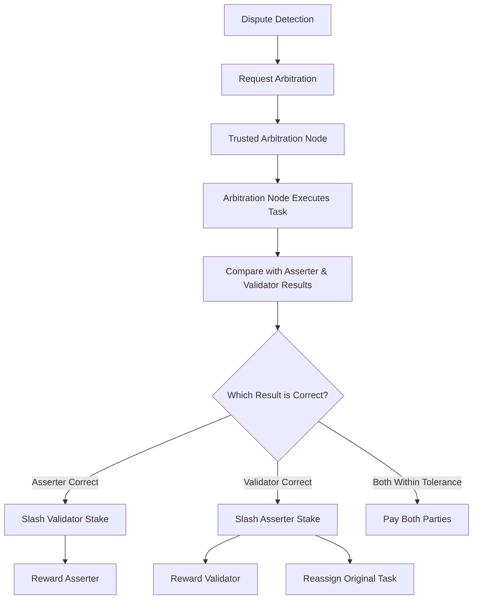
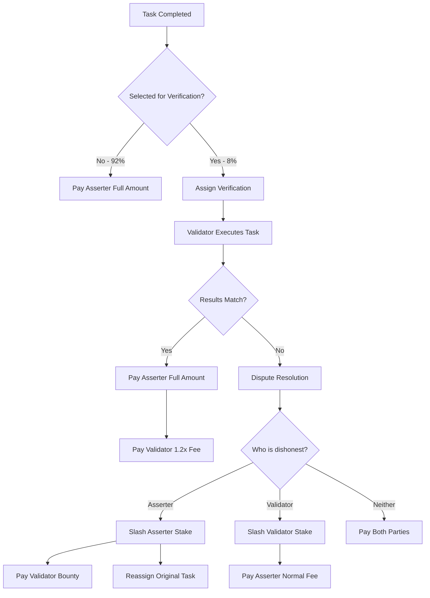
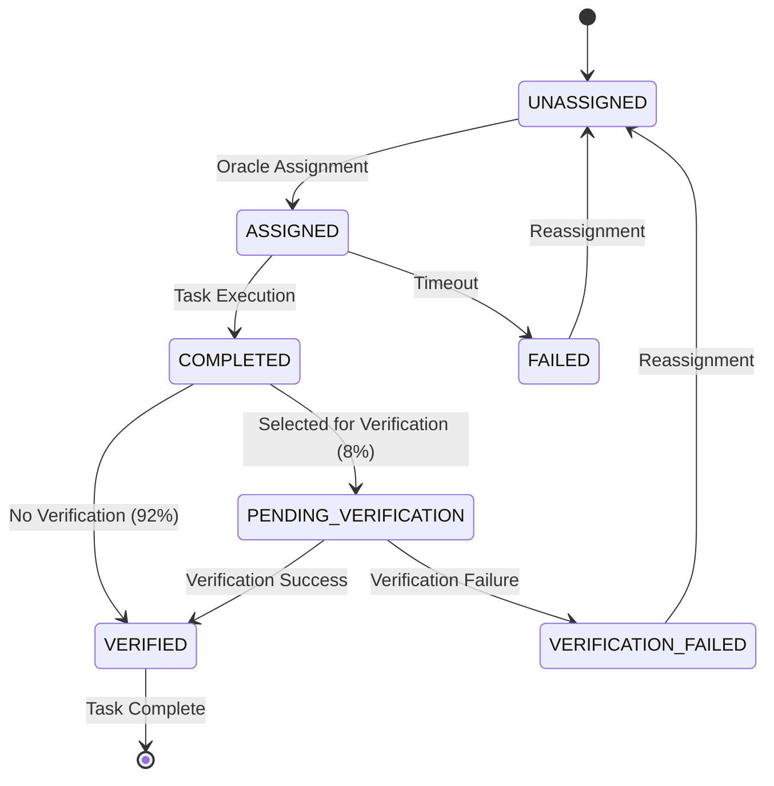

# Proof of Sampling Protocol(PoSP) Verification System

## 1. Introduction and Overview

Proof of Sampling Protocol(PoSP) is SplitUp's verification mechanism that ensures computational integrity while minimizing overhead. Traditional verification approaches in decentralized computation typically require duplicating every computation, effectively doubling costs. PoSP instead uses a probabilistic verification approach combined with strong economic incentives to make honest behavior the optimal strategy for nodes.

This document details the PoSP verification system as implemented in the SplitUp network, focusing on its integration with the broader execution flow described in the [main blockchain integration specification](./index.md).

## 2. Core Principles of PoSP

### 2.1 Probabilistic Verification

Instead of verifying every computation, PoSP randomly selects a small percentage of tasks for verification:

- **Verification Probability (p)**: 8%
- Each task has an 8% chance of being selected for verification
- Selection is deterministic based on VRF (Verifiable Random Function)
- Task selection cannot be predicted or manipulated by nodes

### 2.2 Pure Function Execution

All tasks in SplitUp are designed as pure functions:

- Identical inputs always produce identical outputs
- No stochastic elements or side effects
- Enables deterministic verification by replaying the computation

### 2.3 Economic Security Model

The security of PoSP is enforced through a precisely calibrated economic model:

- **Verification Reward (R)**: 1.2× the computation cost
- **Slashing Amount (S)**: 10× the computation cost
- **Maximum Collusion Fraction (r)**: 0.1 (10%)

The security condition that makes cheating unprofitable is:

```
p > C/((1-r)(R+S))
```

Where:

- p = verification probability (8%)
- C = computation cost
- r = maximum collusion fraction (10%)
- R = verification reward (1.2x)
- S = slashing amount (10x)

With these parameters, dishonesty has negative expected value, ensuring system integrity.

## 3. Verification Contract Interface

The Verification contract orchestrates the PoSP process:

```typescript
interface VerificationContract {
  // Core Functions
  determineVerification(executionId: ExecutionId, taskId: TaskId): boolean;
  compareVerificationResults(executionId: ExecutionId, taskId: TaskId): void;

  // Oracle Committee Interaction
  requestDisputeResolution(executionId: ExecutionId, taskId: TaskId): void;

  // Status Functions
  getVerificationStatus(
    executionId: ExecutionId,
    taskId: TaskId,
  ): VerificationStatus;

  // Oracle Committee Only Functions
  returnDisputeResolution(
    executionId: ExecutionId,
    taskId: TaskId,
    dishonestParty: NodeAddress,
  ): void;
}

// Data Types
enum VerificationStatus {
  None, // 0: No verification required
  Pending, // 1: Verification required but not assigned
  Assigned, // 2: Verification assigned to validator
  Submitted, // 3: Verification result submitted, pending comparison
  Matched, // 4: Verification successful
  Mismatched, // 5: Verification failed, dispute resolution needed
  Resolved, // 6: Dispute resolved
}

interface VerificationResult {
  executionId: ExecutionId;
  taskId: TaskId;
  resultHash: string;
  outputUris: TensorUri[];
  validator: NodeAddress;
  status: VerificationStatus;
  timestamp: number;
}
```

## 4. Verification Process Flow

The PoSP verification process uses the standard node selection flow with blacklisting:



## 5. Verification Selection and Assignment

### 5.1 Selection Algorithm

Selection for verification uses a VRF (Verifiable Random Function) to ensure deterministic but unpredictable selection. The process works as follows:

1. When a task is completed, a deterministic random value is generated using VRF
2. The seed for the VRF is derived from the execution ID, task ID, and current block hash
3. The resulting random value is compared against a threshold representing 8% probability
4. If the value is below the threshold, the task is selected for verification
5. The VRF proof ensures the selection process is verifiable and cannot be manipulated

### 5.2 Unified Node Selection Process

Verification tasks use the same assignment flow as regular tasks, with added blacklisting to ensure the original node cannot verify its own work:



## 6. Result Comparison and Dispute Resolution

### 6.1 Numerical Tensor Comparison Process

Instead of using hash comparison, the verification system uses Manhattan distance (L1 norm) to compare tensor outputs with appropriate tolerance:



The system applies different tolerance thresholds based on:

1. **Data types** (float32, float16, bfloat16, integers)
2. **Computational complexity** of the task

For integer types, exact matching is required, while floating-point types allow for small variations within the specified tolerance.

### 6.2 Centralized Dispute Resolution (Temporary Solution)

> **Note: This centralized approach is a temporary solution and will be reconsidered in future protocol upgrades.**

When numerical comparison between the asserter and validator nodes fails, a dispute is resolved by a trusted arbitration node:



The centralized arbitration process works as follows:

1. When a dispute is detected, the contract forwards both results to a designated arbitration node
2. The arbitration node is operated by the protocol team and uses reference hardware
3. This node executes the same task with identical inputs and model weights
4. It compares its result with both the asserter and validator results
5. The node closest to the arbitration result is considered correct
6. The node with the significantly divergent result (beyond tolerance) is considered dishonest
7. The contract enforces appropriate slashing and rewards based on the arbitration decision

This solution prioritizes reliable operation at launch while future protocol versions will transition to decentralized dispute resolution mechanisms.

### 6.3 Adaptive Tolerance Framework

The system employs an adaptive tolerance framework that adjusts based on:

| Factor                     | Effect on Tolerance                                                  |
| -------------------------- | -------------------------------------------------------------------- |
| Task Precision Requirement | HIGH: 1e-10, STANDARD: 1e-6, LOW: 1e-4                               |
| Data Type                  | float32: base, float16/bfloat16: 10x base, integers: 0 (exact match) |
| Task Domain                | Matrix operations: higher, Element-wise: lower                       |

This adaptive approach accounts for the reality of GPU computation, where different hardware and implementations may produce slightly different but still correct results.

## 7. Economic Rewards and Penalties

### 7.1 Fee Structure

The economic incentives are structured to make honest behavior optimal:

- **Task Payment**: Based on computational complexity (computeUnits × 0.0001 USDC)
- **Verification Fee**: 1.2× the task payment
- **Slashing Amount**: 10× the task payment (minimum 500 USDC)

### 7.2 Payment Distribution Process

The payment distribution process follows different paths based on verification outcome:



## 8. Integration with Task Execution States

The PoSP system integrates with task execution states through a state machine:



The integration workflow follows these steps:

1. When a task transitions to COMPLETED state, verification selection occurs
2. If selected (8% probability), it enters PENDING_VERIFICATION state
3. The Oracle Committee handles validator selection through the standard process
4. After verification, the task transitions to VERIFIED or VERIFICATION_FAILED
5. Failed verifications can result in stake slashing and task reassignment

## 9. Implementation Considerations

### 9.1 Future Decentralization of Dispute Resolution

The centralized arbitration approach is intended as a bootstrapping mechanism with several limitations:

1. **Single Point of Failure**: Relies on the availability of the trusted arbitration node
2. **Trust Assumption**: Requires trusting the protocol team to operate the node honestly
3. **Limited Scalability**: May become a bottleneck as network usage grows

Future protocol upgrades will address these limitations by implementing:

1. **Decentralized Arbitration Committee**: A rotating set of nodes with specialized hardware
2. **Statistical Consensus Mechanisms**: BFT consensus on complex numerical comparisons
3. **Formal Verification**: Automated analysis of implementations to identify sources of divergence
4. **Hardware Certification**: Standardized testing procedures for node hardware

These improvements will be proposed and implemented based on operational experience and community governance decisions.
