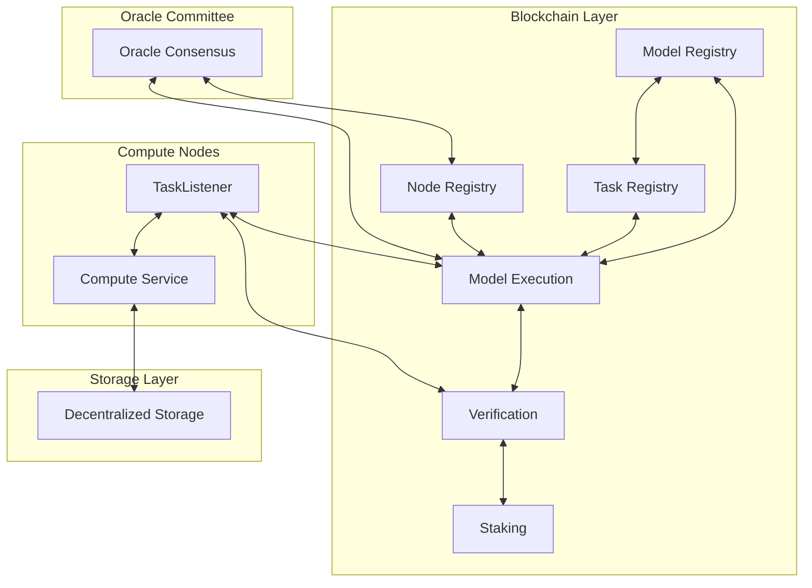
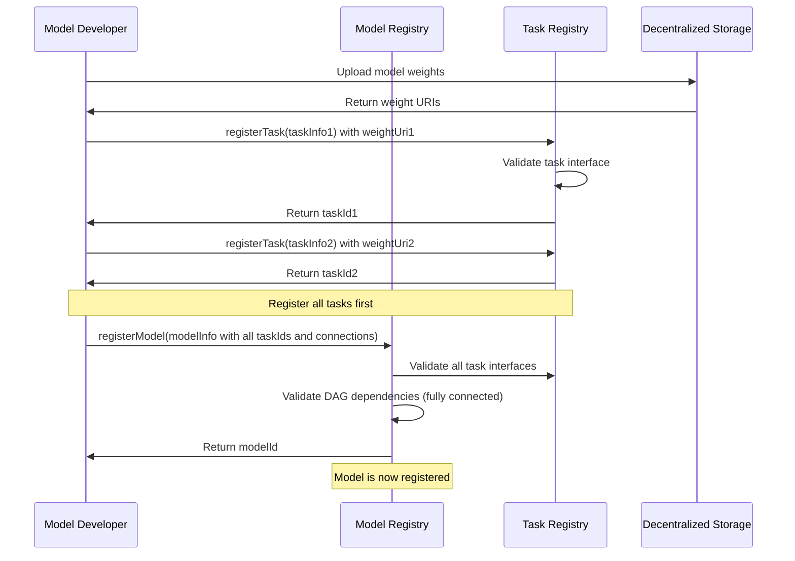
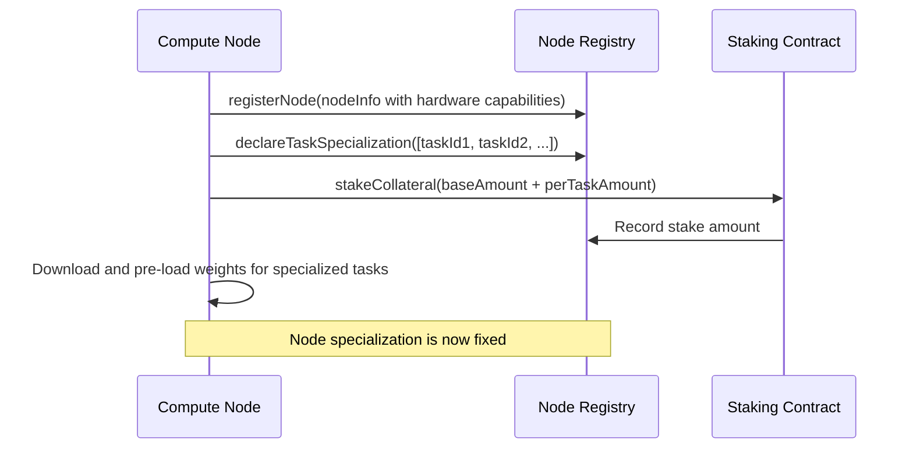
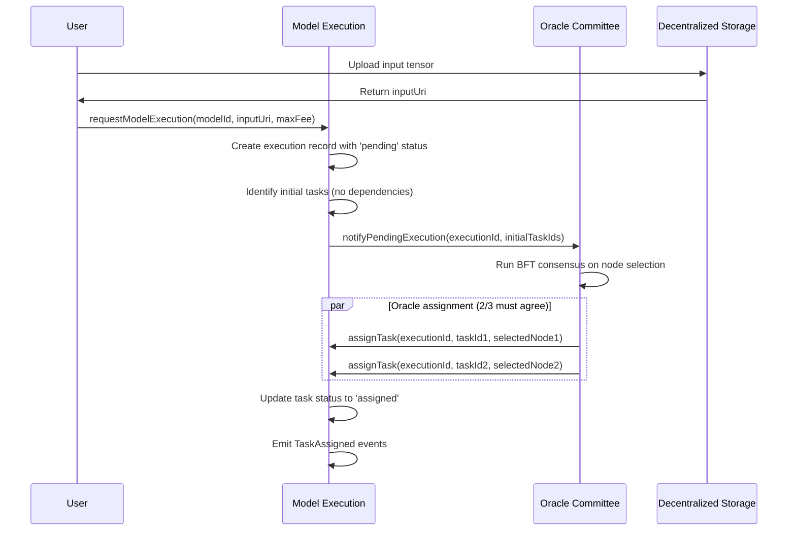
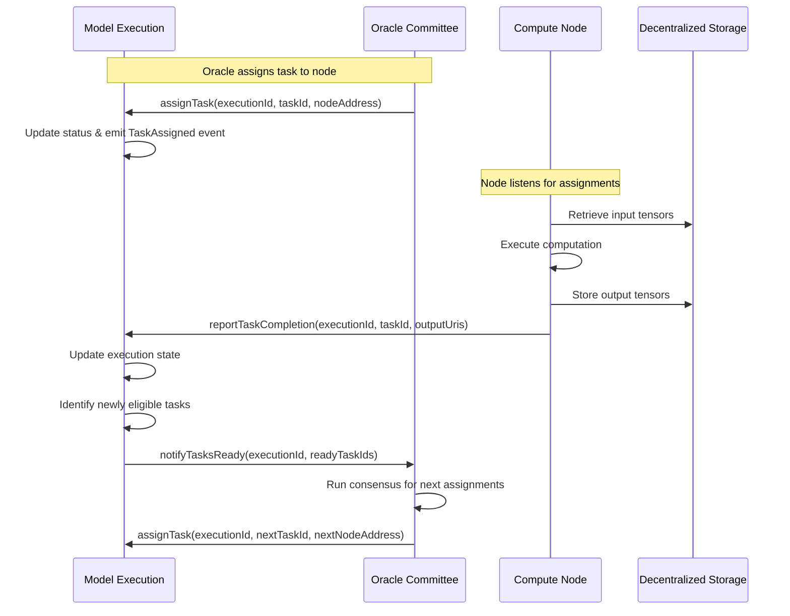
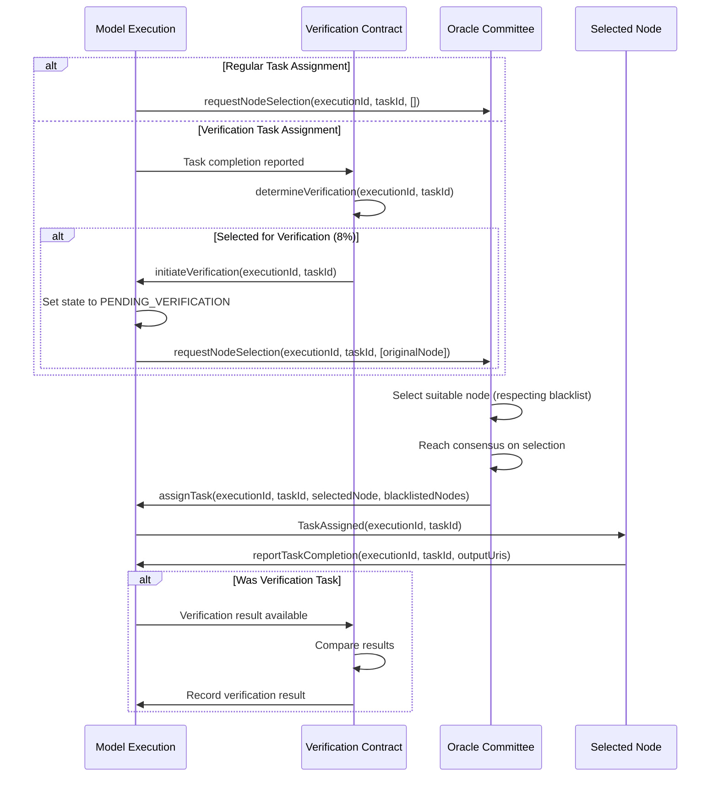
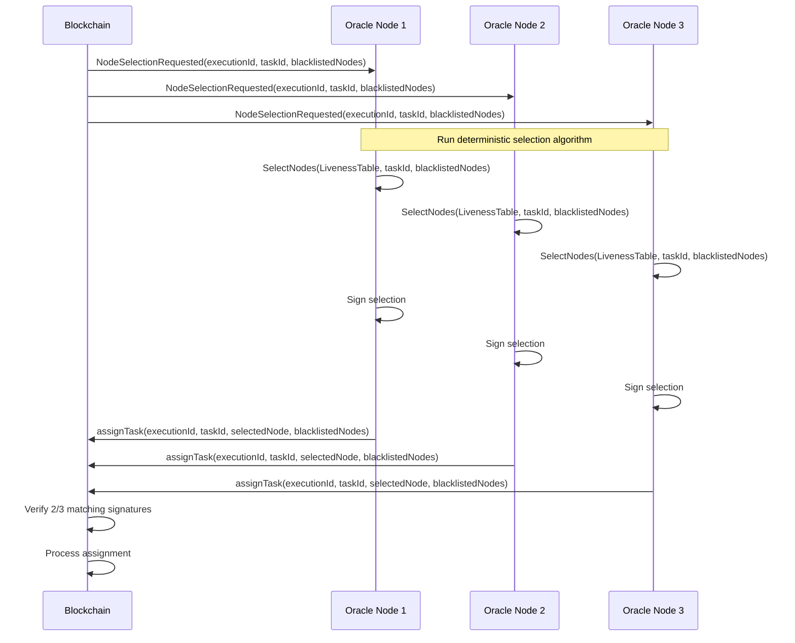

# SplitUp Blockchain Integration Specification

This document details the blockchain functionality and integration points within the SplitUp network, focusing on immutable models, fixed tasks, and oracle-controlled task assignment.

## System Overview

The SplitUp blockchain layer manages the distributed execution of machine learning models through a set of specialized smart contracts on Solana. It provides:

1. Immutable model and task registration
2. Oracle-controlled node selection and task assignment
3. Execution orchestration with dependency tracking
4. Economic incentives and security mechanisms
5. Transparent execution verification



## Core Blockchain Components

### 1. Model Registry Contract

The Model Registry maintains immutable definitions of all ML models:

```typescript
interface ModelRegistry {
  // Registration Function (One-time only)
  registerModel(modelInfo: ModelInfo): ModelId;

  // Query Functions
  getModelInfo(modelId: ModelId): ModelInfo;
  getModelDAG(modelId: ModelId): TaskConnection[];
  listModels(): ModelId[];

  // Validation Functions (used during registration)
  validateModelDependencies(modelInfo: ModelInfo): boolean;
  validateTaskInterfaces(modelInfo: ModelInfo): boolean;
}
```

**Key Changes**:

- Models are immutable once registered
- All tasks must be defined at registration time
- No update functions for models
- All validation happens during registration

**Data Storage**:

- Complete model DAG structure (fixed and immutable)
- Task dependencies and connections
- Input/output tensor specifications
- TensorUris for all weights

### 2. Task Registry Contract

The Task Registry defines immutable computational tasks:

```typescript
interface TaskRegistry {
  // Registration Function (One-time only)
  registerTask(taskInfo: TaskInfo): TaskId;

  // Query Functions
  getTaskInfo(taskId: TaskId): TaskInfo;
  getTasksByModel(modelId: ModelId): TaskId[];
  getTaskRequirements(taskId: TaskId): TaskRequirements;
}
```

**Key Changes**:

- Tasks are immutable once registered
- No update functions for tasks
- Weight URIs must be provided during registration
- All tensor specifications are fixed

**Data Storage**:

- Task computational requirements
- Input and output tensor specifications (explicit and immutable)
- Permanent weight file URIs
- Execution statistics

### 3. Node Registry Contract

The Node Registry manages compute node registration and specialization:

```typescript
interface NodeRegistry {
  // Registration and Staking (One-time declaration of capabilities)
  registerNode(nodeInfo: NodeInfo): void;

  // Task Specialization (Declared during registration)
  declareTaskSpecialization(taskIds: TaskId[]): void;

  // Query Functions
  getNodeInfo(nodeAddress: string): NodeInfo;
  getNodesForTask(taskId: TaskId): NodeAddress[];

  // Staking Functions
  stakeCollateral(amount: number): void;
  withdrawCollateral(amount: number): void;
}
```

**Key Changes**:

- Node capabilities and task specializations declared at registration
- Only capacity updates allowed after registration
- Node-task specialization is fixed
- Staking is directly tied to declared capabilities

### 4. Model Execution Contract

The Model Execution contract orchestrates execution with Oracle control:

```typescript
interface ModelExecution {
  // Execution Initiation (User-facing)
  requestModelExecution(
    modelId: ModelId,
    inputUri: TensorUri,
    maxFee: number,
  ): ExecutionId;

  // Oracle-Controlled Task Assignment (Oracle-only functions)
  assignTask(
    executionId: ExecutionId,
    taskId: TaskId,
    nodeAddress: string,
  ): void;

  // Node-Facing Functions
  reportTaskCompletion(
    executionId: ExecutionId,
    taskId: TaskId,
    outputUris: TensorUri[],
  ): void;

  // User-Facing Functions
  cancelExecution(executionId: ExecutionId): void;
  getExecutionStatus(executionId: ExecutionId): ModelExecutionStatus;

  // Fee Functions
  estimateExecutionFee(modelId: ModelId, priority: number): number;
}
```

## Core Data Types

```typescript
// URI types for all external references
export type TensorUri = string; // URI pointing to tensor data
export type WeightUri = string; // URI pointing to weight data

// Model and task definitions
export interface TensorSpec {
  name: string; // Tensor name
  dimensions: string[]; // Symbolic dimensions
  shape?: number[]; // Concrete shape if known
  dtype: string; // Data type
}

export interface TaskConnection {
  sourceTaskId: number; // Source task (0 for model inputs)
  destinationTaskId: number; // Destination task (0 for model outputs)
  sourceOutputIndex: number; // Index in source task's outputs
  destInputIndex: number; // Index in destination task's inputs
  tensorSpec: TensorSpec; // Specification of the tensor
}

export interface TaskInfo {
  id: number;
  modelId: number;
  description: string;
  vramRequirement: number;
  computeUnits: number; // Fixed computational complexity
  inputs: TensorSpec[]; // Input tensor specs
  outputs: TensorSpec[]; // Output tensor specs
  weightUri: WeightUri; // URI to immutable weights
}

export interface ModelInfo {
  id: number;
  name: string;
  description: string;
  creator: string;
  taskIds: number[];
  connections: TaskConnection[];
}

// Execution status tracking
export interface TaskExecutionStatus {
  taskId: number;
  assignedNode: string;
  status: number; // 0: pending, 1: assigned, 2: in-progress, 3: completed, 4: failed
  inputUris: TensorUri[]; // URIs to input tensors
  outputUris: TensorUri[]; // URIs to output tensors
  startTime: number;
  completionTime: number;
}

export interface ModelExecutionStatus {
  id: number;
  modelId: number;
  requestor: string;
  fee: number;
  taskStatuses: TaskExecutionStatus[];
  overallStatus: number; // 0: pending, 1: in-progress, 2: completed, 3: failed
  inputUri: TensorUri; // Initial model input
  outputUri: TensorUri; // Final model output
  startTime: number;
  completionTime: number;
}

// Node specialization
export interface NodeSpecialization {
  taskId: number;
}

export interface NodeInfo {
  owner: string;
  stakeAmount: number;
  specializations: NodeSpecialization[];
}
```

## Process Flows

### Model and Task Registration Flow



### Node Registration and Specialization



### Execution Request and Oracle Assignment



For what happens after `TaskAssigned` from the perspective, see [the Task Completion diagrams.](../compute_client/task_completion.md)

### Task Execution Flow (Oracle Controlled)



## Oracle Committee Integration

The critical change in this design is that the Oracle Committee has exclusive control over node selection for task assignments:

```typescript
// The Model Execution contract enforces this restriction
function assignTask(
  executionId: ExecutionId,
  taskId: TaskId,
  nodeAddress: string
) {
  // Check caller is part of Oracle Committee
  require(isOracleCommitteeMember(msg.sender), "Not authorized");

  // Check node is specialized for this task
  require(
    nodeRegistry.isSpecializedForTask(nodeAddress, taskId),
    "Node not specialized for task"
  );

  // Assign the task
  assignments[executionId][taskId] = nodeAddress;
  taskStatuses[executionId][taskId] = TASK_STATUS_ASSIGNED;

  // Emit event for node to pick up
  emit TaskAssigned(executionId, taskId, nodeAddress);
}
```

The Oracle Committee uses its consensus process to determine which nodes should execute tasks:

1. Model Execution contract notifies the Oracle Committee of pending tasks
2. Oracle Committee members share liveness information on available nodes
3. Oracle Committee members run identical node selection algorithms
4. Oracle Committee members reach consensus on which nodes to select
5. Oracle Committee members submit selections to the Model Execution contract
6. Model Execution contract implements the assignment once it receives selections from 2/3 of committee members

## Task Execution States and Transitions

Each task within a model execution follows a specific state machine that integrates with the PoSP verification system. The following states represent the lifecycle of a task execution:

```typescript
enum TaskExecutionState {
  UNASSIGNED = 0, // Task is ready for execution but not assigned to a node
  ASSIGNED = 1, // Task has been assigned to a node by the Oracle Committee
  COMPLETED = 2, // Node has completed the computation and submitted results
  PENDING_VERIFICATION = 3, // Completed but selected for PoSP verification
  VERIFIED = 4, // Passed PoSP verification
  VERIFICATION_FAILED = 5, // Failed PoSP verification, under dispute resolution
  FAILED = 6, // Task failed due to timeout or other issues
}
```

### State Transitions

The allowed state transitions follow this pattern:

1. **UNASSIGNED → ASSIGNED**: When Oracle Committee assigns the task to a specialized node
2. **ASSIGNED → COMPLETED**: When the node completes the computation and submits results
3. **ASSIGNED → FAILED**: When a task exceeds its deadline
4. **COMPLETED → PENDING_VERIFICATION OR VERIFIED**:
   - If selected for verification (8% probability) → PENDING_VERIFICATION
   - If not selected for verification (92% probability) → VERIFIED
5. **PENDING_VERIFICATION → VERIFIED**: When verification confirms the result is correct
6. **PENDING_VERIFICATION → VERIFICATION_FAILED**: When verification detects a discrepancy
7. **VERIFICATION_FAILED → UNASSIGNED**: When reassignment is required after failed verification

### State Management Functions

```typescript
interface ModelExecution {
  // Existing functions as previously defined
  // ...

  // State Transition Functions
  reportTaskCompletion(
    executionId: ExecutionId,
    taskId: TaskId,
    outputUris: TensorUri[],
  ): void;

  // PoSP Integration Functions
  initiateVerification(executionId: ExecutionId, taskId: TaskId): boolean;
  recordVerificationResult(
    executionId: ExecutionId,
    taskId: TaskId,
    success: boolean,
  ): void;

  // State Query Functions
  getTaskState(executionId: ExecutionId, taskId: TaskId): TaskExecutionState;

  // Oracle Committee Only Functions
  reassignFailedTask(
    executionId: ExecutionId,
    taskId: TaskId,
    blacklistedNodes?: NodeAddress[],
  ): void;
  assignTask(
    executionId: ExecutionId,
    taskId: TaskId,
    nodeAddress: string,
    isVerification?: boolean,
    blacklistedNodes?: NodeAddress[],
  ): void;
}
```

### Integration with Proof of Sampling Protocol (PoSP)

The execution states integrate directly with the PoSP verification system, which is fully described in [Proof of Sampling Protocol](./proof_of_sampling.md). Key integration points include:

1. After task completion, the Verification contract determines whether verification is needed
2. If selected (8% probability), the task enters PENDING_VERIFICATION state
3. The Model Execution contract calls `requestNodeSelection` with a blacklist containing the original node
4. The Oracle Committee selects a validator node through the standard selection process, respecting the blacklist
5. The validator executes the task through the normal task execution flow
6. The Verification contract compares results and determines verification success or failure
7. Task execution proceeds to dependent tasks only after verification is complete

### Task Deadline Management

Instead of requiring explicit acknowledgment from nodes, each task is assigned a deadline based on its computational complexity:

```typescript
function calculateTaskDeadline(taskId: TaskId): Timestamp {
  const taskInfo = taskRegistry.getTaskInfo(taskId);
  const baseTimeout = 30; // 30 seconds base timeout
  const complexityFactor = Math.ceil(taskInfo.computeUnits / 100);
  const timeout = baseTimeout + complexityFactor * 5; // 5 seconds per 100 compute units

  return getCurrentTimestamp() + timeout;
}
```

The execution contract automatically checks for deadline violations and transitions tasks to FAILED state when they occur:

```typescript
function checkTaskDeadlines() {
  const currentTime = getCurrentTimestamp();

  for (const [executionId, taskId] of assignedTasks) {
    if (taskDeadlines[executionId][taskId] < currentTime) {
      transitionToFailed(executionId, taskId);

      // Request reassignment
      reassignFailedTask(executionId, taskId);
    }
  }
}
```

## Oracle Committee Integration for Task Assignment

The Oracle Committee's task assignment process is extended to support both regular and verification assignments using a unified approach:

```typescript
// The Model Execution contract enforces this restriction
function assignTask(
  executionId: ExecutionId,
  taskId: TaskId,
  nodeAddress: string,
  blacklistedNodes = []
) {
  // Check caller is part of Oracle Committee
  require(isOracleCommitteeMember(msg.sender), "Not authorized");

  // Check node is specialized for this task
  require(
    nodeRegistry.isSpecializedForTask(nodeAddress, taskId),
    "Node not specialized for task"
  );

  // Ensure node is not blacklisted (for verification tasks)
  for (const blacklistedNode of blacklistedNodes) {
    require(nodeAddress !== blacklistedNode, "Node is blacklisted for this task");
  }

  // Assign the task
  assignments[executionId][taskId] = nodeAddress;
  taskStatuses[executionId][taskId] = TASK_STATUS_ASSIGNED;
  taskDeadlines[executionId][taskId] = calculateTaskDeadline(taskId);

  // Emit event for node to pick up
  emit TaskAssigned(executionId, taskId, nodeAddress);
}
```

The verification process initiates through the standard Oracle Committee node selection workflow:

```typescript
// In Model Execution contract
function initiateVerification(executionId: ExecutionId, taskId: TaskId): void {
  // Get the original node that executed the task
  const originalNode = assignments[executionId][taskId];

  // Set task status to pending verification
  taskStatuses[executionId][taskId] = TASK_STATUS_PENDING_VERIFICATION;

  // Request node selection through the standard Oracle Committee process,
  // but with the original node blacklisted
  requestNodeSelection(executionId, taskId, [originalNode]);
}

// Oracle Committee request function
function requestNodeSelection(
  executionId: ExecutionId,
  taskId: TaskId,
  blacklistedNodes = []
): void {
  // Emit event to all Oracle Committee members
  emit NodeSelectionRequested(executionId, taskId, blacklistedNodes);
}
```

The Oracle Committee handles both regular and verification tasks through the same process:



## Oracle-to-Blockchain Protocol

The Oracle Committee protocol for node selection and verification is standardized:



### Oracle Committee Data Types

```typescript
// Extended Node selection request types
interface NodeSelectionRequest {
  executionId: ExecutionId; // ID of the execution
  taskId: TaskId; // Task to be executed
  blacklistedNodes: NodeAddress[];
  timestamp: Timestamp; // When the request was made
}

// Node selection for a task
interface NodeSelection {
  executionId: ExecutionId; // ID of the execution
  taskId: TaskId; // Task to be executed
  selectedNode: NodeAddress; // Selected node for the task
  blacklistedNodes: NodeAddress; // Nodes that were excluded
  vrfSeed: string; // Seed used for selection
  roundId: RoundId; // Liveness round used
  timestamp: Timestamp; // When selection was made
}

// Signed node selection
interface CommitteeSignedNodeSelection {
  selection: NodeSelection; // The node selection
  signatures: {
    // Signatures from oracles
    [oracleId: string]: string;
  };
}
```

### Integration with Proof of Sampling Protocol (PoSP)

The execution states integrate directly with the PoSP verification system, which is fully described in [Proof of Sampling Protocol](./proof_of_sampling.md). Key integration points include:

1. After task completion, the Verification contract determines whether verification is needed
2. If selected (8% probability), the task enters PENDING_VERIFICATION state
3. The Model Execution contract calls `requestNodeSelection` with a blacklist containing the original node
4. The Oracle Committee selects a validator node through the standard selection process, respecting the blacklist
5. The validator executes the task through the normal task execution flow
6. The Verification contract compares results and determines verification success or failure
7. Task execution proceeds to dependent tasks only after verification is complete

### Task Deadline Management

Instead of requiring explicit acknowledgment from nodes, each task is assigned a deadline based on its computational complexity:

```typescript
function calculateTaskDeadline(taskId: TaskId): Timestamp {
  const taskInfo = taskRegistry.getTaskInfo(taskId);
  const baseTimeout = 30; // 30 seconds base timeout
  const complexityFactor = Math.ceil(taskInfo.computeUnits / 100);
  const timeout = baseTimeout + complexityFactor * 5; // 5 seconds per 100 compute units

  return getCurrentTimestamp() + timeout;
}
```

The execution contract automatically checks for deadline violations and transitions tasks to FAILED state when they occur:

```typescript
function checkTaskDeadlines() {
  const currentTime = getCurrentTimestamp();

  for (const [executionId, taskId] of assignedTasks) {
    if (taskDeadlines[executionId][taskId] < currentTime) {
      transitionToFailed(executionId, taskId);

      // Request reassignment
      reassignFailedTask(executionId, taskId);
    }
  }
}
```

## Economic Security Model

The revised economic model enforces specialization and integrates with the PoSP verification system:

1. **Stake Requirements**:

   - Base stake: 1000 USDC

2. **Slashing Conditions**:

   - Fraudulent result (caught by PoSP): 100% of stake

3. **Node Selection Factors**:

   - Specialization status (must be declared at registration)
   - Total stake amount

4. **Verification Rewards**:
   - Validators receive 1.2× the task payment for successful verification
   - Bounty reward for identifying fraudulent results