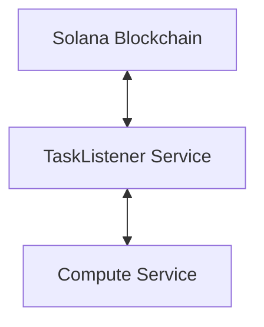
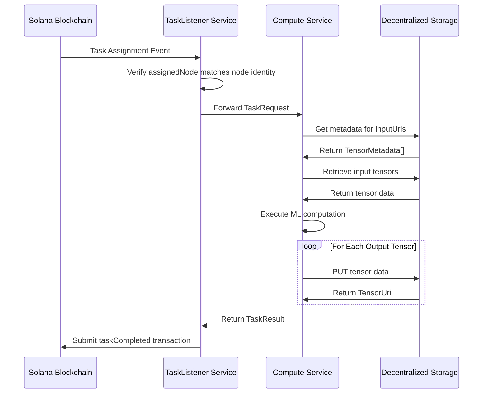

# TaskListener Service

A service that listens for task assignments on the Solana blockchain and coordinates ML computation execution as part of the SplitUp Node infrastructure.

## Overview

The SplitUp TaskListener Service is responsible for:

1. Listening for task assignment events on the Solana blockchain
2. Forwarding tasks to the Compute Service for execution
3. Submitting task completion transactions back to the blockchain
4. Tracking pending task executions
5. Managing the node's task queue and execution state

## Setup

1. Make sure you have Deno installed. If not, follow the [official installation guide](https://docs.deno.com/runtime/manual/getting_started/installation).

2. Install dependencies:

```
deno cache main.ts
```

## Running the Client

```bash
deno task start
```

Or with explicit permissions:

```bash
deno run --allow-net --allow-env main.ts
```

## Configuration

The service can be configured using environment variables:

- `SPLITUP_CLIENT_SOLANA_PRIVATE_KEY`: Path to your Solana private key
- `SPLITUP_CLIENT_SOLANA_RPC_URL`: Solana RPC endpoint URL
- `SPLITUP_CLIENT_PROGRAM_ID`: SplitUp program ID on Solana
- `TASK_LISTENER_PORT`: Service port (default: 3001)
- `TASK_LISTENER_LOG_LEVEL`: Log level (DEBUG, INFO, WARNING, ERROR) (default: INFO)

## System Integration

The TaskListener Service bridges between the blockchain and the compute components:



## Running the Service

```bash
npm start
```

## Execution Flow

The TaskListener Service operates in the following sequence:

1. Continuously monitors the Solana blockchain for task assignment events
2. When assigned a task, validates that it matches the node's identity
3. Forwards the task to the Compute Service for execution
4. Waits for the Compute Service to complete processing
5. Retrieves task results from the Compute Service
6. Submits a transaction to the blockchain confirming task completion
7. For tasks requiring verification (8% probability), handles the verification flow

## Task Completion Flow



For a complete system overview, see the system diagrams and documentation.
