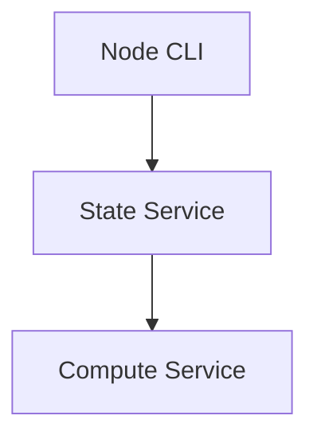

# State Service

The configuration API for the SplitUp node which performs ML operations.

## Overview

The State Service is responsible for:

1. Keeping track of the node's configuration state locally
2. Transmitting configuration details to the `compute-service`
3. Managing which model tasks to specialize in
4. Controlling which model weights to keep cached
5. Storing node preferences and settings
6. Providing a persistent configuration across service restarts

## Setup

1. Make sure you have the required dependencies installed.

2. Install dependencies:

```bash
uv install
```

## System Integration

The State Service sits between the node management interface and the compute components:



## Running the Service

```bash
uv run main.py
```

## State Management

The State Service maintains configuration for:

1. **Task Specializations**: Which specific model tasks this node is specialized to perform
2. **Weight Caching**: Which model weights to keep in local storage
3. **Service Settings**: Configuration for other services in the node

All configuration is persisted locally and synchronized with the compute service as needed.

## Example Configuration Flow

1. User updates task specializations through Node CLI
2. CLI sends configuration update to State Service
3. State Service persists changes locally
4. State Service notifies Compute Service of new configuration
5. Compute Service adjusts its behavior based on updated settings

For a complete system overview, see the system diagrams and documentation.
