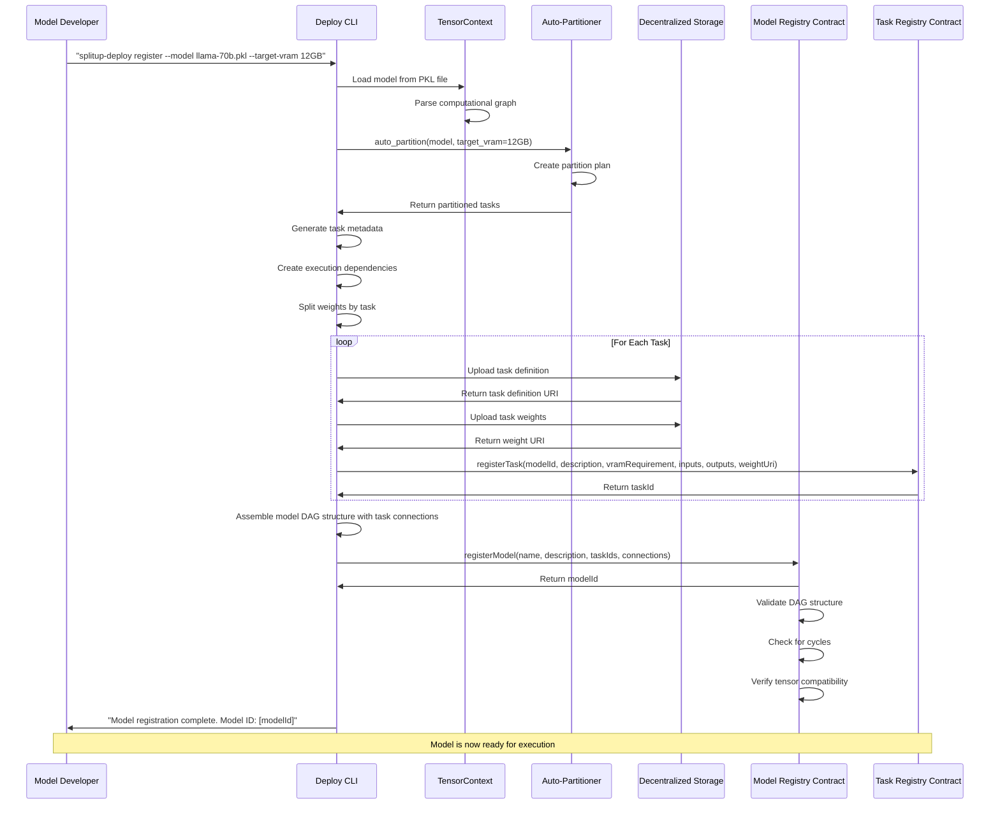

```mermaid
sequenceDiagram
    participant ModelDev as Model Developer
    participant CLI as Deploy CLI
    participant TensorContext as TensorContext
    participant Partitioner as Auto-Partitioner
    participant Storage as Decentralized Storage
    participant ModelRegistry as Model Registry Contract
    participant TaskRegistry as Task Registry Contract
    
    ModelDev->>CLI: "splitup-deploy register --model llama-70b.pkl --target-vram 12GB"
    CLI->>TensorContext: Load model from PKL file
    TensorContext->>TensorContext: Parse computational graph
    
    CLI->>Partitioner: auto_partition(model, target_vram=12GB)
    Partitioner->>Partitioner: Create partition plan
    
    Partitioner->>CLI: Return partitioned tasks
    
    CLI->>CLI: Generate task metadata
    CLI->>CLI: Create execution dependencies
    CLI->>CLI: Split weights by task
    
    loop For Each Task
        CLI->>Storage: Upload task definition
        Storage->>CLI: Return task definition URI
        
        CLI->>Storage: Upload task weights
        Storage->>CLI: Return weight URI
        
        CLI->>TaskRegistry: registerTask(modelId, description, vramRequirement, inputs, outputs, weightUri)
        TaskRegistry->>CLI: Return taskId
    end
    
    CLI->>CLI: Assemble model DAG structure with task connections
    CLI->>ModelRegistry: registerModel(name, description, taskIds, connections)
    ModelRegistry->>CLI: Return modelId
    
    ModelRegistry->>ModelRegistry: Validate DAG structure
    ModelRegistry->>ModelRegistry: Check for cycles
    ModelRegistry->>ModelRegistry: Verify tensor compatibility
    
    CLI->>ModelDev: "Model registration complete. Model ID: [modelId]"
    
    Note over ModelDev, TaskRegistry: Model is now ready for execution
```