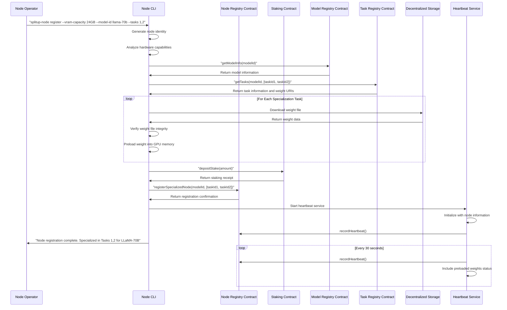

```mermaid
sequenceDiagram
    participant NodeOp as Node Operator
    participant NodeCLI as Node CLI
    participant NodeRegistry as Node Registry Contract
    participant Staking as Staking Contract
    participant ModelRegistry as Model Registry Contract
    participant TaskRegistry as Task Registry Contract
    participant Storage as Decentralized Storage
    participant HeartbeatSvc as Heartbeat Service

    NodeOp->>NodeCLI: "splitup-node register --vram-capacity 24GB --model-id llama-70b --tasks 1,2"
    NodeCLI->>NodeCLI: Generate node identity
    NodeCLI->>NodeCLI: Analyze hardware capabilities

    NodeCLI->>ModelRegistry: "getModelInfo(modelId)"
    ModelRegistry->>NodeCLI: Return model information

    NodeCLI->>TaskRegistry: "getTasks(modelId, [taskId1, taskId2])"
    TaskRegistry->>NodeCLI: Return task information and weight URIs

    loop For Each Specialization Task
        NodeCLI->>Storage: Download weight file
        Storage->>NodeCLI: Return weight data
        NodeCLI->>NodeCLI: Verify weight file integrity
        NodeCLI->>NodeCLI: Preload weight into GPU memory
    end

    NodeCLI->>Staking: "depositStake(amount)"
    Staking->>NodeCLI: Return staking receipt

    NodeCLI->>NodeRegistry: "registerSpecializedNode(modelId, [taskId1, taskId2])"
    NodeRegistry->>NodeCLI: Return registration confirmation

    NodeCLI->>HeartbeatSvc: Start heartbeat service
    HeartbeatSvc->>HeartbeatSvc: Initialize with node information
    HeartbeatSvc->>NodeRegistry: recordHeartbeat()

    NodeCLI->>NodeOp: "Node registration complete. Specialized in Tasks 1,2 for LLaMA-70B"

    loop Every 30 seconds
        HeartbeatSvc->>NodeRegistry: recordHeartbeat()
        HeartbeatSvc->>HeartbeatSvc: Include preloaded weights status
    end
```
