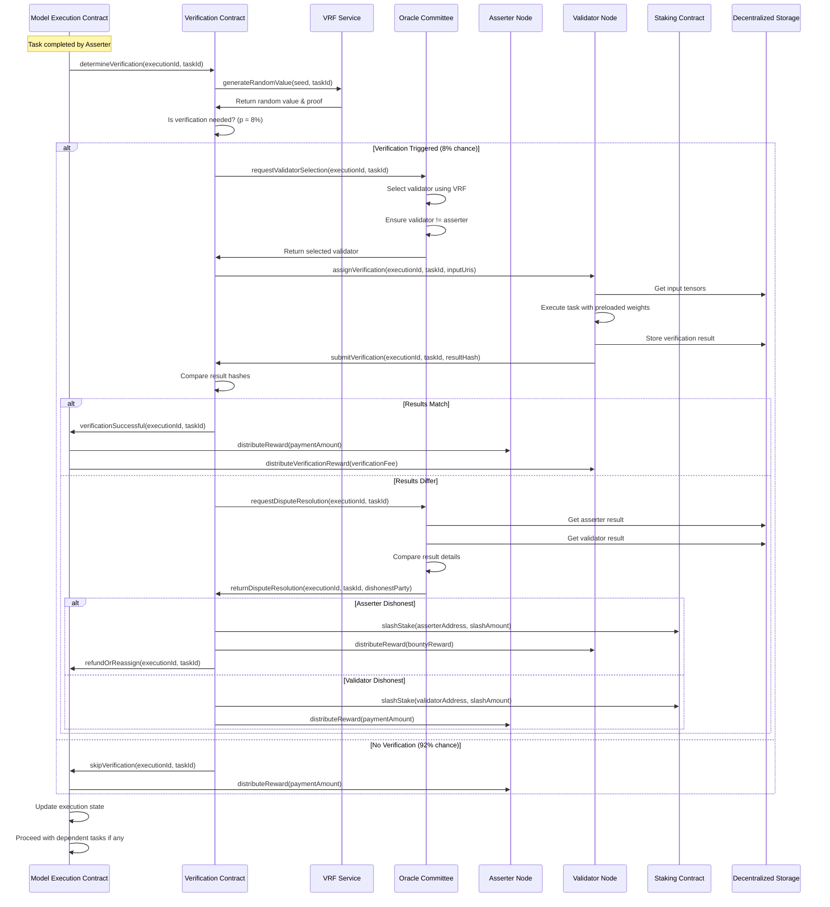

```mermaid
sequenceDiagram
    participant ModelContract as Model Execution Contract
    participant Verification as Verification Contract
    participant VRF as VRF Service
    participant Oracle as Oracle Committee
    participant Asserter as Asserter Node
    participant Validator as Validator Node
    participant Staking as Staking Contract
    participant Storage as Decentralized Storage
    
    Note over ModelContract: Task completed by Asserter
    
    ModelContract->>Verification: determineVerification(executionId, taskId)
    Verification->>VRF: generateRandomValue(seed, taskId)
    VRF->>Verification: Return random value & proof
    
    Verification->>Verification: Is verification needed? (p = 8%)
    
    alt Verification Triggered (8% chance)
        Verification->>Oracle: requestValidatorSelection(executionId, taskId)
        Oracle->>Oracle: Select validator using VRF
        Oracle->>Oracle: Ensure validator != asserter
        Oracle->>Verification: Return selected validator
        
        Verification->>Validator: assignVerification(executionId, taskId, inputUris)
        
        Validator->>Storage: Get input tensors
        Validator->>Validator: Execute task with preloaded weights
        Validator->>Storage: Store verification result
        Validator->>Verification: submitVerification(executionId, taskId, resultHash)
        
        Verification->>Verification: Compare result hashes
        
        alt Results Match
            Verification->>ModelContract: verificationSuccessful(executionId, taskId)
            ModelContract->>Asserter: distributeReward(paymentAmount)
            ModelContract->>Validator: distributeVerificationReward(verificationFee)
        else Results Differ
            Verification->>Oracle: requestDisputeResolution(executionId, taskId)
            Oracle->>Storage: Get asserter result
            Oracle->>Storage: Get validator result
            Oracle->>Oracle: Compare result details
            Oracle->>Verification: returnDisputeResolution(executionId, taskId, dishonestParty)
            
            alt Asserter Dishonest
                Verification->>Staking: slashStake(asserterAddress, slashAmount)
                Verification->>Validator: distributeReward(bountyReward)
                Verification->>ModelContract: refundOrReassign(executionId, taskId)
            else Validator Dishonest
                Verification->>Staking: slashStake(validatorAddress, slashAmount)
                Verification->>Asserter: distributeReward(paymentAmount)
            end
        end
    else No Verification (92% chance)
        Verification->>ModelContract: skipVerification(executionId, taskId)
        ModelContract->>Asserter: distributeReward(paymentAmount)
    end
    
    ModelContract->>ModelContract: Update execution state
    ModelContract->>ModelContract: Proceed with dependent tasks if any
```