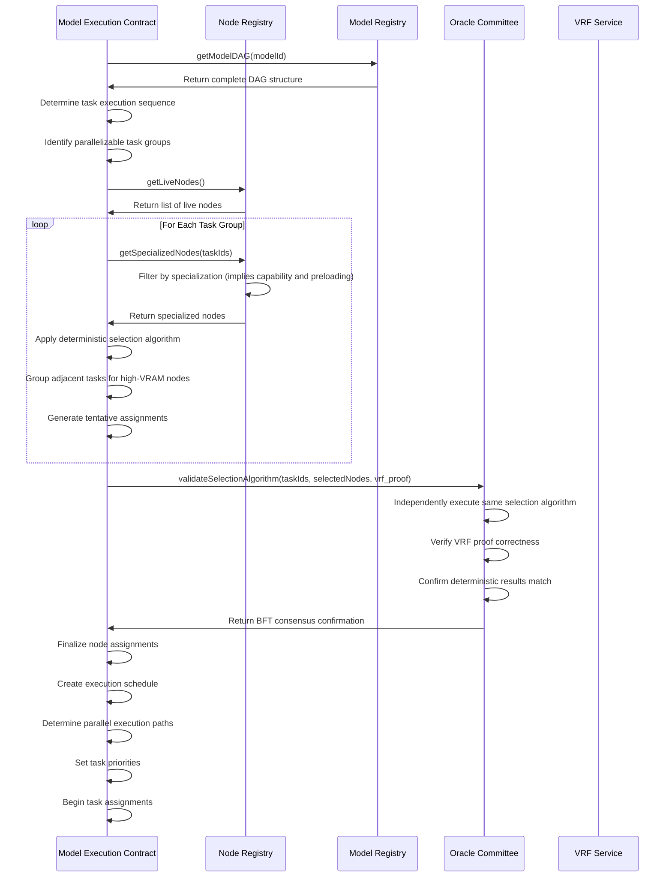

```mermaid
sequenceDiagram
    participant ModelContract as Model Execution Contract
    participant NodeRegistry as Node Registry
    participant ModelRegistry as Model Registry
    participant Oracle as Oracle Committee
    participant VRF as VRF Service

    ModelContract->>ModelRegistry: getModelDAG(modelId)
    ModelRegistry->>ModelContract: Return complete DAG structure

    ModelContract->>ModelContract: Determine task execution sequence
    ModelContract->>ModelContract: Identify parallelizable task groups

    ModelContract->>NodeRegistry: getLiveNodes()
    NodeRegistry->>ModelContract: Return list of live nodes

    loop For Each Task Group
        ModelContract->>NodeRegistry: getSpecializedNodes(taskIds)
        NodeRegistry->>NodeRegistry: Filter by specialization (implies capability and preloading)
        NodeRegistry->>ModelContract: Return specialized nodes

        ModelContract->>ModelContract: Apply deterministic selection algorithm

        ModelContract->>ModelContract: Group adjacent tasks for high-VRAM nodes

        ModelContract->>ModelContract: Generate tentative assignments
    end

    ModelContract->>Oracle: validateSelectionAlgorithm(taskIds, selectedNodes, vrf_proof)
    Oracle->>Oracle: Independently execute same selection algorithm
    Oracle->>Oracle: Verify VRF proof correctness
    Oracle->>Oracle: Confirm deterministic results match
    Oracle->>ModelContract: Return BFT consensus confirmation

    ModelContract->>ModelContract: Finalize node assignments

    ModelContract->>ModelContract: Create execution schedule
    ModelContract->>ModelContract: Determine parallel execution paths
    ModelContract->>ModelContract: Set task priorities

    ModelContract->>ModelContract: Begin task assignments
```
