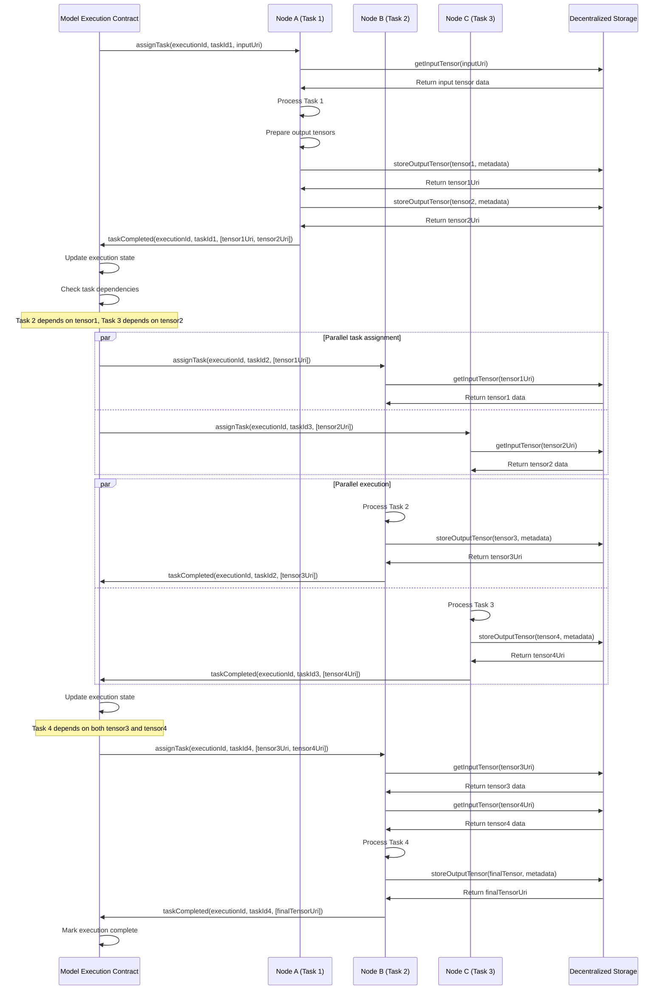

```mermaid
sequenceDiagram
    participant ModelContract as Model Execution Contract
    participant NodeA as Node A (Task 1)
    participant NodeB as Node B (Task 2)
    participant NodeC as Node C (Task 3)
    participant Storage as Decentralized Storage
    
    ModelContract->>NodeA: assignTask(executionId, taskId1, inputUri)
    NodeA->>Storage: getInputTensor(inputUri)
    Storage->>NodeA: Return input tensor data
    
    NodeA->>NodeA: Process Task 1
    
    NodeA->>NodeA: Prepare output tensors
    NodeA->>Storage: storeOutputTensor(tensor1, metadata)
    Storage->>NodeA: Return tensor1Uri
    NodeA->>Storage: storeOutputTensor(tensor2, metadata)
    Storage->>NodeA: Return tensor2Uri
    
    NodeA->>ModelContract: taskCompleted(executionId, taskId1, [tensor1Uri, tensor2Uri])
    
    ModelContract->>ModelContract: Update execution state
    ModelContract->>ModelContract: Check task dependencies
    
    Note over ModelContract: Task 2 depends on tensor1, Task 3 depends on tensor2
    
    par Parallel task assignment
        ModelContract->>NodeB: assignTask(executionId, taskId2, [tensor1Uri])
        NodeB->>Storage: getInputTensor(tensor1Uri)
        Storage->>NodeB: Return tensor1 data
    and
        ModelContract->>NodeC: assignTask(executionId, taskId3, [tensor2Uri])
        NodeC->>Storage: getInputTensor(tensor2Uri)
        Storage->>NodeC: Return tensor2 data
    end
    
    par Parallel execution
        NodeB->>NodeB: Process Task 2
        NodeB->>Storage: storeOutputTensor(tensor3, metadata)
        Storage->>NodeB: Return tensor3Uri
        NodeB->>ModelContract: taskCompleted(executionId, taskId2, [tensor3Uri])
    and
        NodeC->>NodeC: Process Task 3
        NodeC->>Storage: storeOutputTensor(tensor4, metadata)
        Storage->>NodeC: Return tensor4Uri
        NodeC->>ModelContract: taskCompleted(executionId, taskId3, [tensor4Uri])
    end
    
    ModelContract->>ModelContract: Update execution state
    
    Note over ModelContract: Task 4 depends on both tensor3 and tensor4
    
    ModelContract->>NodeB: assignTask(executionId, taskId4, [tensor3Uri, tensor4Uri])
    NodeB->>Storage: getInputTensor(tensor3Uri)
    Storage->>NodeB: Return tensor3 data
    NodeB->>Storage: getInputTensor(tensor4Uri)
    Storage->>NodeB: Return tensor4 data
    
    NodeB->>NodeB: Process Task 4
    NodeB->>Storage: storeOutputTensor(finalTensor, metadata)
    Storage->>NodeB: Return finalTensorUri
    
    NodeB->>ModelContract: taskCompleted(executionId, taskId4, [finalTensorUri])
    
    ModelContract->>ModelContract: Mark execution complete
```