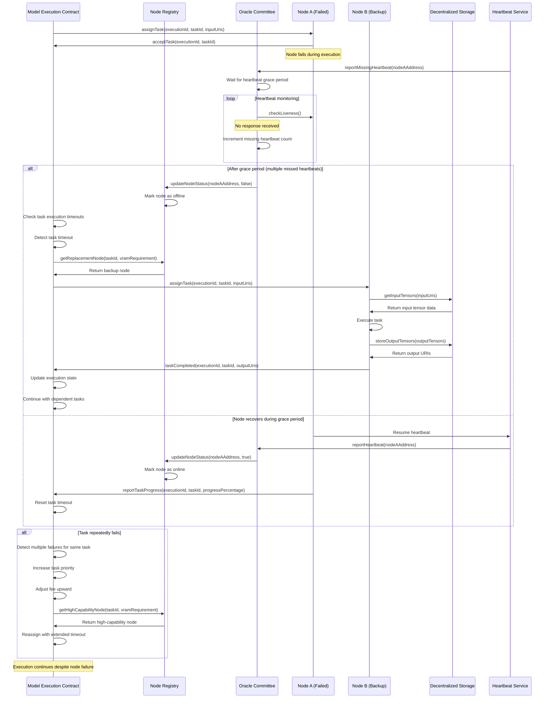

```mermaid
sequenceDiagram
    participant ModelContract as Model Execution Contract
    participant NodeRegistry as Node Registry
    participant Oracle as Oracle Committee
    participant NodeA as Node A (Failed)
    participant NodeB as Node B (Backup)
    participant Storage as Decentralized Storage
    participant HeartbeatSvc as Heartbeat Service
    
    ModelContract->>NodeA: assignTask(executionId, taskId, inputUris)
    NodeA->>ModelContract: acceptTask(executionId, taskId)
    
    Note over NodeA: Node fails during execution
    
    HeartbeatSvc->>Oracle: reportMissingHeartbeat(nodeAAddress)
    Oracle->>Oracle: Wait for heartbeat grace period
    
    loop Heartbeat monitoring
        Oracle->>NodeA: checkLiveness()
        Note over Oracle: No response received
        Oracle->>Oracle: Increment missing heartbeat count
    end
    
    alt After grace period (multiple missed heartbeats)
        Oracle->>NodeRegistry: updateNodeStatus(nodeAAddress, false)
        NodeRegistry->>NodeRegistry: Mark node as offline
        
        ModelContract->>ModelContract: Check task execution timeouts
        ModelContract->>ModelContract: Detect task timeout
        
        ModelContract->>NodeRegistry: getReplacementNode(taskId, vramRequirement)
        NodeRegistry->>ModelContract: Return backup node
        
        ModelContract->>NodeB: assignTask(executionId, taskId, inputUris)
        NodeB->>Storage: getInputTensors(inputUris)
        Storage->>NodeB: Return input tensor data
        
        NodeB->>NodeB: Execute task
        NodeB->>Storage: storeOutputTensors(outputTensors)
        Storage->>NodeB: Return output URIs
        
        NodeB->>ModelContract: taskCompleted(executionId, taskId, outputUris)
        
        ModelContract->>ModelContract: Update execution state
        ModelContract->>ModelContract: Continue with dependent tasks
    else Node recovers during grace period
        NodeA->>HeartbeatSvc: Resume heartbeat
        HeartbeatSvc->>Oracle: reportHeartbeat(nodeAAddress)
        Oracle->>NodeRegistry: updateNodeStatus(nodeAAddress, true)
        NodeRegistry->>NodeRegistry: Mark node as online
        
        NodeA->>ModelContract: reportTaskProgress(executionId, taskId, progressPercentage)
        ModelContract->>ModelContract: Reset task timeout
    end
    
    alt Task repeatedly fails
        ModelContract->>ModelContract: Detect multiple failures for same task
        ModelContract->>ModelContract: Increase task priority
        ModelContract->>ModelContract: Adjust fee upward
        ModelContract->>NodeRegistry: getHighCapabilityNode(taskId, vramRequirement)
        NodeRegistry->>ModelContract: Return high-capability node
        
        ModelContract->>ModelContract: Reassign with extended timeout
    end
    
    Note over ModelContract: Execution continues despite node failure
```