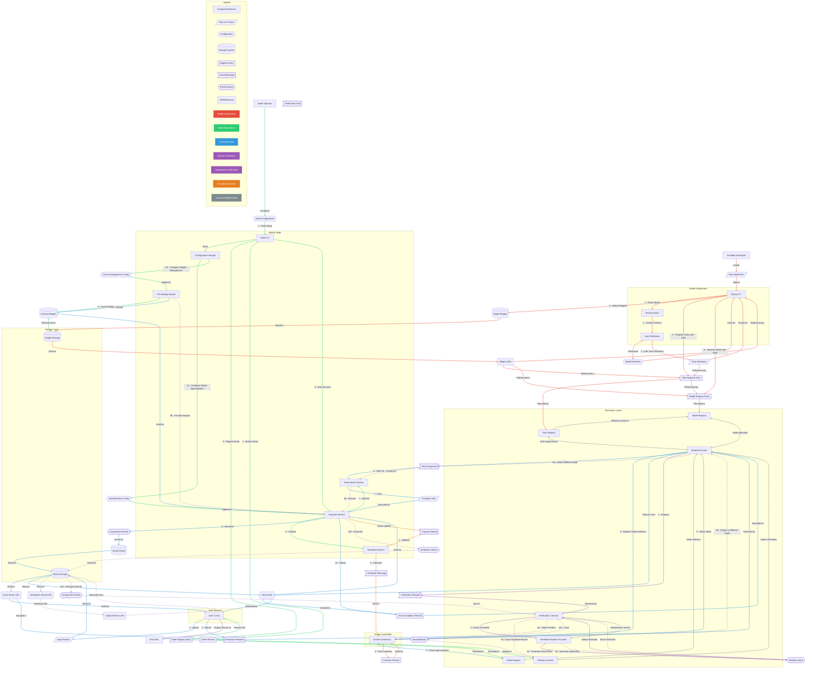

I'm not certain that this is 100% correct, but it might be helpful.

```mermaid
flowchart TD
    %% Primary actors
    Client[AI Model Developer]
    User[End User]
    NodeUser[Node Operator]
    
    %% Special data objects
    RawModel[/Raw Model File/]
    ModelParts{{Model Partitions}}
    TaskDefs[/Task Definitions/]
    Weights[(Model Weights)]
    WeightURI("Weight URIs")
    TaskReg[[Task Registry Entry]]
    ModelReg[[Model Registry Entry]]
    NodeConfig{{Node Configuration}}
    SpecConfig{{Specialization Config}}
    CacheConfig{{Cache Management Config}}
    RegEntry[[Node Registry Entry]]
    StakeRecord[[Stake Record]]
    CachedWeights[(Cached Weights)]
    
    InputTensors[/Input Tensors/]
    InputURI("Input Tensor URI")
    ExecutionRequest>Execution Request]
    TaskAssignment>Task Assignment]
    ComputeTask[/Compute Task/]
    ComputeOutput([Computation Result])
    StoredResult[(Stored Result)]
    ResultURI("Result URI")
    CompletionRecord[[Task Completion Record]]
    
    VerificationRequest>Verification Request]
    RandomValue([Random Value])
    VerificationTask>Verification Task]
    VerificationResult([Verification Result])
    VerificationURI("Verification Result URI")
    OriginalResultURI("Original Result URI")
    ComparisonResult([Comparison Result])
    RewardOrSlash([Reward/Slash])
    
    CapacityReport>Capacity Report]
    HeartbeatMessage>Heartbeat Message]
    LivenessRecord[[Liveness Record]]
    
    %% Model deployment tools
    subgraph "Model Deployment"
        DC[Deploy CLI]
        AP[Auto-Partitioner]
        TC[TensorContext]
    end
    
    %% Oracle Committee
    subgraph "Oracle Committee"
        OC[Oracle Consensus]
    end
    
    %% Blockchain contracts
    subgraph "Blockchain Layer"
        MR[Model Registry]
        TR[Task Registry]
        NR[Node Registry]
        ME[Model Execution]
        VC[Verification Contract]
        SC[Staking Contract]
        VRF[Verifiable Random Function]
    end
    
    %% Node components
    subgraph "SplitUp Node"
        NM[Node CLI]
        CF[Configuration Storage]
        CS[Compute Service]
        PS[Pre-loading System]
        TL[TaskListener Service]
        HS[Heartbeat Service]
    end
    
    %% Storage
    subgraph "Storage Layer"
        WS[(Weight Storage)]
        TS[(Tensor Storage)]
    end
    
    %% User interface
    subgraph "User Interface"
        UC[User CLI/UI]
    end
    
    %% MODEL DEPLOYMENT FLOW (RED)
    Client -->|"Initiate"| RawModel
    RawModel -->|"Upload"| DC
    DC -->|"1 - Parse Model"| TC
    TC -->|"2 - Create Partitions"| AP
    AP -->|"Generated"| ModelParts
    ModelParts -->|"Used for"| DC
    DC -->|"3 - Upload Weights"| Weights
    Weights -->|"Stored in"| WS
    WS -->|"Returns"| WeightURI
    WeightURI -->|"Referenced by"| DC
    AP -->|"4 - Infer Task Definitions"| TaskDefs
    TaskDefs -->|"Passed to"| DC
    DC -->|"5 - Register Tasks with URIs"| TaskReg
    TaskDefs -->|"Referenced by"| TaskReg
    WeightURI -->|"Referenced in"| TaskReg
    TaskReg -->|"Recorded in"| TR
    DC -->|"6 - Register Model with URIs"| ModelReg
    TaskReg -->|"Referenced by"| ModelReg
    WeightURI -->|"Referenced in"| ModelReg
    ModelReg -->|"Recorded in"| MR
    
    %% NODE REGISTRATION FLOW (GREEN)
    NodeUser -->|"Configure"| NodeConfig
    NodeConfig -->|"1 - Initial Setup"| NM
    NM -->|"Store"| CF
    CF -->|"2a - Configure Model Specialization"| SpecConfig
    SpecConfig -->|"Applied to"| CS
    CF -->|"2b - Configure Weight Management"| CacheConfig
    CacheConfig -->|"Applied to"| PS
    NM -->|"3 - Register Node"| RegEntry
    RegEntry -->|"Recorded in"| NR
    NM -->|"4 - Submit Stake"| StakeRecord
    StakeRecord -->|"Recorded in"| SC
    PS <-->|"5 - Cache Model Weights"| CachedWeights
    CachedWeights <-->|"Retrieved from"| WS
    NM -->|"6 - Boot Services"| CS
    CS -->|"7 - Initialize"| TL
    CS -->|"8 - Initialize"| HS
    
    %% TASK EXECUTION FLOW (BLUE)
    User -->|"Interact with"| UC
    UC -->|"1 - Upload"| InputTensors
    InputTensors -->|"Stored in"| TS
    TS -->|"Returns"| InputURI
    InputURI -->|"Used by"| UC
    UC -->|"2 - Submit"| ExecutionRequest
    InputURI -->|"Included in"| ExecutionRequest
    ExecutionRequest -->|"Received by"| ME
    ME -->|"3 - Request Node Selection"| OC
    OC <-->|"4 - Check Specialization"| NR
    OC -->|"5 - Select Node"| ME
    ME -->|"Create"| TaskAssignment
    TaskAssignment -->|"6 - Sent to"| TL
    TL -->|"7 - Pass"| ComputeTask
    ComputeTask -->|"Executed by"| CS
    PS -->|"8 - Provide"| CachedWeights
    CachedWeights -->|"Used by"| CS
    CS -->|"9 - Generate"| ComputeOutput
    ComputeOutput -->|"Saved as"| StoredResult
    StoredResult -->|"Stored in"| TS
    TS -->|"Returns"| ResultURI
    ResultURI -->|"Used by"| CS
    CS -->|"10 - Report"| CompletionRecord
    ResultURI -->|"Included in"| CompletionRecord
    CompletionRecord -->|"Recorded in"| ME
    ME -->|"Returns Final"| ResultURI
    ResultURI -->|"Retrieved by"| UC
    UC -->|"Display Results to"| User
    
    %% VERIFICATION FLOW (PURPLE)
    ME -->|"1 - Request"| VerificationRequest
    VerificationRequest -->|"Received by"| VC
    VC -->|"2 - Check Threshold"| VRF
    
    %% Normal path (92% probability)
    VRF -->|"3a - Generate Value (92%)"| RandomValue
    RandomValue -->|"Below threshold"| VC
    VC -->|"4a - Issue Standard Reward"| SC
    
    %% Re-computation path (8% probability)
    VRF -.->|"3b - Generate Value (8%)"| RandomValue
    RandomValue -.->|"Above threshold"| VC
    VC -.->|"4b - Select Verifiers"| OC
    OC -.->|"5b - Assign to Different Node"| ME
    ME -.->|"6b - Select Different Node"| TaskAssignment
    TaskAssignment -.->|"7b - Forward to"| TL
    TL -.->|"8b - Execute"| CS
    PS -.->|"9b - Provide Weights"| CS
    CS -.->|"10b - Generate"| VerificationResult
    VerificationResult -.->|"Saved as"| TS
    TS -.->|"Returns"| VerificationURI
    OriginalResultURI -.->|"Retrieved from"| TS
    VerificationURI -.->|"Retrieved with"| OriginalResultURI
    TS -.->|"11b - Compare Results"| ComparisonResult
    ComparisonResult -.->|"Sent to"| VC
    VC -.->|"12b - Issue"| RewardOrSlash
    RewardOrSlash -.->|"Applied to"| SC
    
    %% HEARTBEAT/LIVENESS FLOW (ORANGE)
    CS -->|"Status Update"| CapacityReport
    CapacityReport -->|"1 - Updates"| HS
    HS -->|"2 - Generate"| HeartbeatMessage
    HeartbeatMessage -->|"Sent to"| OC
    OC -->|"3 - Track Liveness"| LivenessRecord
    LivenessRecord -->|"Used for"| OC
    
    %% CONTRACT RELATIONSHIPS (GRAY)
    MR <-->|"Reference tasks in"| TR
    MR <-->|"Model definition"| ME
    TR <-->|"Task requirements"| ME
    NR <-->|"Node selection"| ME
    SC <-->|"Stake verification"| ME
    VRF <-->|"Randomness service"| VC
    
    %% Style flows by color
    %% Model Deployment (Red)
    linkStyle 0,1,2,3,4,5,6,7,8,9,10,11,12,13,14,15,16,17,18,19 stroke:#e74c3c,stroke-width:2;
    
    %% Node Registration (Green)
    linkStyle 20,21,22,23,24,25,26,27,28,29,30,31,32,33,34,35,36 stroke:#2ecc71,stroke-width:2;
    
    %% Task Execution (Blue)
    linkStyle 37,38,39,40,41,42,43,44,45,46,47,48,49,50,51,52,53,54,55,56,57,58,59,60,61,62 stroke:#3498db,stroke-width:2;
    
    %% Verification - Normal path (Purple)
    linkStyle 63,64,65,66,67,68 stroke:#9b59b6,stroke-width:2;
    
    %% Verification - Recomputation path (Purple dashed)
    linkStyle 69,70,71,72,73,74,75,76,77,78,79,80,81,82,83,84,85,86 stroke:#9b59b6,stroke-width:2,stroke-dasharray: 5 5;
    
    %% Heartbeat/Liveness (Orange)
    linkStyle 87,88,89,90,91,92 stroke:#e67e22,stroke-width:2;
    
    %% Contract Relationships (Gray)
    linkStyle 93,94,95,96,97,98 stroke:#7f8c8d,stroke-width:2;
    
    %% Add a legend
    subgraph "Legend"
        L0[Component/Service]
        L1[/Data or Process/]
        L2{{Configuration}}
        L3[(Storage System)]
        L4[[Registry Entry]]
        L5>Event/Message]
        L6([Result/Output])
        L7("URI/Reference")
        Flow1[Model Deployment]:::redFlow
        Flow2[Node Registration]:::greenFlow
        Flow3[Task Execution]:::blueFlow
        Flow4[Normal Verification]:::purpleFlow
        Flow5[Probabilistic Verification]:::purpleDashedFlow
        Flow6[Heartbeat/Liveness]:::orangeFlow
        Flow7[Contract Relationships]:::grayFlow
    end
    
    classDef redFlow fill:#e74c3c,stroke:#c0392b,color:white;
    classDef greenFlow fill:#2ecc71,stroke:#27ae60,color:white;
    classDef blueFlow fill:#3498db,stroke:#2980b9,color:white;
    classDef purpleFlow fill:#9b59b6,stroke:#8e44ad,color:white;
    classDef purpleDashedFlow fill:#9b59b6,stroke:#8e44ad,color:white,stroke-dasharray: 5 5;
    classDef orangeFlow fill:#e67e22,stroke:#d35400,color:white;
    classDef grayFlow fill:#7f8c8d,stroke:#2c3e50,color:white;
    
    class Flow1 redFlow;
    class Flow2 greenFlow;
    class Flow3 blueFlow;
    class Flow4 purpleFlow;
    class Flow5 purpleDashedFlow;
    class Flow6 orangeFlow;
    class Flow7 grayFlow;
```