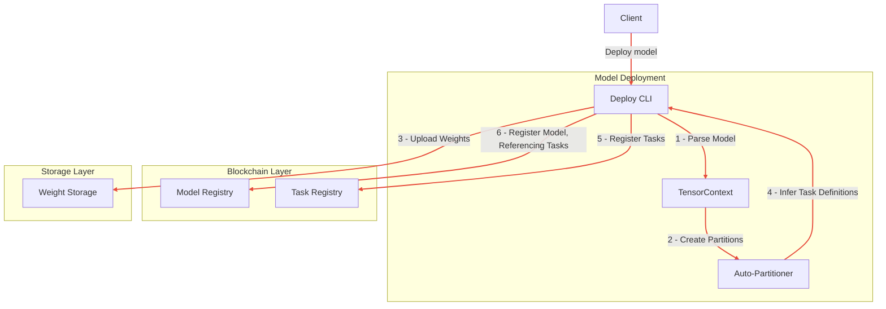
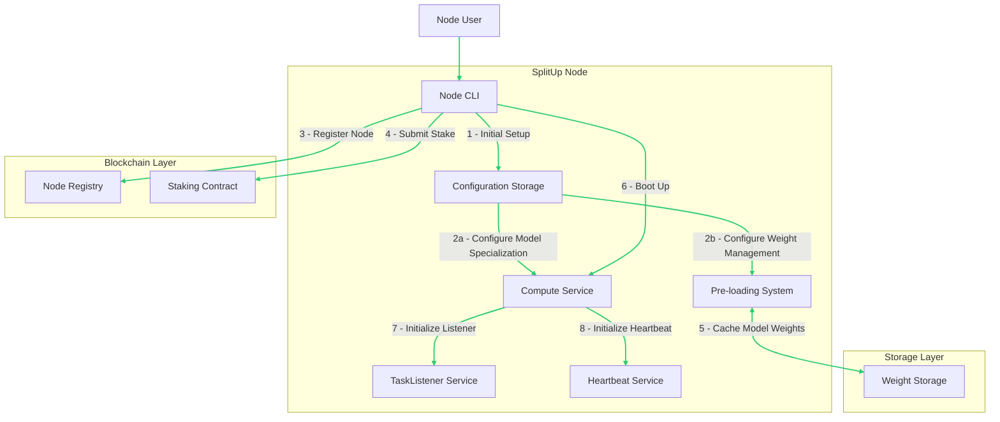
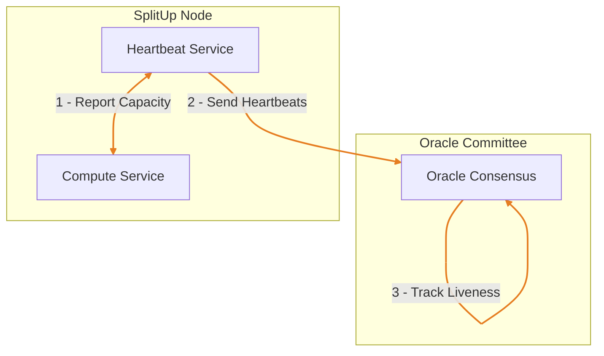
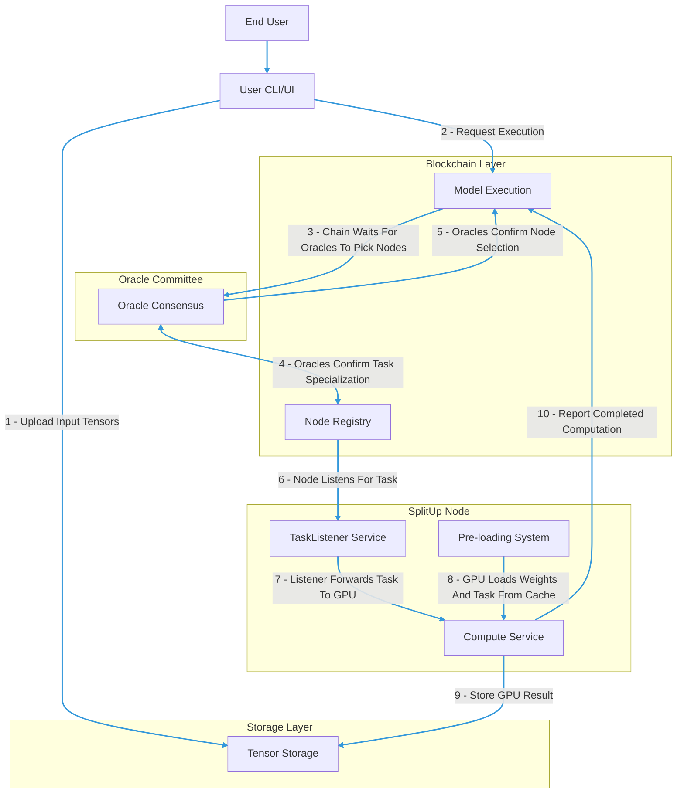
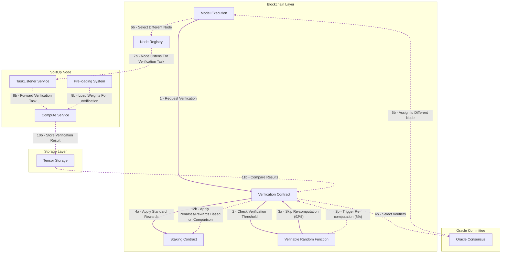

# System Flow Diagrams

I've checked through, I'm pretty sure these are (approximately) correct.

## Whole-System

```mermaid
flowchart TD
    %% Client actors
    Client[Client]
    User[End User]
    UC[User CLI/UI]
    NodeUser[Node User]
    
    %% Model deployment tools
    subgraph "Model Deployment"
        DC[Deploy CLI]
        AP[Auto-Partitioner]
        TC[TensorContext]
    end
    
    %% Oracle Committee
    subgraph "Oracle Committee"
        OC[Oracle Consensus]
    end
    
    %% Blockchain contracts
    subgraph "Blockchain Layer"
        MR[Model Registry]
        TR[Task Registry]
        NR[Node Registry]
        ME[Model Execution]
        VC[Verification Contract]
        SC[Staking Contract]
        VRF[Verifiable Random Function]
    end
    
    %% Node components
    subgraph "SplitUp Node"
        NM[Node CLI]
        CF[Configuration Storage]
        CS[Compute Service]
        PS[Pre-loading System]
        TL[TaskListener Service]
        HS[Heartbeat Service]
    end
    
    %% Storage
    subgraph "Storage Layer"
        WS[Weight Storage]
        TS[Tensor Storage]
    end
    
    %% MODEL DEPLOYMENT FLOW (RED)
    Client -->|"Deploy model"| DC
    DC -->|"1 - Parse Model"| TC
    TC -->|"2 - Create Partitions"| AP
    DC -->|"3 - Upload Weights"| WS
    AP -->|"4 - Infer Task Definitions"| DC
    DC -->|"5 - Register Tasks"| TR
    DC -->|"6 - Register Model, Referencing Tasks"| MR
    
    %% NODE REGISTRATION FLOW (GREEN)
    NodeUser --> NM
    NM -->|"1 - Initial Setup"| CF
    CF -->|"2a - Configure Model Specialization"| CS
    CF -->|"2b - Configure Weight Management"| PS
    NM -->|"3 - Register Node"| NR
    NM -->|"4 - Submit Stake"| SC
    PS <-->|"5 - Cache Model Weights"| WS
    NM -->|"6 - Boot Up"| CS
    CS -->|"7 - Initialize Listener"| TL
    CS -->|"8 - Initialize Heartbeat"| HS
    
    %% TASK EXECUTION FLOW (BLUE)
    User --> UC
    UC -->|"1 - Upload Input Tensors"| TS
    UC -->|"2 - Request Execution"| ME
    ME -->|"3 - Chain Waits For Oracles To Pick Nodes"| OC
    OC <-->|"4 - Oracles Confirm Task Specialization"| NR
    OC -->|"5 - Oracles Confirm Node Selection"| ME
    NR -->|"6 - Node Listens For Task"| TL
    TL -->|"7 - Listener Forwards Task To GPU"| CS
    PS -->|"8 - GPU Loads Weights And Task From Cache"| CS
    CS -->|"9 - Store GPU Result"| TS
    CS -->|"10 - Report Completed Computation"| ME
    
    %% VERIFICATION FLOW (PURPLE)
    ME -->|"1 - Request Verification"| VC
    VC -->|"2 - Check Verification Threshold"| VRF
    
    %% Normal path (92% probability)
    VRF -->|"3a - Skip Re-computation (92%)"| VC
    VC -->|"4a - Apply Standard Rewards"| SC
    
    %% Re-computation path (8% probability)
    VRF -.->|"3b - Trigger Re-computation (8%)"| VC
    VC -.->|"4b - Select Verifiers"| OC
    OC -.->|"5b - Assign to Different Node"| ME
    ME -.->|"6b - Select Different Node"| NR
    NR -.->|"7b - Node Listens For Verification Task"| TL
    TL -.->|"8b - Forward Verification Task"| CS
    PS -.->|"9b - Load Weights For Verification"| CS
    CS -.->|"10b - Store Verification Result"| TS
    TS -.->|"11b - Compare Results"| VC
    VC -.->|"12b - Apply Penalties/Rewards Based on Comparison"| SC
    
    %% HEARTBEAT/LIVENESS FLOW (ORANGE)
    HS <-->|"1 - Report Capacity"| CS
    HS -->|"2 - Send Heartbeats"| OC
    OC <-->|"3 - Track Liveness"| HS
    
    %% CONTRACT RELATIONSHIPS (GRAY)
    MR <-->|"Reference tasks in"| TR
    MR <-->|"Model definition"| ME
    TR <-->|"Task requirements"| ME
    NR <-->|"Node selection"| ME
    SC <-->|"Stake verification"| ME
    VRF <-->|"Randomness service"| VC
    
    %% Style all relationships by flow type
    %% Model Deployment (Red)
    linkStyle 0,1,2,3,4,5,6 stroke:#e74c3c,stroke-width:2;
    
    %% Node Registration (Green)
    linkStyle 7,8,9,10,11,12,13,14,15,16 stroke:#2ecc71,stroke-width:2;
    
    %% Task Execution (Blue)
    linkStyle 17,18,19,20,21,22,23,24,25,26,27 stroke:#3498db,stroke-width:2;
    
    %% Verification - Normal path (Purple)
    linkStyle 28,29,30,31 stroke:#9b59b6,stroke-width:2;
    
    %% Verification - Recomputation path (Purple dashed)
    linkStyle 32,33,34,35,36,37,38,39,40,41 stroke:#9b59b6,stroke-width:2,stroke-dasharray: 5 5;
    
    %% Heartbeat/Liveness (Orange)
    linkStyle 42,43,44 stroke:#e67e22,stroke-width:2;
    
    %% Contract Relationships (Gray)
    linkStyle 45,46,47,48,49,50 stroke:#7f8c8d,stroke-width:2;
    
    %% Add a legend
    subgraph "Legend"
        ModelDeployment[Model Deployment Flow]:::redFlow
        NodeRegistration[Node Registration Flow]:::greenFlow
        TaskExecution[Task Execution Flow]:::blueFlow
        NormalV[Normal Verification]:::purpleFlow
        ProbV[Probabilistic Verification]:::purpleDashedFlow
        Heartbeat[Liveness Flow]:::orangeFlow
        ContractRelations[Contract Relationships]:::grayFlow
    end
    
    classDef redFlow fill:#e74c3c,stroke:#c0392b,color:white;
    classDef greenFlow fill:#2ecc71,stroke:#27ae60,color:white;
    classDef blueFlow fill:#3498db,stroke:#2980b9,color:white;
    classDef purpleFlow fill:#9b59b6,stroke:#8e44ad,color:white;
    classDef purpleDashedFlow fill:#9b59b6,stroke:#8e44ad,color:white,stroke-dasharray: 5 5;
    classDef orangeFlow fill:#e67e22,stroke:#d35400,color:white;
    classDef grayFlow fill:#7f8c8d,stroke:#2c3e50,color:white;
    
    class ModelDeployment redFlow;
    class NodeRegistration greenFlow;
    class TaskExecution blueFlow;
    class NormalV purpleFlow;
    class ProbV purpleDashedFlow;
    class Heartbeat orangeFlow;
    class ContractRelations grayFlow;
```

## Model Deployment

## Node Setup

## Liveness Tracking System

Informs the Oracle Committee as to which nodes it should pick to perform the task.

## Node Selection Oracles

## Compute Verification Flows

