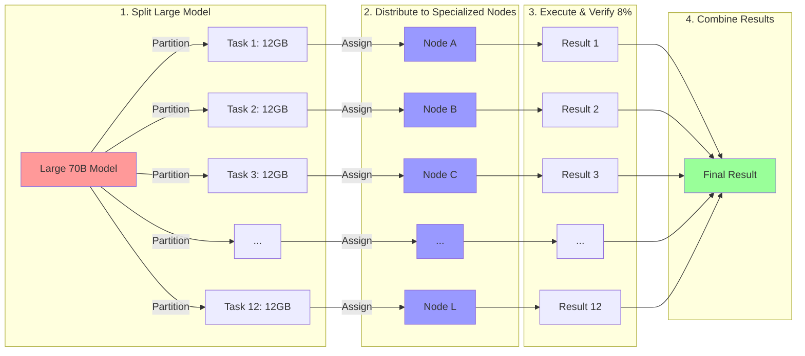
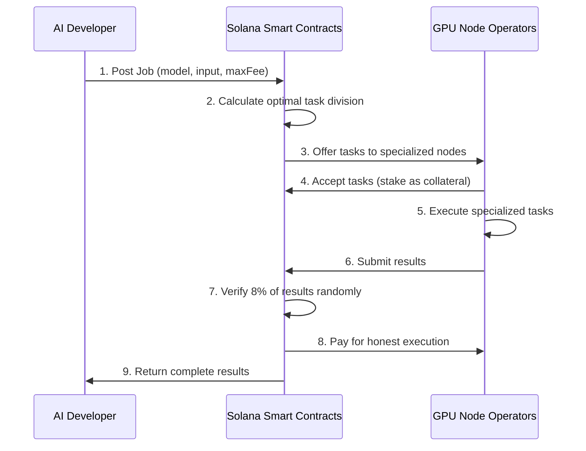

# SplitUp: Large AI Model Marketplace on Solana

> **TLDR: A Solana-powered marketplace where consumer GPU owners earn by running specialized portions of large AI models that wouldn't otherwise fit on their hardware.**

---

## The Problem: Large Models Don't Fit on Consumer Hardware

- **Hard Technical Limit**: Modern AI models require 24-80GB VRAM
- **Consumer Reality**: Most GPUs have only 8-16GB VRAM
- **Current Options**:
  - Buy expensive specialized hardware ($5,000-10,000+)
  - Pay for cloud GPU instances ($2-8+ per hour)
  - Use smaller, less capable models

This creates a significant barrier to AI democratization.

---

## Introducing SplitUp: AI Compute Marketplace

**SplitUp creates a two-sided marketplace on Solana:**

- **Buyers**: AI developers who need to run large models
- **Sellers**: GPU owners who specialize in specific model components

The correctness of computations is ensured through our Proof of Sampling Protocol (PoSP) with only 8% verification overhead - dramatically more efficient than traditional verification methods that require 100%+ redundancy.

Result: Consumer GPUs can collectively run models too large for any single one... and it's cheap.

---

## Why SplitUp is Special: Technical Advantages

**Built on EigenTensor**

1. **Tensor-Centric Computation**: Universal format for any ML workload

   - Compatible with popular frameworks (PyTorch, TensorFlow models)
   - Entire models represented as computational graphs
   - TinyGrad compatible - familiar API for ML developers

2. **Memory Safety**: No arbitrary code execution - only memory-safe tensor operations allowed

   - Prevents security exploits or physical hardware damage
   - Enables trustless computation with mathematical guarantees

3. **GPU Agnosticism**: Works on any consumer GPU regardless of manufacturer

   - NVIDIA, AMD, Intel all supported
   - Nodes compile optimized code for their specific hardware

4. **Automatic Model Splitting**: VRAM no longer limits model size

   - Novel partitioning algorithm finds optimal split points
   - Memory requirements distributed across multiple nodes
   - Solves the #1 bottleneck in AI democratization

**Uses Proof of Sampling Protocol (PoSP)**

1. **Efficient Verification**: Only 8% of work needs verification
   - Proof of Sampling Protocol vs traditional 100%+ overhead
   - Economic incentives make honesty more profitable than cheating

No other platform combines all these advantages in a working marketplace.

---

## How It Works: The Big Picture



---

## Technical Deep Dive: EigenTensor Integration

```python
# Define your model using TinyGrad-compatible code
def create_llama_task(context: TensorContext) -> GraphProgram:
    # Define placeholder tensors for token embeddings
    input_ids = context.add_graph_input("input_ids", (1, max_seq_len))

    # Load model architecture (weights handled separately)
    model = LLaMAModel(config)

    # Define forward pass (automatically builds computational graph)
    outputs = model(input_ids)

    # Compile to universal tensor graph format
    return context.compile_to_graph(outputs)

# Auto-partition the model for distributed execution
def auto_partition(
    graph_program: GraphProgram,
    target_vram: int
) -> list[SolanaTaskDefinition]:
    # Analyze model memory requirements and dependencies
    partitions = split_graph_by_memory_constraints(graph_program, target_vram)

    # Define clean interfaces between partitions
    task_definitions = []
    for partition in partitions:
        task_definition = SolanaTaskDefinition(
            task_id=generate_task_id(),
            vram_requirement=calculate_vram_needs(partition),
            weight_uri=upload_weights_to_storage(partition),
            input_interfaces=define_input_interfaces(partition),
            output_interfaces=define_output_interfaces(partition)
        )
        task_definitions.append(task_definition)

    return task_definitions
```

SplitUp transforms this memory-safe computation into a Solana marketplace.

---

## Solana-powered Marketplace



The marketplace uses USDC for payments and staking with bonded economic guarantees.

---

## Market Dynamics & Incentives

**For GPU Owners (Sellers):**

- **Earnings**: ~$0.10-0.50 per hour per GPU depending on task specialization
- **Specialization**: Choose specific model components to specialize in
- **Requirements**: Stake USDC as security deposit (slashed if dishonest)
- **Optimization**: Run multiple adjacent tasks for higher earnings

**For AI Developers (Buyers):**

- **Access**: Run 70B+ models without specialized hardware
- **Cost**: Pay only for compute used (~$0.25-1.00 per inference)
- **Interface**: Simple API similar to centralized alternatives
- **Control**: Own your data and model weights

---

## Comparison: What Makes Us Unique

| Feature                   | SplitUp                       | Other Decentralized    |
| ------------------------- | ----------------------------- | ---------------------- |
| **Large Model Support**   | ✓ Any size via partitioning   | ✗ Limited by node VRAM |
| **Memory Safety**         | ✓ Only tensor operations      | ✓ Limited operations   |
| **GPU Agnosticism**       | ✓ Any GPU hardware            | ✗ Often specific GPUs  |
| **Model Splitting**       | ✓ Automatic partitioning      | ✗ Not supported        |
| **Verification Overhead** | ✓ Just 8% (PoSP)              | ~ Larger overheads     |
| **Marketplace Model**     | ✓ Open on Solana              | ✓ Limited efficiency   |
| **Flexibility**           | ✓ Any tensor DAG via TinyGrad | ✗ Limited model types  |
| **Developer Experience**  | ✓ TinyGrad compatible         | ✗ Complex custom APIs  |

---

## Concrete Example: Running LLaMA-70B on SplitUp

**Traditional Approach:**

- Requires A100 GPU (~$10,000) or cloud instance ($2-8/hour)
- VRAM limitation forces expensive hardware choices

**SplitUp Approach:**

- Model automatically partitioned into 12 tasks of ~12GB each
- Memory-safe task definitions registered on Solana
- Tasks distributed to specialized nodes (RTX 3060+ GPUs)
- Results combined into complete inference output
- Total cost: ~$0.50 per inference vs. $2+ on cloud platforms

This makes state-of-the-art models accessible to everyone.

---

## Technical Architecture

```mermaid
flowchart TD
    %% Client actors
    Client[Client]
    User[End User]
    UC[User CLI/UI]
    NodeUser[Node User]
    
    %% Model deployment tools
    subgraph "Model Deployment"
        DC[Deploy CLI]
        AP[Auto-Partitioner]
        TC[TensorContext]
    end
    
    %% Oracle Committee
    subgraph "Oracle Committee"
        OC[Oracle Consensus]
    end
    
    %% Blockchain contracts
    subgraph "Blockchain Layer"
        MR[Model Registry]
        TR[Task Registry]
        NR[Node Registry]
        ME[Model Execution]
        VC[Verification Contract]
        SC[Staking Contract]
        VRF[Verifiable Random Function]
    end
    
    %% Node components
    subgraph "SplitUp Node"
        NM[Node CLI]
        CF[Configuration Storage]
        CS[Compute Service]
        PS[Pre-loading System]
        TL[TaskListener Service]
        HS[Heartbeat Service]
    end
    
    %% Storage
    subgraph "Storage Layer"
        WS[Weight Storage]
        TS[Tensor Storage]
    end
    
    %% MODEL DEPLOYMENT FLOW (RED)
    Client -->|"Deploy model"| DC
    DC -->|"1 - Parse Model"| TC
    TC -->|"2 - Create Partitions"| AP
    DC -->|"3 - Upload Weights"| WS
    AP -->|"4 - Infer Task Definitions"| DC
    DC -->|"5 - Register Tasks"| TR
    DC -->|"6 - Register Model, Referencing Tasks"| MR
    
    %% NODE REGISTRATION FLOW (GREEN)
    NodeUser --> NM
    NM -->|"1 - Initial Setup"| CF
    CF -->|"2a - Configure Model Specialization"| CS
    CF -->|"2b - Configure Weight Management"| PS
    NM -->|"3 - Register Node"| NR
    NM -->|"4 - Submit Stake"| SC
    PS <-->|"5 - Cache Model Weights"| WS
    NM -->|"6 - Boot Up"| CS
    CS -->|"7 - Initialize Listener"| TL
    CS -->|"8 - Initialize Heartbeat"| HS
    
    %% TASK EXECUTION FLOW (BLUE)
    User --> UC
    UC -->|"1 - Upload Input Tensors"| TS
    UC -->|"2 - Request Execution"| ME
    ME -->|"3 - Chain Waits For Oracles To Pick Nodes"| OC
    OC <-->|"4 - Oracles Confirm Task Specialization"| NR
    OC -->|"5 - Oracles Confirm Node Selection"| ME
    NR -->|"6 - Node Listens For Task"| TL
    TL -->|"7 - Listener Forwards Task To GPU"| CS
    PS -->|"8 - GPU Loads Weights And Task From Cache"| CS
    CS -->|"9 - Store GPU Result"| TS
    CS -->|"10 - Report Completed Computation"| ME
    
    %% VERIFICATION FLOW (PURPLE)
    ME -->|"1 - Request Verification"| VC
    VC -->|"2 - Check Verification Threshold"| VRF
    
    %% Normal path (92% probability)
    VRF -->|"3a - Skip Re-computation (92%)"| VC
    VC -->|"4a - Apply Standard Rewards"| SC
    
    %% Re-computation path (8% probability)
    VRF -.->|"3b - Trigger Re-computation (8%)"| VC
    VC -.->|"4b - Select Verifiers"| OC
    OC -.->|"5b - Assign to Different Node"| ME
    ME -.->|"6b - Select Different Node"| NR
    NR -.->|"7b - Node Listens For Verification Task"| TL
    TL -.->|"8b - Forward Verification Task"| CS
    PS -.->|"9b - Load Weights For Verification"| CS
    CS -.->|"10b - Store Verification Result"| TS
    TS -.->|"11b - Compare Results"| VC
    VC -.->|"12b - Apply Penalties/Rewards Based on Comparison"| SC
    
    %% HEARTBEAT/LIVENESS FLOW (ORANGE)
    HS <-->|"1 - Report Capacity"| CS
    HS -->|"2 - Send Heartbeats"| OC
    OC <-->|"3 - Track Liveness"| HS
    
    %% CONTRACT RELATIONSHIPS (GRAY)
    MR <-->|"Reference tasks in"| TR
    MR <-->|"Model definition"| ME
    TR <-->|"Task requirements"| ME
    NR <-->|"Node selection"| ME
    SC <-->|"Stake verification"| ME
    VRF <-->|"Randomness service"| VC
    
    %% Style all relationships by flow type
    %% Model Deployment (Red)
    linkStyle 0,1,2,3,4,5,6 stroke:#e74c3c,stroke-width:2;
    
    %% Node Registration (Green)
    linkStyle 7,8,9,10,11,12,13,14,15,16 stroke:#2ecc71,stroke-width:2;
    
    %% Task Execution (Blue)
    linkStyle 17,18,19,20,21,22,23,24,25,26,27 stroke:#3498db,stroke-width:2;
    
    %% Verification - Normal path (Purple)
    linkStyle 28,29,30,31 stroke:#9b59b6,stroke-width:2;
    
    %% Verification - Recomputation path (Purple dashed)
    linkStyle 32,33,34,35,36,37,38,39,40,41 stroke:#9b59b6,stroke-width:2,stroke-dasharray: 5 5;
    
    %% Heartbeat/Liveness (Orange)
    linkStyle 42,43,44 stroke:#e67e22,stroke-width:2;
    
    %% Contract Relationships (Gray)
    linkStyle 45,46,47,48,49,50 stroke:#7f8c8d,stroke-width:2;
    
    %% Add a legend
    subgraph "Legend"
        ModelDeployment[Model Deployment Flow]:::redFlow
        NodeRegistration[Node Registration Flow]:::greenFlow
        TaskExecution[Task Execution Flow]:::blueFlow
        NormalV[Normal Verification]:::purpleFlow
        ProbV[Probabilistic Verification]:::purpleDashedFlow
        Heartbeat[Liveness Flow]:::orangeFlow
        ContractRelations[Contract Relationships]:::grayFlow
    end
    
    classDef redFlow fill:#e74c3c,stroke:#c0392b,color:white;
    classDef greenFlow fill:#2ecc71,stroke:#27ae60,color:white;
    classDef blueFlow fill:#3498db,stroke:#2980b9,color:white;
    classDef purpleFlow fill:#9b59b6,stroke:#8e44ad,color:white;
    classDef purpleDashedFlow fill:#9b59b6,stroke:#8e44ad,color:white,stroke-dasharray: 5 5;
    classDef orangeFlow fill:#e67e22,stroke:#d35400,color:white;
    classDef grayFlow fill:#7f8c8d,stroke:#2c3e50,color:white;
    
    class ModelDeployment redFlow;
    class NodeRegistration greenFlow;
    class TaskExecution blueFlow;
    class NormalV purpleFlow;
    class ProbV purpleDashedFlow;
    class Heartbeat orangeFlow;
    class ContractRelations grayFlow;
```



---

## Hackathon Implementation

We've built a functional prototype demonstrating:

- **EigenTensor integration** with memory-safe tensor operations
- **Partitioning engine** that divides models into VRAM-constrained tasks
- **Solana contracts** for marketplace coordination
- **Proof of Sampling** implementation (8% verification)
- **Economic model** for staking and payments

Demo: Partitioning LLaMA-70B for execution across consumer GPUs

---

## Join Our Marketplace

**For AI Developers**:

- Access large models without expensive hardware
- Pay only for what you use, no upfront costs
- Simple API for model execution

**For GPU Owners**:

- Earn USDC by joining our compute marketplace
- Specialize in high-demand model components
- Low barrier to entry with consumer hardware

GitHub: github.com/splitup/splitup

---

## Thank You

**SplitUp: The Solana-powered Marketplace for Distributed AI Computation**

[Created for a 2025 AI + Web3 Hackathon]
