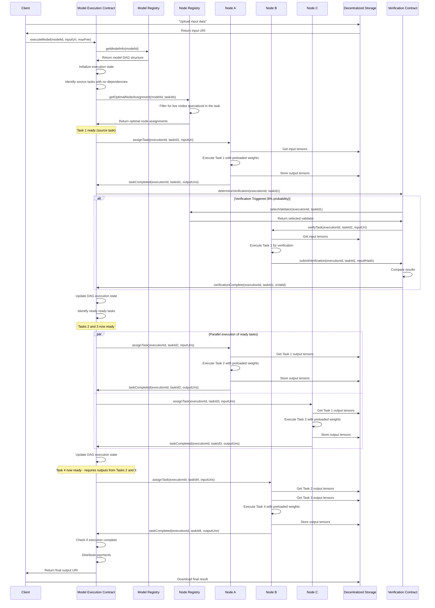

```mermaid
sequenceDiagram
    participant Client
    participant ModelContract as Model Execution Contract
    participant ModelRegistry as Model Registry
    participant NodeRegistry as Node Registry
    participant NodeA as Node A
    participant NodeB as Node B
    participant NodeC as Node C
    participant Storage as Decentralized Storage
    participant Verification as Verification Contract

    Client->>Storage: "Upload input data"
    Storage->>Client: Return input URI

    Client->>ModelContract: executeModel(modelId, inputUri, maxFee)
    ModelContract->>ModelRegistry: getModelInfo(modelId)
    ModelRegistry->>ModelContract: Return model DAG structure

    ModelContract->>ModelContract: Initialize execution state
    ModelContract->>ModelContract: Identify source tasks with no dependencies

    ModelContract->>NodeRegistry: getOptimalNodeAssignment(modelId, taskIds)
    NodeRegistry->>NodeRegistry: Filter for live nodes specialized in the task
    NodeRegistry->>ModelContract: Return optimal node assignments

    Note over ModelContract: Task 1 ready (source task)

    ModelContract->>NodeA: assignTask(executionId, taskId1, inputUri)
    NodeA->>Storage: Get input tensors
    NodeA->>NodeA: Execute Task 1 with preloaded weights
    NodeA->>Storage: Store output tensors
    NodeA->>ModelContract: taskCompleted(executionId, taskId1, outputUris)

    ModelContract->>Verification: determineVerification(executionId, taskId1)

    alt Verification Triggered (8% probability)
        Verification->>NodeRegistry: selectValidator(executionId, taskId1)
        NodeRegistry->>Verification: Return selected validator
        Verification->>NodeB: verifyTask(executionId, taskId1, inputUri)
        NodeB->>Storage: Get input tensors
        NodeB->>NodeB: Execute Task 1 for verification
        NodeB->>Verification: submitVerification(executionId, taskId1, resultHash)
        Verification->>Verification: Compare results
        Verification->>ModelContract: verificationComplete(executionId, taskId1, isValid)
    end

    ModelContract->>ModelContract: Update DAG execution state
    ModelContract->>ModelContract: Identify newly ready tasks

    Note over ModelContract: Tasks 2 and 3 now ready

    par Parallel execution of ready tasks
        ModelContract->>NodeA: assignTask(executionId, taskId2, inputUris)
        NodeA->>Storage: Get Task 1 output tensors
        NodeA->>NodeA: Execute Task 2 with preloaded weights
        NodeA->>Storage: Store output tensors
        NodeA->>ModelContract: taskCompleted(executionId, taskId2, outputUris)
    and
        ModelContract->>NodeC: assignTask(executionId, taskId3, inputUris)
        NodeC->>Storage: Get Task 1 output tensors
        NodeC->>NodeC: Execute Task 3 with preloaded weights
        NodeC->>Storage: Store output tensors
        NodeC->>ModelContract: taskCompleted(executionId, taskId3, outputUris)
    end

    ModelContract->>ModelContract: Update DAG execution state

    Note over ModelContract: Task 4 now ready - requires outputs from Tasks 2 and 3

    ModelContract->>NodeB: assignTask(executionId, taskId4, inputUris)
    NodeB->>Storage: Get Task 2 output tensors
    NodeB->>Storage: Get Task 3 output tensors
    NodeB->>NodeB: Execute Task 4 with preloaded weights
    NodeB->>Storage: Store output tensors
    NodeB->>ModelContract: taskCompleted(executionId, taskId4, outputUris)

    ModelContract->>ModelContract: Check if execution complete
    ModelContract->>ModelContract: Distribute payments

    ModelContract->>Client: Return final output URI
    Client->>Storage: Download final result
```
