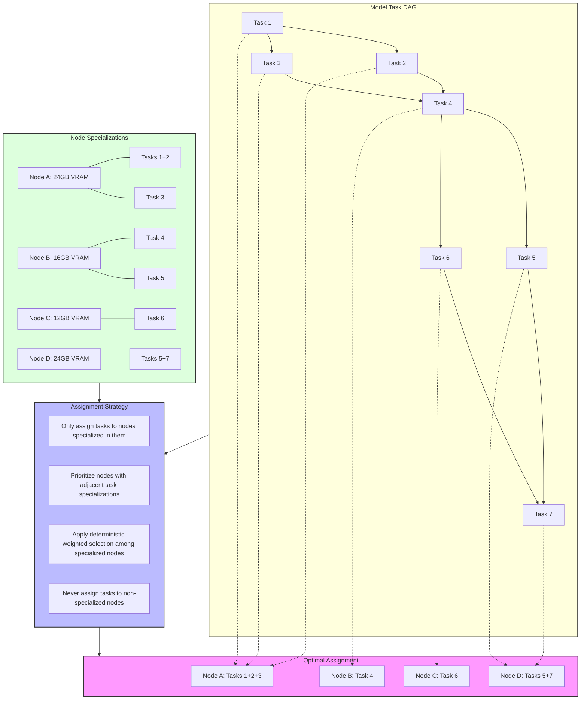

```mermaid
flowchart TD
    subgraph ModelDAG["Model Task DAG"]
        Task1["Task 1"]
        Task2["Task 2"]
        Task3["Task 3"]
        Task4["Task 4"]
        Task5["Task 5"]
        Task6["Task 6"]
        Task7["Task 7"]

        Task1 --> Task2
        Task1 --> Task3
        Task2 --> Task4
        Task3 --> Task4
        Task4 --> Task5
        Task4 --> Task6
        Task5 --> Task7
        Task6 --> Task7
    end

    subgraph NodeSpecializations["Node Specializations"]
        NodeA["Node A: 24GB VRAM"]
        NodeB["Node B: 16GB VRAM"]
        NodeC["Node C: 12GB VRAM"]
        NodeD["Node D: 24GB VRAM"]

        SpecA1["Tasks 1+2"]
        SpecA2["Task 3"]
        SpecB1["Task 4"]
        SpecB2["Task 5"]
        SpecC1["Task 6"]
        SpecD1["Tasks 5+7"]

        NodeA --- SpecA1
        NodeA --- SpecA2
        NodeB --- SpecB1
        NodeB --- SpecB2
        NodeC --- SpecC1
        NodeD --- SpecD1
    end

    subgraph AssignmentStrategy["Assignment Strategy"]
        Strategy1["Only assign tasks to nodes specialized in them"]
        Strategy2["Prioritize nodes with adjacent task specializations"]
        Strategy3["Apply deterministic weighted selection among specialized nodes"]
        Strategy4["Never assign tasks to non-specialized nodes"]
    end

    subgraph OptimalAssignment["Optimal Assignment"]
        OptA["Node A: Tasks 1+2+3"]
        OptB["Node B: Task 4"]
        OptD["Node D: Tasks 5+7"]
        OptC["Node C: Task 6"]
    end

    ModelDAG --> AssignmentStrategy
    NodeSpecializations --> AssignmentStrategy
    AssignmentStrategy --> OptimalAssignment

    Task1 -.-> OptA
    Task2 -.-> OptA
    Task3 -.-> OptA
    Task4 -.-> OptB
    Task5 -.-> OptD
    Task6 -.-> OptC
    Task7 -.-> OptD

    style ModelDAG fill:#ffd,stroke:#333,stroke-width:2px
    style NodeSpecializations fill:#dfd,stroke:#333,stroke-width:2px
    style AssignmentStrategy fill:#bbf,stroke:#333,stroke-width:2px
    style OptimalAssignment fill:#f9f,stroke:#333,stroke-width:2px
```
