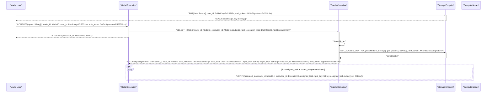
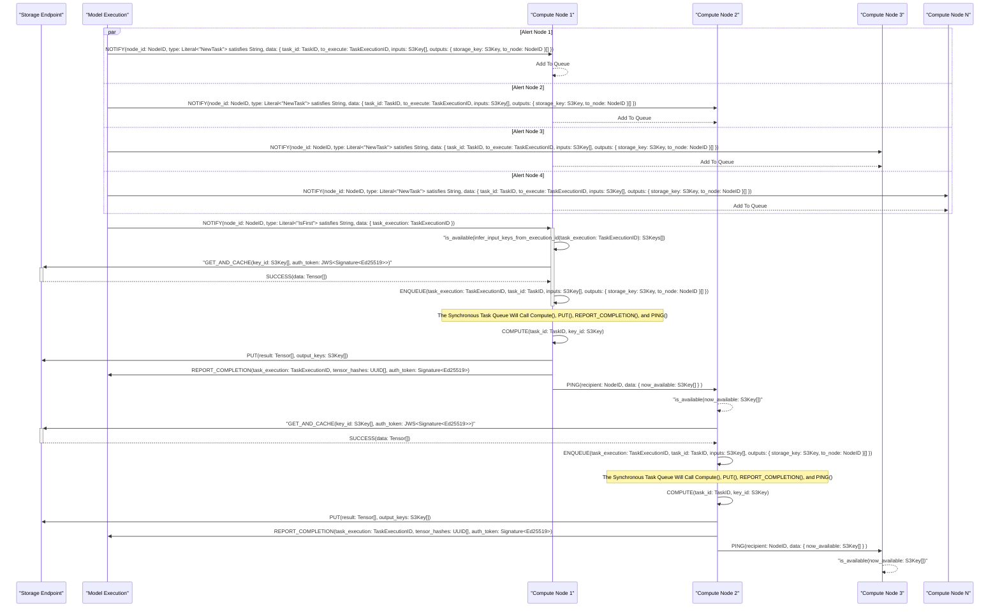

```mermaid
sequenceDiagram
    participant US as "Model User"
    participant ME as "Model Execution"
    participant OC as "Oracle Commitee"
    participant SE as "Storage Endpoint"
    participant ND as "Compute Nodes"

    US ->>+ SE: "PUT(data: Tensor[], user_id: PublicKey<Ed25519>, auth_token: JWS<Signature<Ed25519>)"
    SE -->>- US: "SUCCESS(storage_key: S3Key[])"
    US ->>+ ME: "COMPUTE(inputs: S3Key[], model_id: ModelID, user_id: PublicKey<Ed25519>, auth_token: JWS<Signature<Ed25519>>)"
    ME ->>+ OC: "SELECT_NODES(model_id: ModelID, execution_id: ModelExecutionID, task_execution_map: Dict<TaskID, TaskExecutionID>)"
    ME -->>- US: "SUCCESS(execution_id: ModelExecutionID)"
    OC ->> OC: "Select Nodes"
    OC ->>+ SE: "SET_ACCESS_CONTROL(put: (NodeID, S3Key)[], get: (NodeID, S3Key)[], auth_token: JWS<Ed25519Signature>)"
    SE -->>- OC: "SUCCESS()"
    OC -->>- ME: "SUCCESS(assignments: Dict<TaskID, { node_id: NodeID, task_instance: TaskExecutionID }>, task_data: Dict<TaskExecutionID, { input_key: S3Key, output_key: S3Key }> execution_id: ModelExecutionID, auth_token: Signature<Ed25519>)"

    par 
        loop "for assigned_task in output_assignments.keys"
            ME ->> ND: "NOTIFY(assigned_task.node_id: NodeID, { execution_id: ExecutionID, assigned_task.input_key: S3Key, assigned_task.output_key: S3Key })"
        end
    end
```

```mermaid
sequenceDiagram
    participant SE as "Storage Endpoint"
    participant ME as "Model Execution"
    participant C1 as "Compute Node 1"
    participant C2 as "Compute Node 2"
    participant C3 as "Compute Node 3"
    participant CN as "Compute Node N"

    par Alert Node 1
        ME ->> C1: NOTIFY(node_id: NodeID, type: Literal<"NewTask"> satisfies String, data: { task_id: TaskID, to_execute: TaskExecutionID, inputs: S3Key[], outputs: { storage_key: S3Key, to_node: NodeID }[] })
        C1 -->> C1: Add To Queue
    and Alert Node 2
        ME ->> C2: NOTIFY(node_id: NodeID, type: Literal<"NewTask"> satisfies String, data: { task_id: TaskID, to_execute: TaskExecutionID, inputs: S3Key[], outputs: { storage_key: S3Key, to_node: NodeID }[] })
        C1 -->> C2: Add To Queue
    and Alert Node 3
        ME ->> C3: NOTIFY(node_id: NodeID, type: Literal<"NewTask"> satisfies String, data: { task_id: TaskID, to_execute: TaskExecutionID, inputs: S3Key[], outputs: { storage_key: S3Key, to_node: NodeID }[] })
        C1 -->> C3: Add To Queue
    and Alert Node 4
        ME ->> CN: NOTIFY(node_id: NodeID, type: Literal<"NewTask"> satisfies String, data: { task_id: TaskID, to_execute: TaskExecutionID, inputs: S3Key[], outputs: { storage_key: S3Key, to_node: NodeID }[] })
        C1 -->> CN: Add To Queue
    end

    ME ->>+ C1: NOTIFY(node_id: NodeID, type: Literal<"IsFirst"> satisfies String, data: { task_execution: TaskExecutionID })
    C1 ->> C1: "is_available(infer_input_keys_from_execution_id(task_execution: TaskExecutionID): S3Keys[])
    C1 ->>+ SE: "GET_AND_CACHE(key_id: S3Key[], auth_token: JWS<Signature<Ed25519>>)"
    SE -->>- C1: SUCCESS(data: Tensor[])
    C1 ->>- C1: ENQUEUE(task_execution: TaskExecutionID, task_id: TaskID, inputs: S3Key[], outputs: { storage_key: S3Key, to_node: NodeID }[] })

    NOTE over C1: The Synchronous Task Queue Will Call Compute(), PUT(), REPORT_COMPLETION(), and PING()

    C1 ->> C1: COMPUTE(task_id: TaskID, key_id: S3Key)
    C1 ->> SE: PUT(result: Tensor[], output_keys: S3Key[])
    C1 ->> ME: REPORT_COMPLETION(task_execution: TaskExecutionID, tensor_hashes: UUID[], auth_token: Signature<Ed25519>)
    C1 ->> C2: PING(recipient: NodeID, data: { now_available: S3Key[] } )

    C2 -->> C2: "is_available(now_available: S3Key[])"
    C2 ->>+ SE: "GET_AND_CACHE(key_id: S3Key[], auth_token: JWS<Signature<Ed25519>>)"
    SE -->>- C2: SUCCESS(data: Tensor[])
    C2 ->> C2: ENQUEUE(task_execution: TaskExecutionID, task_id: TaskID, inputs: S3Key[], outputs: { storage_key: S3Key, to_node: NodeID }[] })

    NOTE over C2: The Synchronous Task Queue Will Call Compute(), PUT(), REPORT_COMPLETION(), and PING()

    C2 ->> C2: COMPUTE(task_id: TaskID, key_id: S3Key)
    C2 ->> SE: PUT(result: Tensor[], output_keys: S3Key[])
    C2 ->> ME: REPORT_COMPLETION(task_execution: TaskExecutionID, tensor_hashes: UUID[], auth_token: Signature<Ed25519>)
    C2 ->> C3: PING(recipient: NodeID, data: { now_available: S3Key[] } )

    C3 -->> C3: "is_available(now_available: S3Key[])"
```