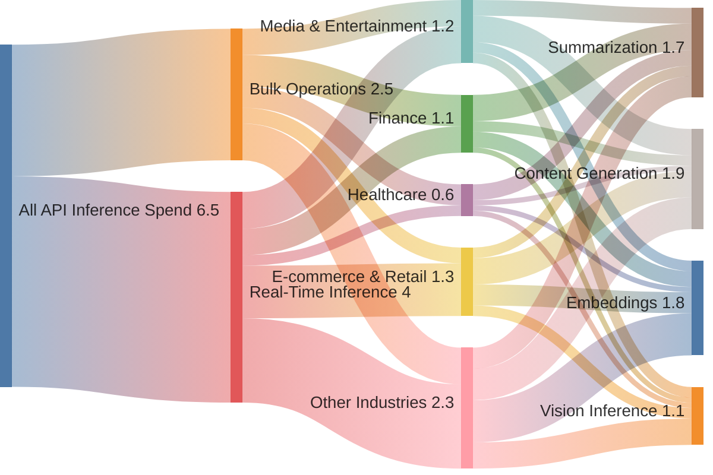
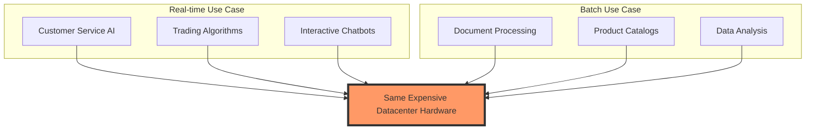
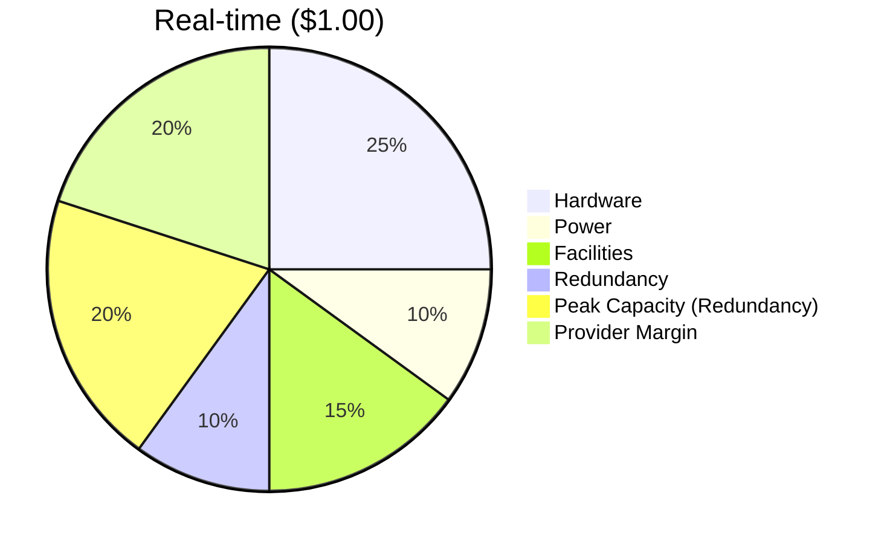
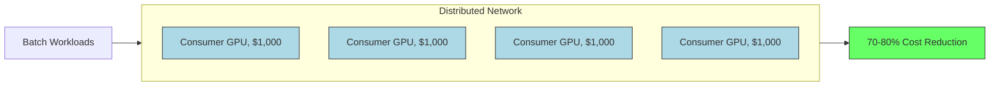

# SplitUp: The Cheapest Bulk-Inference Platform

> Ultra-Low-Cost Inference Network, Powered By Idle GPUs

---

## Bulk Operations Are Too Expensive

**Enterprises running large-scale AI batch jobs are being massively overcharged:**

- **E-commerce** companies generating millions of product descriptions
- **Data analytics firms** enriching entire databases
- **Marketing agencies** creating SEO content at scale

**SplitUp delivers 70-80% cost savings by matching batch workloads with idle GPUs**

---

## Spending On LLMs via API, Visualized

**>20% of LLM API Spending Involves Bulk Operations!**



Many companies rely heavily on bulk operations, but not real-time operations!

---

## Problem: Datacenter GPU Utilization

- **Real-time inference requires massive over-provisioning**

  - Datacenters must maintain enough capacity for peak demand
  - Leading to **40-60% idle time during off-peak hours**
  - This cost gets passed directly to customers

- **Who pays the price?**
  - Data processing teams needing to analyze millions of documents
  - E-commerce companies wanting to enrich entire product catalogs
  - Startups with limited budgets but high-volume AI needs
  - Anyone getting priced-out of a market due to API costs

---

## Current Solution: OpenAI-Style Batch Processing


- **Current batch processing approach:**
  - Queue user requests for up to 24 hours
  - Process them on the same premium datacenter hardware
  - Offer a 50% discount for the delayed processing
- **Example: OpenAI Batch API**
  - Released early 2024
  - o1 costs $15/M tokens standard, $7.50/M tokens in batch
  - Completed within 24 hours, often much sooner

---

## OpenAI's Batch Processing Is Popular...

- **Already 20-30% of total LLM queries can tolerate high latency**

  - No need for immediate response, overnight data enrichment, etc

- **Batch workloads growing faster than real-time:**

  - Total token volume in batch jobs may eclipse interactive queries
  - Entire datasets can be processed in bulk rather than selectively

- **Economics strongly favor batch processing:**
  - 80-90%+ GPU utilization vs. 40-60% for real-time inference
  - 14× throughput improvement with increased batch sizes

---

## ... But Stupid.



- **Datacenter GPUs are built for low latency, but unnecessary for batch processing**
  - H100s cost $25,000-40,000 each
  - Designed for millisecond response times
  - Housed in facilities with 1.5+ PUE (power usage effectiveness)
  - Optimized for density and heat dissipation in data centers

---

Using modern datacenter hardware for 24-hour batch jobs is like using a Ferrari as a delivery truck.

---

## The Real Cost Structure of AI Inference

**The actual infrastructure cost for a non-MoE 70B Transformer LLM:**



---

> OpenAI's Batch APIs eliminate only the redundancy cost! The largest cost category, hardware acquisition costs (amortized across queries), remains unaddressed!

---

|              | OpenAI o1 | OpenAI o1 (Batch) | DeepSeek R1 | DeepSeek R1 (Batch) | **SplitUp /w R1** |
| ------------ | ----------------- | ----------------- | ----------------- | ----------------- | ----------------- |
| $/M Tokens\* | $15.00    | $7.50             | $0.50-2.00  | $0.25-1.00          | **$0.15-0.75**    |
| 500M Tokens  | $7,500    | $3,750            | $250-1,000  | $125-500            | **$75-375**       |
| Node VRAM    | ???       | ???               | 100+ GB     | 100+ GB             | **8+ GB**         |

\*once you absorb the cost of the reasoning tokens, counting only the output tokens.

---

## Open-Weight Models Need Bulk Processing Infrastructure

- **Open-weight models made progress in 2025...**

  - DeepSeek R1 matches OpenAI o1 quality at a fraction of the cost
  - No licensing fees for the model weights
  - Major cost reduction compared to proprietary models

- **... but efficient bulk-processing did not emerge.**
  - These models require 100+ GB of VRAM to run
  - Only expensive datacenter GPUs can accommodate them
  - Few API providers offered bulk query discounts
  - Inference costs remain prohibitively high for bulk jobs

---

Thus, we need bulk processing services that:

1. Use cheap, underutilized, or decommissioned hardware
2. Work with all popular open-weight ML models
3. Simplifies the data processing pipeline

**That's what we've built.**

---

## How SplitUp Makes Cheap Bulk Inference Possible

- **Break large AI models into smaller "tasks" that fit on consumer GPUs**
- **Create a marketplace where GPU owners specialize in specific tasks**
- **Coordinate execution across nodes with predictive allocation**
- **Verify results through cryptographic proofs and economic incentives**

---

## SplitUp's Distributed Batch Processing



- **Consumer GPUs offer significantly better economics:**

  - **Hardware Cost: RTX 4090 ($1,600) vs. H100 ($30,000)**
  - **Performance per Dollar: 30-50% better for batch tasks**
  - **Power Efficiency: Newer consumer GPUs use less power per FLOP**
  - **Thermal Efficiency: Consumer GPUs don't require complex HVAC systems***

- **This enables true cost transformation:**
  - 70-80% cost reduction vs. standard pricing
  - $0.20-$0.30/M tokens vs. $1.00-$3.00/M tokens for 70B models

---

## Price: Before and After

| Before | After |
| ---- | ---- |
| ```mermaid 
pie title Real-time ($1.00)
  "Hardware" : 0.25
  "Power" : 0.10
  "Facilities" : 0.15
  "Redundancy" : 0.10
  "Peak Capacity" : 0.20
  "Provider Margin" : 0.20``` |


- All data is kept confidential, only revealed to the nodes completing the computation

- **Why verification matters:**
  - Prevents nodes from tampering with results
  - Enables applications requiring result integrity
- We can implement a fee model for running computations in a confidential manner on sanctioned nodes, etc.
  - Allowing the customer to pay for more trust guarantees may overcome some hurdles to the adoption of off-premise APIs.

---

## Business Model & Go-to-Market

- **Platform Fee**: 10% of transaction value
- **Node Rewards**: 80% of transaction value goes to node operators
- **Verification Pool**: 10% funds the verification system

**Singular Objective: Get Onto OpenRouter!**

- OpenRouter routes queries to the cheapest inference provider
- We will be extremely price-competitive, thus heavily utilized
- This is an immediate source of revenue!!!

---

## Team & Roadmap

[Placeholder for Team Information]

---

## Investment Opportunity

- **Raising**: [Amount] for [Stage] round
- **Use of Funds**:
  - Engineering team expansion
  - Infrastructure development
  - Security audits
  - Go-to-market strategy
- **Market Potential**: Addressing the growing $724 billion AI inference market
- **Unique Position**: First-to-market with ultra-low-cost verified inference

---

## SplitUp: The Airbnb for AI Compute Power

- **70-80% cost reduction** for high-volume AI workloads
- **Distributed execution** across consumer GPUs
- **Verified results** through cryptographic proofs
- **Enabling mass adoption** of large-scale AI processing

### Contact Information

- Email: info@splitup.ai
- Website: www.splitup.ai
- GitHub: github.com/splitup
- Twitter: @splitup_ai
