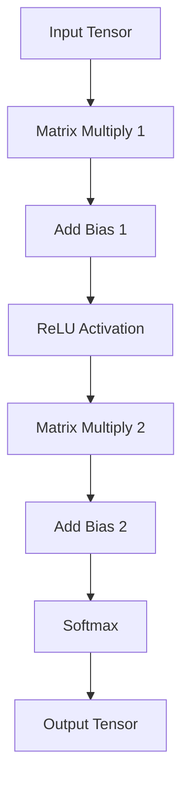
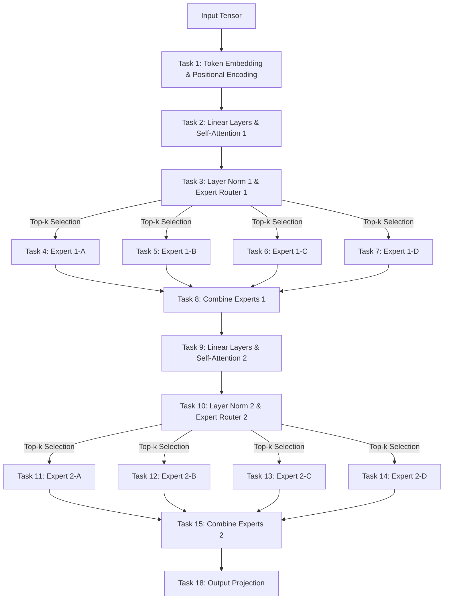
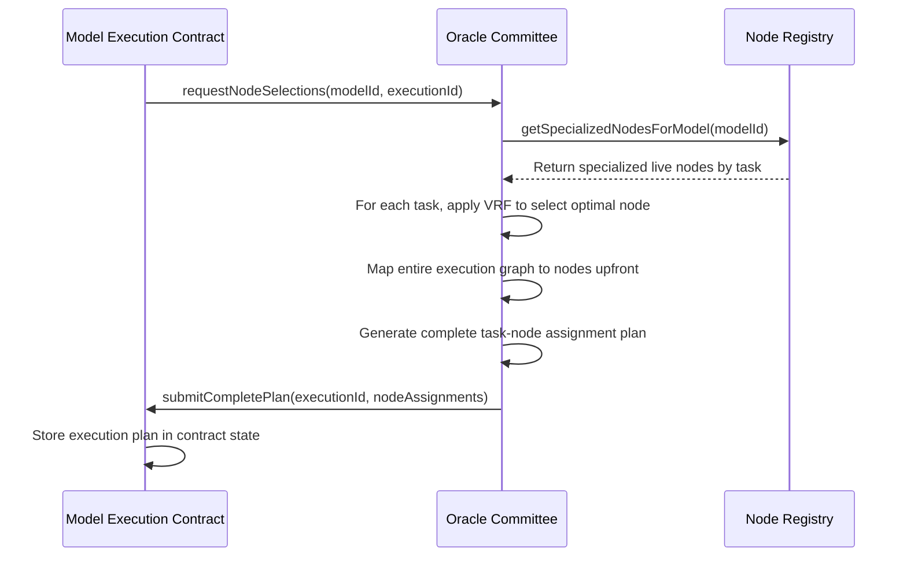

# SplitUp: A Low-Latency Decentralized System for Large-Scale AI Inference

## 1. The Core Problem

Modern AI models like LLaMA-70B require 80-140GB of VRAM (Video RAM on graphics cards), but consumer GPUs typically only have 8-24GB. This creates a fundamental limitation: even if you have a powerful consumer GPU, you simply can't run these large models on your hardware. To overcome this limitation, we need to distribute model execution across multiple devices, but doing so efficiently presents significant challenges.

## 2. Our Solution: First Principles Approach

SplitUp solves this problem by:

1. Breaking models into smaller "tasks" that function as pure computations with typed tensor interfaces
2. Creating a marketplace where GPU owners can specialize in specific tasks
3. Coordinating the execution of these tasks across multiple nodes to run complete models
4. Using economic incentives and verification to ensure accurate results
5. Optimizing the entire system for low latency through predictive allocation and direct communication

Let's explore each aspect.

## 3. Fundamental Concepts

### 3.1. Model Partitioning, Task Structure, Node Specialization

**Problem:** Large models don't fit in consumer GPU memory.

**Solution:** We automatically split models into smaller pieces (tasks) that can run on consumer hardware.

```
Model Developer --> CLI: "splitup-deploy register --model llama-70b.pkl --target-vram 12GB"
```

This process:

- Parses the model using a lightweight ML framework
- Analyzes its computational graph (the mathematical operations)
- Identifies memory bottlenecks, etc
- Splits the model into independent "tasks"
- Defines strictly typed tensor interfaces between independent tasks

**Critical Feature: Directed Acyclic Graph (DAG) Structure**

Each task is a directed acyclic graph (DAG) of mathematical operations, and the entire model forms a larger DAG of tasks.

Here's a DAG of operations, which makes up a task:



Here's a DAG of tasks, which makes up a model:



The DAG structure ensures:

- Ahead-of-time cost estimation for each task
- No infinite loops or unpredictability
- Clear dependencies between tasks

This structure is essential for our system as it allows us to plan the entire execution path in advance.

**Each node specializes to specific tasks. It must be able to keep the task code and weights in VRAM for use at any given instant.**

### 3.2. Tensor Data Flow Between Nodes

**Problem:** When a model is split across multiple nodes, the output tensors from one task must become the input tensors for another.

**Solution:** We use decentralized storage to transfer tensors between nodes.

Tensors are multi-dimensional arrays with explicit specifications:

- Dimensions (e.g., [1, 512, 1024])
- Data type (e.g., float16, float32)
- Size (often megabytes or even gigabytes)

In a distributed model, tensor data flows through the system:

1. Initial input tensors come from the user
2. Each task produces output tensors
3. These outputs become inputs for downstream tasks
4. Eventually, final output tensors are returned to the user

This tensor flow creates a critical latency challenge: without optimization, nodes spend significant time waiting for tensor data to be stored and retrieved.

### 3.3. Node Selection and Liveness Monitoring

**Problem:** How do we select which nodes should execute each task and ensure they're actually available?

**Solution:** We use an Oracle Committee that tracks node liveness and makes selection decisions.

The Oracle Committee is a Byzantine Fault Tolerant (BFT) system that:

1. Receives regular heartbeats from all compute nodes
2. Maintains a live status map of all nodes in the network
3. Selects appropriate nodes for task execution
4. Uses a Verifiable Random Function (VRF) to ensure fair, unpredictable, but deterministic node selection

Node selection must consider:

- Which tasks a node has specialized in
- Whether the node is currently online
- Estimated time-to-completion, for efficient task scheduling
- Socially fair distribution of work, won't discourage participant

This selection process is critical for both performance and security, as it must be resistant to manipulation by malicious actors.

### 3.4. Economic Security and Verification

**Problem:** In a decentralized system, nodes might return incorrect results either by accident or malicious intent.

**Solution:** We implement economic incentives and probabilistic verification through Hyperbolic's Proof of Sampling Protocol (PoSP).

The key elements are:

1. Nodes stake USDC as security collateral (1000 USDC base + 100 USDC per GB of VRAM)
2. Only 8% of tasks are randomly selected for verification
3. For verified tasks, another node re-computes the result and compares outputs
4. Outputs are compared using appropriate metrics (cosine similarity, Manhattan distance, or Hamming distance) to account for acceptable floating-point errors from GPU computation
5. When two verification nodes disagree, a third node breaks the tie
6. Honest computation is rewarded; dishonest nodes lose their stake

This creates a mathematical security condition:

$$p \gt \frac{C}{(1-r)(R+S)}$$

Where:

- p = verification probability (8%)
- C = computation cost
- r = maximum collusion fraction (10%)
- R = verification reward (1.2x)
- S = slashing amount (10x)

With these parameters, honesty is more profitable than cheating. The probabilistic nature keeps verification costs low while maintaining security.

The security of this scheme depends on the capacity of Oracle Committee, who determine which node performs the initial computation as well as which node will perform the re-computation (verification), to select nodes by a credibly fair process.

### 3.5. Memory Safety, Optimization and Graphs

**Problem:** How do we get fast executable code that works the same across different GPUs for each computation?

**Solution:** We use computational graph representations in tandem with an optimizing compiler to achieve for fast, memory-safe execution.

This graph-based approach provides several critical advantages:

1. **Memory safety** - No arbitrary code execution, only predefined tensor operations permitted by the compiler
2. **Cross-platform compatibility** - Same graph runs on any GPU architecture
3. **Optimization opportunities** - Compiler can perform kernel fusion, operation reordering

We're evaluating two primary frameworks for implementation:

- **TinyGrad** - Lightweight, memory-safe tensor library and frontend

  - Provides lazy evaluation for building complete computation graphs
  - Supports automatic optimization through kernel fusion
  - Familiar API for ML engineers
  - Small codebase (~5000 lines) that's easier to audit for security

- **Apache TVM** - Production-grade tensor compiler
  - Provides hardware-specific optimizations
  - Supports a wide range of hardware targets
  - Includes sophisticated graph-level transformations

## 4. Latency Challenges in Distributed Execution

At the AI3 hackathon, we presented v0 of SplitUp, which suffered from three critical latency bottlenecks:

### 4.1. Sequential Node Assignment

In the original design, nodes were assigned one task at a time:

1. Task A completes and reports to the blockchain
2. Oracle Committee observes completion event
3. Oracle Committee selects a node for Task B
4. Oracle Committee submits node selection to the blockchain
5. Selected node observes assignment and begins Task B

This sequential process created significant delays between tasks, often 1-2 seconds per task due to blockchain confirmation times.

### 4.2. Dynamic Tensor Storage Management

Originally, tensor storage locations were determined dynamically:

1. Task A completes computation
2. Node uploads results to storage
3. Node receives storage location (S3 key)
4. Node reports completion with storage location
5. Node for Task B learns where to find its inputs

This dynamic approach caused unnecessary waiting periods as nodes couldn't prepare for data retrieval in advance.

### 4.3. Blockchain-Mediated Communication

All node communication happened through the blockchain:

1. Node A completes task and reports to blockchain
2. Blockchain event is observed (after confirmation)
3. Node B learns that inputs are available
4. Node B retrieves inputs and begins computation

This indirect communication path added substantial latency to each step in the execution process.

## 5. Low-Latency Design Solutions

To address these latency challenges, we've redesigned the system with three key innovations:

### 5.1. Predictive Node Allocation

**Problem:** Sequential node assignment adds significant delays between tasks.

**Solution:** The Oracle Committee assigns all nodes for the entire model execution upfront.



When a user requests model execution, the Oracle Committee:

1. Consults the model's task graph structure
2. Identifies all live nodes specialized in each required task
3. Uses a VRF to deterministically select the best node for each task
4. Creates a complete execution plan mapping tasks to nodes
5. Submits the entire plan to the blockchain in a single transaction

This approach offers several advantages:

- Eliminates repeated node selection delays
- Enables parallel execution of independent task branches
- Allows for critical path optimization
- Reduces blockchain congestion by using fewer transactions

### 5.2. Pre-determined Storage Key System

**Problem:** Dynamic tensor storage management causes delays as nodes wait to learn where data is stored.

**Solution:** Generate all tensor storage keys at the beginning of execution with precise access control.

```typescript
interface StorageEndpoint {
  // S3-compatible storage with precise access control
  setAccessControl(
    putPermissions: { nodeId: NodeID; s3Key: S3Key }[],
    getPermissions: { nodeId: NodeID; s3Key: S3Key }[],
    authToken: JWS<Ed25519Signature>,
  ): Promise<void>;

  put(
    data: Tensor[],
    outputKeys: S3Key[],
    authToken: JWS<Ed25519Signature>,
  ): Promise<void>;

  getAndCache(
    keyIds: S3Key[],
    authToken: JWS<Ed25519Signature>,
  ): Promise<Tensor[]>;
}
```

When execution begins, the Oracle Committee:

1. Generates a unique S3 key for every intermediate tensor in the model
2. Creates fine-grained access permissions:
   - Write permissions only for the node producing each tensor
   - Read permissions only for nodes that need each tensor as input
3. Distributes these keys to all relevant nodes upfront

This approach provides both performance and security benefits:

- Nodes know in advance exactly where to find inputs and store outputs
- No waiting for key generation between tasks
- Cryptographic access control prevents unauthorized access
- Non-repudiation through signed operations

### 5.3. Direct Node Communication

**Problem:** Relying on blockchain events for signaling task completion introduces significant delays.

**Solution:** Implement a direct node-to-node notification system for immediate task succession.

```typescript
interface ComputeNode {
  // Direct notification from another node
  ping(
    recipient: NodeID,
    data: {
      nowAvailable: S3Key[]; // S3 keys for tensors that just became available
    },
  ): Promise<void>;

  // Report completion to blockchain (eventual consistency)
  reportCompletion(
    taskExecution: TaskExecutionID,
    tensorHashes: UUID[],
    authToken: JWS<Ed25519Signature>,
  ): Promise<void>;
}
```

With this system:

1. When a node completes a task, it uploads the results to storage
2. The node immediately pings all downstream nodes that need its outputs
3. Downstream nodes begin working as soon as they're notified, without waiting for blockchain confirmation
4. The node also reports completion to the blockchain for verification and payment

The transport layer handles authentication implicitly:

- Each node has an Ed25519 key pair used for blockchain transactions
- The same keys are used to authenticate direct communications
- The transport layer automatically signs messages with the node's private key
- Receiving nodes verify the signature using the sender's public key

This dual reporting approach provides:

- Dramatic latency reduction (milliseconds vs. seconds)
- Maintained security through blockchain verification
- Cryptographic guarantees of message authenticity

### 5.4. Task Queue Implementation

To handle direct notifications efficiently, each node implements a task queue:

```typescript
interface TaskQueue {
  // Add a task to the queue
  enqueue(
    taskExecution: TaskExecutionID,
    taskId: TaskID,
    inputs: S3Key[],
    outputs: { storage_key: S3Key; to_node: NodeID }[],
  ): void;

  // Check if all inputs for a task are available
  checkInputAvailable(inputKeys: S3Key[]): boolean;

  // Mark inputs as available when notified
  setInputAvailable(inputKeys: S3Key[]): void;
}
```

When a node receives a notification that inputs are available:

1. It marks those inputs as available in its queue
2. Checks if any queued tasks now have all required inputs
3. Begins execution for tasks that are ready
4. Prioritizes tasks on the critical path

This queue system enables efficient handling of parallel tasks and ensures nodes begin computation as soon as possible.

## 6. The Complete Workflow

Let's walk through the entire process from model deployment to execution:

### 6.1. Preparation Phase

1. **Model Registration**:

   - Developer partitions model into pure function tasks with typed tensor interfaces
   - Uploads weights to decentralized storage
   - Registers tasks and model structure on the blockchain

2. **Node Registration**:
   - Node operators stake USDC as security
   - Nodes specialize in specific tasks, pre-loading weights for them
   - Nodes begin sending regular heartbeats to prove availability

These preparation steps happen once and aren't part of the latency-critical execution path.

### 6.2. Low-Latency Execution Phase

When a user wants to run inference on a model:

1. **Input Upload and Request**:

   ```mermaid
   sequenceDiagram
       participant User
       participant Storage
       participant ModelExec

       User->>Storage: PUT(input tensors, userID, authToken)
       Storage-->>User: Return input S3Keys
       User->>ModelExec: COMPUTE(S3Keys, modelID, userID, authToken)
       ModelExec-->>User: Return executionID
   ```

   - User uploads input tensors to storage
   - User submits execution request with input keys to the blockchain

2. **Comprehensive Execution Planning**:

   ```mermaid
   sequenceDiagram
       participant ModelExec
       participant Oracle
       participant Storage

       ModelExec->>Oracle: SELECT_NODES(modelID, executionID, taskMap)
       Oracle->>Oracle: Determine all node assignments
       Oracle->>Storage: SET_ACCESS_CONTROL(permissions)
       Oracle-->>ModelExec: Return complete execution plan
   ```

   - Oracle Committee immediately plans the entire execution
   - Generates all S3 keys and access permissions
   - Selects optimal nodes for all tasks
   - Returns comprehensive plan to the blockchain

3. **Parallel Task Notification**:

   ```mermaid
   sequenceDiagram
       participant ModelExec
       participant Node1
       participant Node2
       participant Node3

       par Notify All Nodes Simultaneously
           ModelExec->>Node1: NOTIFY(task1, input/output keys)
           ModelExec->>Node2: NOTIFY(task2, input/output keys)
           ModelExec->>Node3: NOTIFY(task3, input/output keys)
       end

       ModelExec->>Node1: NOTIFY(isFirst=true)
   ```

   - All nodes receive their assignments simultaneously
   - Each node learns exactly which task to perform and where to find inputs/store outputs
   - First-level nodes are marked to begin immediately

4. **Execution With Direct Communication**:

   ```mermaid
   sequenceDiagram
       participant Storage
       participant Node1
       participant ModelExec
       participant Node2

       Node1->>Storage: GET_AND_CACHE(inputKeys)
       Node1->>Node1: COMPUTE(task)
       Node1->>Storage: PUT(results, outputKeys)

       par Direct Notification
           Node1->>Node2: PING(nowAvailable=[outputKeys])
       and Blockchain Reporting
           Node1->>ModelExec: REPORT_COMPLETION(taskExecution, hashes)
       end

       Node2->>Storage: GET_AND_CACHE(inputKeys)
       Node2->>Node2: COMPUTE(task)
   ```

   - First-level nodes begin processing input tensors
   - When a node completes its task:
     - It uploads results to storage at the predetermined location
     - It directly pings downstream nodes
     - It reports completion to the blockchain
   - Downstream nodes begin immediately when pinged
   - This process continues through the entire model

5. **Verification (8% of Tasks)**:

   - Randomly selected tasks are verified by other nodes
   - Verifiers access the same inputs and compare outputs
   - Economic penalties are applied for incorrect results

6. **Result Delivery**:
   - Final output tensor URI is returned to user
   - User retrieves complete result from storage

## 7. Security Considerations

Our low-latency optimizations maintain all the security properties of the original system:

### 7.1. Verification Integrity

The Proof of Sampling Protocol operates exactly as before:

- 8% of tasks are randomly selected for verification
- Selection uses a Verifiable Random Function for unpredictability
- Verification checks exact tensor equality
- Economic penalties make cheating unprofitable

Even with direct node communication, the blockchain provides a complete record of all operations for verification purposes.

### 7.2. Storage Security

The pre-determined storage key system includes robust security measures:

```typescript
type AccessControl = {
  putPermissions: Map<NodeId, Set<S3Key>>; // Who can write where
  getPermissions: Map<NodeId, Set<S3Key>>; // Who can read what
  tokenExpirations: Map<NodeId, Timestamp>; // When permissions expire
};
```

Every storage operation is:

- Authenticated with signed JWS tokens
- Authorized against explicit permission grants
- Limited by token expiration times
- Verified for tensor integrity through hashing

### 7.3. Node Communication Security

Direct node-to-node communication is secured by:

- Cryptographic authentication using Ed25519 keys
- Non-repudiation through digital signatures
- Tamper-evident messaging protocols
- Cross-validation with blockchain records

This ensures that even with low-latency direct communication, the system maintains its security guarantees.

## 8. Performance Benefits

Our low-latency design provides dramatic improvements:

1. **Reduced Inter-Task Latency**:

   - Original design: 1-2 seconds per task transition (blockchain confirmation)
   - New design: ~100ms per task transition (direct notification)
   - Improvement: 10-20x reduction in transition delays

2. **Increased Parallelization**:

   - Original design: Limited parallelism due to sequential assignment
   - New design: Fully parallel execution with comprehensive planning
   - Improvement: Better utilization of available nodes

3. **Overall Execution Time**:
   - For a model with 10 sequential tasks:
     - Original design: ~15-20 seconds (dominated by blockchain delays)
     - New design: ~2-3 seconds (dominated by actual computation)
   - Improvement: 5-10x reduction in total execution time

These improvements make distributed AI inference practical for latency-sensitive applications.

## 9. Conclusion

SplitUp makes large AI models accessible on consumer hardware with minimal latency penalties, bringing enterprise-grade AI capabilities to anyone with a modern GPU while preserving the trustless, verifiable nature of decentralized systems.
